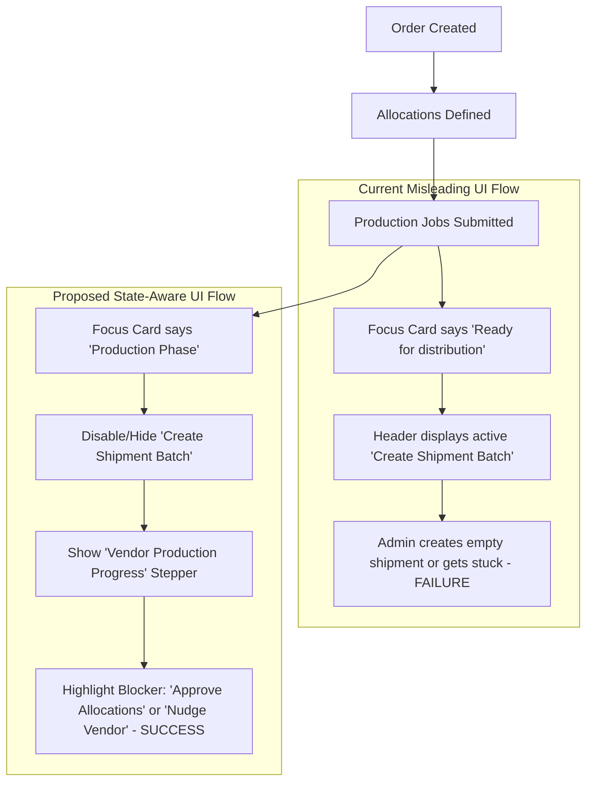
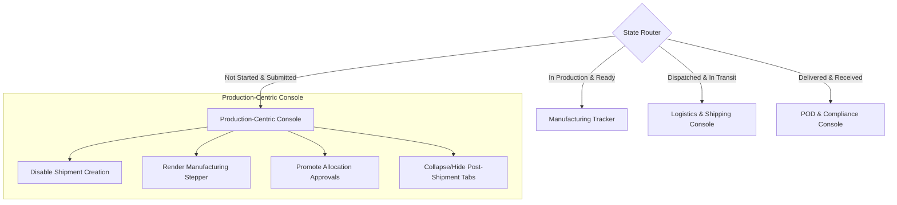

# Order Detail UX/UI Usability Review (Not Started & Submitted States)

- **Date:** 2026-06-15
- **Target Component:** [OrderDetail.tsx](file:///Users/perdanahary/Documents/Projects/Officebee/VA%20Trace/src/pages/admin/OrderDetail.tsx)
- **User Role Context:** Admin / Procurement Manager (PM)
- **Order State Context:** Distribution Status: `NOT_STARTED` | Production Job Status: `SUBMITTED` (0% ready quantity)

---

## 1. Executive Summary
When a new order request is created, it enters the **Production Phase**. In this early stage, the order's distribution status is `NOT_STARTED` and all production jobs are `SUBMITTED` (or waiting to be accepted by the vendor). 

The current interface of the **Order Detail Workbench** treats this state using the same UI hierarchy as a mature, in-transit order. This results in **misleading instructions, excessive cognitive load, and empty state fatigue**. The primary actions guide the Admin to ship items before they are manufactured, while hiding critical production tracking details.

This review proposes a **state-aware layout refactor** that dynamically pivots the UI structure. When an order is waiting on production, the interface automatically hides logistics clutter and transforms into a focused **Production Monitoring Console** with clear, actionable steps for the Admin.

---

## 2. Current State UX Flaws & Usability Issues

Below is a detailed analysis of why the current interface fails in the `NOT_STARTED` / `SUBMITTED` state:

### A. The Misleading Focus Card (Aside Sidebar)
* **The Code Issue:** In `OrderDetail.tsx` (line 1239), the focus card logic checks if `allocationRows.some(row => row.canAddToBatch)`. Because `canAddToBatch` is true as long as there is outstanding quantity (which is true for any new order), the card shows:
  * **Eyebrow:** "Ready for distribution"
  * **Title:** "Outstanding allocations can be moved into a shipment batch"
* **UX Impact:** This is **operationally false**. The items have not yet been produced (`readyQuantity` is `0` across all jobs). Advising the user to initiate a shipment batch at this stage leads to confusion and potential errors.

### B. Premature Header Actions
* **The Code Issue:** The primary button in the header is `Create Shipment Batch` because `canCreateBatch` is set to `true` if any allocation has outstanding quantity.
* **UX Impact:** Promoting "Create Shipment Batch" as the single primary call-to-action when nothing has been manufactured is a mismatch. It encourages the Admin to perform a distribution task prematurely, rather than focusing on vendor follow-up or allocation approvals.

### C. Low Signal-to-Noise Ratio & Layout Clutter
* **The Code Issue:** The layout renders five persistent tabs: `Overview`, `Operations`, `Documents`, `Compliance`, and `Audit`.
* **UX Impact:** In this phase, `Documents` (Delivery Notes/PODs) and `Compliance` (Complaints/Reconciliation) contain **no data** (showing only empty tables). The `Overview` tab shows a prominent, empty "Delivery progress" bar at 0%, but relegates the active "Recent Production Jobs" table to a small section at the very bottom.
* **Cognitive Load:** The screen is flooded with 0-value cards ("Shipped: 0 pcs", "Received: 0 pcs", "Delivery Notes: 0") and labels, diluting focus from what actually matters.

### D. No Production Pipeline Visualization
* **The Code Issue:** While production status changes from `SUBMITTED` to `ACCEPTED` and `PRINTING`, there is no visual tracker or timeline to show this progress.
* **UX Impact:** The Admin is left to read raw status badges inside a table. There is no clear visual indication of where the bottleneck lies in the manufacturing lifecycle.

---

## 3. Flow Comparisons & UI Architecture

### Flow Comparison: Current vs. Proposed



### Proposed State-Driven Layout Routing
The layout should adjust based on the current order lifecycle phase:



---

## 4. Proposed Redesign & Usability Improvements

To dramatically improve the UX and simplify the interface, we recommend a **state-aware** rendering strategy:

### 1. Dynamic Call to Action & Guard Rails
* **Gated Batch Creation:** Update `canCreateBatch` so it evaluates to `true` **only** when there is ready quantity available in production (`productionReadyQuantity > 0`).
* **Contextual Action:** If there are allocations that are not approved, replace the primary header button with `Approve Allocations` or show a `Nudge Vendor` action if jobs remain in `SUBMITTED` beyond a specific threshold.

### 2. State-Aware Focus Card Guidance
Modify the `buildFocusCard` logic to identify the manufacturing stage:
* **Eyebrow:** "Production Startup"
* **Title:** "Waiting for Vendor to start manufacturing"
* **Description:** "All jobs are submitted. Monitor vendor acceptance and preparation progress. No items are ready for distribution yet."

### 3. Replace Delivery Progress with Production Stepper
When the order has not been shipped, the large "Delivery Progress" card should be replaced with a **Production Progress Stepper** that visualizes the manufacturing pipeline:

```
[ Submitted ] ──●── [ Accepted ] ─── [ Printing ] ─── [ QC ] ─── [ Ready to Ship ]
```

### 4. Tab Simplification & Dynamic Visibility
* **Hide or Reorder Tabs:** In this early phase, hide the `Documents` and `Compliance` tabs or render them in a secondary, muted group. Reorder `Operations` (renamed to `Allocations & Production`) to the front.
* **Simplified Overview Card:** Reorganize the Operational Summary to show only metrics relevant to production (e.g., Ordered, Approved Allocations, Vendor Jobs Status).

---

## 5. Low-Fidelity UI Layout Proposal

Here is how the restructured page should look when in the **Not Started / Submitted** state:

```
+--------------------------------------------------------------------------------------+
| ALL ORDERS / OR-004529                                                               |
| OR-004529                                                 [ Nudge Vendor (Primary) ] |
+--------------------------------------------------------------------------------------+
|  (Tab: Overview)   (Tab: Allocations)   (Tab: Audit)                                 |
+-----------------------------------------------------------------+--------------------+
|                                                                 | AT A GLANCE        |
|  PRODUCTION PROGRESS                                            | State: Not Started |
|  [SUBMITTED] ====> [ACCEPTED] ====> [PRINTING] ====> [READY]     |                    |
|  Currently: Submitted to Vendor. Awaiting acceptance.           | +----------------+ |
|                                                                 | | FOCUS CARD     | |
|                                                                 | | Production     | |
|  OPERATIONAL SUMMARY                                            | | Waiting for    | |
|  +--------------------+ +--------------------+ +--------------+ | | Vendor to      | |
|  | Ordered Quantity   | | Allocated Quantity | | Ready Qty    | | | accept jobs.   | |
|  | 2,500 pcs          | | 2,500 pcs          | | 0 pcs        | | +----------------+ |
|  +--------------------+ +--------------------+ +--------------+ |                    |
|                                                                 | ORDER DETAILS      |
|  RECENT PRODUCTION JOBS                                         | Project: Summer 26 |
|  +---------+---------------+-----------+-----------+----------+ | Vendor: PMG Asia   |
|  | Job ID  | Product       | Ordered   | Ready     | Status   | | Deadline: 5 days   |
|  +---------+---------------+-----------+-----------+----------+ |                    |
|  | J-882   | Promo Banner  | 1,500     | 0         |Submitted | | DOCUMENTS (0)      |
|  | J-883   | Wobbler Card  | 1,000     | 0         |Submitted | | [Notes: None]      |
|  +---------+---------------+-----------+-----------+----------+ |                    |
+-----------------------------------------------------------------+--------------------+
```

---

## 6. Technical Implementation Details

To apply these changes, the following modifications should be made to `OrderDetail.tsx`:

### Code Diff 1: Dynamic Focus Card Selector
Refactor `buildFocusCard` to check production status before distribution.

```diff
// src/pages/admin/OrderDetail.tsx

function buildFocusCard(
  hydrated: HydratedOrder,
  allocationRows: OrderAllocationTableRow[],
  workflowBatch: HydratedOrder["shipmentBatches"][number] | undefined,
  exceptionState: ExceptionState,
) {
  if (exceptionState === "BLOCKED") {
    return {
      eyebrow: "Attention required",
      title: "Order is blocked by an active exception",
      description:
        hydrated.order.exceptionSummary.latestExceptionReason ??
        "Resolve the active exception before pushing the order forward.",
    };
  }

+  // Check if we are in the pre-shipment/production phase
+  const totalReadyQty = hydrated.productionJobs.reduce((acc, job) => acc + job.readyQuantity, 0);
+  const totalOrderedQty = hydrated.order.quantitySummary.orderedQuantity;
+  const isDistributionNotStarted = hydrated.order.distributionStatus === "NOT_STARTED";
+
+  if (isDistributionNotStarted && totalReadyQty === 0) {
+    const hasUnsubmitted = hydrated.productionJobs.some(job => job.status === "NEW");
+    return {
+      eyebrow: "Production Startup",
+      title: hasUnsubmitted 
+        ? "Production jobs require submission to Vendor" 
+        : "Waiting for Vendor to start manufacturing",
+      description: hasUnsubmitted
+        ? "Some production jobs are still drafts. Submit them to begin production."
+        : "All jobs are submitted. Monitor vendor acceptance and preparation progress.",
+    };
+  }

  if (hydrated.deliveryConfirmations.length > 0 && hydrated.podStatus !== "VERIFIED") {
    return {
      eyebrow: "Proof of Delivery (POD) review",
      title: "Proof of Delivery (POD) review is the current bottleneck",
      description:
        "Proof of Delivery (POD) review is the current bottleneck.",
    };
  }

  if (workflowBatch) {
    return {
      eyebrow: "Active shipment",
      title: `${workflowBatch.batchNumber} is driving this order forward`,
      description:
        "Active shipment is driving this order forward.",
    };
  }

-  if (allocationRows.some((row) => row.canAddToBatch)) {
+  // Enable batching focus card only when there is actually ready inventory to dispatch
+  if (allocationRows.some((row) => row.canAddToBatch) && totalReadyQty > 0) {
    return {
      eyebrow: "Ready for distribution",
      title: "Outstanding allocations can be moved into a shipment batch",
      description:
        "Outstanding allocations can be moved into a shipment batch.",
    };
  }

  return {
    eyebrow: "Order workbench",
    title: "Monitor production, shipment, and receipt from one screen",
    description:
      "Monitor production, shipment, and receipt from one screen.",
  };
}
```

### Code Diff 2: Gate Shipment Batch Creation
Refactor the actions definition in `OrderDetail.tsx` to prevent creating empty batches.

```diff
// src/pages/admin/OrderDetail.tsx

  const viewModel = useMemo(
    () => (hydrated ? buildAdminOrderWorkbenchViewModel(hydrated, allocationRows, orderAudit) : null),
    [allocationRows, hydrated, orderAudit],
  );

+ const totalReadyQty = useMemo(() => {
+   return hydrated?.productionJobs.reduce((acc, job) => acc + job.readyQuantity, 0) ?? 0;
+ }, [hydrated]);
+
  const canCreateBatch =
    (userRole === "admin" || userRole === "operator" || userRole === "vendor") &&
-   allocationRows.some((row) => row.canAddToBatch);
+   allocationRows.some((row) => row.canAddToBatch) &&
+   totalReadyQty > 0;
```

---

## 7. Usability Evaluation & Verification Plan

To verify that the UX changes are successful, the following checks should be executed:

### Automated Tests (Playwright)
Verify the button state and focus card text during the E2E lifecycle tests:
```typescript
// tests/admin-order-detail.spec.ts

test("Admin Order Detail - Not Started and Submitted Production UX", async ({ page }) => {
  // 1. Navigate to an order that is Not Started with Submitted production jobs
  await page.goto("/admin/orders/order-not-started-id");

  // 2. Verify that 'Create Shipment Batch' button is either disabled or hidden
  const createBatchBtn = page.getByRole("button", { name: "Create Shipment Batch" });
  await expect(createBatchBtn).toBeDisabled();

  // 3. Verify Focus Card contains accurate production startup messaging
  const focusCardTitle = page.locator("aside").getByText("Waiting for Vendor to start manufacturing");
  await expect(focusCardTitle).toBeVisible();

  // 4. Verify Delivery Progress Bar is replaced or accompanied by a Production Stepper
  const productionStepper = page.getByText("Production Progress");
  await expect(productionStepper).toBeVisible();
});
```

### Manual Verification Checklist
1. **State Transition Test:** Verify that once the vendor updates any job's `readyQuantity` to be `> 0`, the header immediately renders the active `Create Shipment Batch` button and the Focus Card transitions to "Ready for distribution".
2. **Tab Redundancy Audit:** Switch between tabs to confirm that post-shipment tabs (Documents/Compliance) do not distract the user while no logistics actions have occurred.
