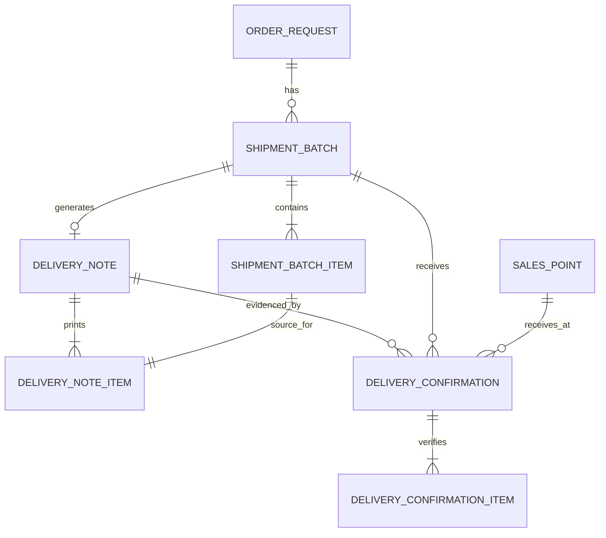

# Delivery Note API Contract

Canonical TypeScript-first contract for batch-scoped Delivery Notes, Delivery Note print/register views, and Delivery Confirmation/POD verification. Delivery Notes are generated from Shipment Batches, never directly from total order quantities.

## 1. Entity Overview

### Business purpose

Delivery Note is the official logistics document for a Shipment Batch. It states what was shipped, from whom, to which Sales Point destinations, under which Order Request and Shipment Batch, and reserves receiver confirmation fields for signature, date, and stamp.

Delivery Confirmation records POD evidence and verified received quantities. Verified Delivery Confirmations update Shipment Batch Items, Sales Point Allocations, and derived distribution status.

### Ownership

- Delivery Note generation/print: Vendor, Admin, or delegated Operator.
- Signed document upload: Vendor through POD workflow.
- Verification: Admin only.
- Read-only register access: Analyst and permitted Client users.

### Lifecycle

1. Shipment Batch is created and contains shipment items.
2. Delivery Note is generated with a unique DN number and immutable snapshots.
3. Delivery Note is printed and travels with the shipment.
4. Receiver signs/stamps the document.
5. Vendor uploads signed DN and POD photos through Delivery Confirmation.
6. Admin verifies, rejects, or requests correction.
7. Delivery Note is closed when batch/document closure policy is satisfied.

### Relationships with other entities

- One Shipment Batch can have one active Delivery Note.
- One Order Request can have many Delivery Notes through multiple Shipment Batches.
- Delivery Note contains Delivery Note Items sourced from Shipment Batch Items.
- Delivery Confirmation belongs to a Shipment Batch and may reference one Delivery Note.
- Delivery Confirmation captures received quantities per Shipment Batch Item.

## 2. TypeScript Interfaces

```ts
export type ID = string;
export type ISODateString = string;
export type ISODateTimeString = string;
export type Quantity = number;

export interface DeliveryNote {
  id: ID;
  deliveryNoteNumber: string;
  shipmentBatchId: ID;
  batchNumber: string;
  orderRequestId: ID;
  orderRequestNumber: string;
  clientPoNumber: string | null;
  salesOrderNumber?: string;
  projectName: string;
  client: PartySnapshot;
  vendor: PartySnapshot;
  senderSnapshot: PartySnapshot;
  destinationSnapshots: DeliveryDestinationSnapshot[];
  status: DeliveryNoteStatus;
  generatedAt: ISODateTimeString;
  generatedByUserId: ID;
  printedAt?: ISODateTimeString;
  lastPrintedAt?: ISODateTimeString;
  printCount: number;
  signedAt?: ISODateTimeString;
  uploadedAt?: ISODateTimeString;
  verifiedAt?: ISODateTimeString;
  closedAt?: ISODateTimeString;
  qrPayload: DeliveryNoteQrPayload;
  items: DeliveryNoteItem[];
  signatureFields: DeliveryNoteSignatureFields;
  documentFiles: DeliveryNoteFile[];
  quantitySummary: DeliveryNoteQuantitySummary;
  extension: DeliveryNoteExtensionFields;
  audit: AuditStamp;
  version: number;
}

export interface DeliveryNoteItem {
  id: ID;
  deliveryNoteId: ID;
  shipmentBatchItemId: ID;
  orderItemId: ID;
  salesPointAllocationId: ID;
  poLineNumber: number;
  salesPointId: ID;
  salesPointCode: string;
  salesPointName: string;
  materialCode: string;
  sku: string;
  description: string;
  specification?: string;
  orderedQuantity: Quantity;
  allocatedQuantity: Quantity;
  previouslyShippedQuantity: Quantity;
  shippedQuantity: Quantity;
  outstandingQuantityAfterShipment: Quantity;
  unitOfMeasure: UnitOfMeasure;
  remarks?: string;
}

export interface DeliveryConfirmation {
  id: ID;
  shipmentBatchId: ID;
  deliveryNoteId: ID;
  deliveryNoteNumber: string;
  orderRequestId: ID;
  salesPointId: ID;
  salesPointCode: string;
  salesPointName: string;
  status: DeliveryConfirmationStatus;
  receiverName: string;
  receiverRole?: string;
  receiverPhone?: string;
  receivedDate: ISODateString;
  submittedByUserId: ID;
  submittedAt: ISODateTimeString;
  reviewedByUserId?: ID;
  reviewedAt?: ISODateTimeString;
  rejectionReason?: string;
  correctionRequestedReason?: string;
  evidence: PodEvidence[];
  itemConfirmations: DeliveryConfirmationItem[];
  quantitySummary: DeliveryConfirmationQuantitySummary;
  extension: DeliveryConfirmationExtensionFields;
  audit: AuditStamp;
  version: number;
}

export interface DeliveryConfirmationItem {
  id: ID;
  deliveryConfirmationId: ID;
  shipmentBatchItemId: ID;
  deliveryNoteItemId: ID;
  salesPointAllocationId: ID;
  materialCode: string;
  sku: string;
  expectedShippedQuantity: Quantity;
  claimedReceivedQuantity: Quantity;
  verifiedReceivedQuantity?: Quantity;
  varianceQuantity: Quantity;
  varianceReason?: DeliveryVarianceReason;
  condition: DeliveredItemCondition;
  remarks?: string;
}

export interface PartySnapshot {
  id?: ID;
  name: string;
  code?: string;
  address?: string;
  phone?: string;
  email?: string;
  contactName?: string;
}

export interface DeliveryDestinationSnapshot {
  salesPointId: ID;
  salesPointCode: string;
  wCode: string;
  salesPointName: string;
  zone: string;
  region: string;
  area: string;
  subArea: string;
  address: string;
  deliveryInstructions?: string;
  contacts: SalesPointContactSnapshot[];
}

export interface SalesPointContactSnapshot {
  name: string;
  role: SalesPointContactRole;
  phone?: string;
  email?: string;
  isPrimary: boolean;
}

export interface DeliveryNoteSignatureFields {
  senderPreparedBy?: string;
  senderApprovedBy?: string;
  receiverName?: string;
  receiverSignatureRequired: boolean;
  receiverStampRequired: boolean;
  receivedDateRequired: boolean;
  notes?: string;
}

export interface DeliveryNoteQrPayload {
  deliveryNoteId: ID;
  deliveryNoteNumber: string;
  shipmentBatchId: ID;
  batchNumber: string;
  orderRequestId: ID;
  generatedAt: ISODateTimeString;
  checksum: string;
}

export interface DeliveryNoteFile {
  id: ID;
  type: DeliveryNoteFileType;
  fileName: string;
  mimeType: string;
  sizeBytes: number;
  storageKey: string;
  uploadedAt: ISODateTimeString;
  uploadedByUserId: ID;
}

export interface PodEvidence {
  id: ID;
  type: PodEvidenceType;
  fileName: string;
  mimeType: string;
  sizeBytes: number;
  storageKey: string;
  capturedAt?: ISODateTimeString;
  uploadedAt: ISODateTimeString;
  uploadedByUserId: ID;
  notes?: string;
}

export interface DeliveryNoteQuantitySummary {
  salesPointCount: number;
  itemCount: number;
  orderedContextQuantity: Quantity;
  allocatedContextQuantity: Quantity;
  shippedQuantity: Quantity;
  outstandingQuantityAfterShipment: Quantity;
}

export interface DeliveryConfirmationQuantitySummary {
  expectedShippedQuantity: Quantity;
  claimedReceivedQuantity: Quantity;
  verifiedReceivedQuantity: Quantity;
  varianceQuantity: Quantity;
  hasPartialDelivery: boolean;
}

export interface AuditStamp {
  createdAt: ISODateTimeString;
  createdByUserId: ID;
  updatedAt: ISODateTimeString;
  updatedByUserId: ID;
}

export interface DeliveryNoteExtensionFields {
  podUpload?: PodUploadDocumentExtension;
  installationVerification?: InstallationVerificationDocumentExtension;
  invoiceReconciliation?: InvoiceReconciliationDocumentExtension;
  vendorScorecard?: VendorScorecardDocumentExtension;
  sapCoupaIntegration?: IntegrationDocumentExtension;
}

export interface DeliveryConfirmationExtensionFields {
  installationVerification?: {
    installationEvidenceExpected?: boolean;
    installationVerificationId?: ID;
  };
  vendorScorecard?: {
    podSubmittedWithinSla?: boolean;
    podAcceptedFirstPass?: boolean;
  };
}

export interface PodUploadDocumentExtension {
  podDeadline?: ISODateString;
  acceptedMimeTypes?: string[];
  maxFileSizeBytes?: number;
}

export interface InstallationVerificationDocumentExtension {
  installationRequired?: boolean;
  installationInstruction?: string;
}

export interface InvoiceReconciliationDocumentExtension {
  invoiceReference?: string;
  billableQuantity?: Quantity;
}

export interface VendorScorecardDocumentExtension {
  documentAccuracyScore?: number;
  firstPrintAt?: ISODateTimeString;
  signedDnUploadSlaMet?: boolean;
}

export interface IntegrationDocumentExtension {
  externalDeliveryDocumentId?: string;
  syncStatus?: IntegrationSyncStatus;
  lastSyncedAt?: ISODateTimeString;
}
```

## 3. Enums

```ts
export enum DeliveryNoteStatus {
  GENERATED = "GENERATED",
  PRINTED = "PRINTED",
  SIGNED = "SIGNED",
  UPLOADED = "UPLOADED",
  VERIFIED = "VERIFIED",
  CLOSED = "CLOSED",
}

export enum DeliveryConfirmationStatus {
  DRAFT = "DRAFT",
  SUBMITTED = "SUBMITTED",
  VERIFIED = "VERIFIED",
  REJECTED = "REJECTED",
  CORRECTION_REQUESTED = "CORRECTION_REQUESTED",
  CANCELLED = "CANCELLED",
}

export enum PodStatus {
  PENDING_UPLOAD = "PENDING_UPLOAD",
  SUBMITTED = "SUBMITTED",
  VERIFIED = "VERIFIED",
  REJECTED = "REJECTED",
  CORRECTION_REQUESTED = "CORRECTION_REQUESTED",
  VARIANCE = "VARIANCE",
}

export enum PodEvidenceType {
  SIGNED_DN = "SIGNED_DN",
  POD_PHOTO = "POD_PHOTO",
  RECEIVER_STAMP = "RECEIVER_STAMP",
  INSTALLATION_PHOTO = "INSTALLATION_PHOTO",
  OTHER = "OTHER",
}

export enum DeliveryNoteFileType {
  GENERATED_PDF = "GENERATED_PDF",
  SIGNED_SCAN = "SIGNED_SCAN",
  CORRECTED_VERSION = "CORRECTED_VERSION",
}

export enum DeliveryVarianceReason {
  NO_VARIANCE = "NO_VARIANCE",
  SHORT_SHIPPED = "SHORT_SHIPPED",
  DAMAGED = "DAMAGED",
  LOST_IN_TRANSIT = "LOST_IN_TRANSIT",
  RECEIVER_REJECTED = "RECEIVER_REJECTED",
  OVERAGE = "OVERAGE",
  COUNTING_ERROR = "COUNTING_ERROR",
  OTHER = "OTHER",
}

export enum DeliveredItemCondition {
  GOOD = "GOOD",
  DAMAGED = "DAMAGED",
  MISSING = "MISSING",
  PARTIALLY_DAMAGED = "PARTIALLY_DAMAGED",
  REJECTED = "REJECTED",
}

export enum UnitOfMeasure {
  PCS = "PCS",
  SET = "SET",
  BOX = "BOX",
  ROLL = "ROLL",
  PACK = "PACK",
}

export enum SalesPointContactRole {
  ARA = "ARA",
  SRE = "SRE",
  SPV_DPC = "SPV_DPC",
  RECEIVER = "RECEIVER",
  LOGISTICS = "LOGISTICS",
  OTHER = "OTHER",
}

export enum IntegrationSyncStatus {
  NOT_SYNCED = "NOT_SYNCED",
  SYNCED = "SYNCED",
  FAILED = "FAILED",
  CONFLICT = "CONFLICT",
}
```

## 4. Validation Rules

### Required fields

- Delivery Note requires `shipmentBatchId`, `orderRequestId`, `deliveryNoteNumber`, destination snapshots, and at least one item.
- Delivery Note items must be sourced from Shipment Batch Items.
- Delivery Confirmation requires `shipmentBatchId`, `deliveryNoteId`, `salesPointId`, receiver name, received date, evidence, and item confirmations.
- POD upload requires at least one signed DN file when signed DN policy is enabled.

### Optional fields

- `salesOrderNumber`, receiver phone/role, POD photos, carrier references, and future extension fields are optional unless client policy requires them.
- `verifiedReceivedQuantity` is optional until Admin review.

### Uniqueness constraints

- `deliveryNoteNumber` must be globally unique.
- One Shipment Batch can have only one active Delivery Note.
- Delivery Confirmation uniqueness is `(shipmentBatchId, salesPointId, deliveryNoteId)` for the current active submission unless corrections create a new version.

### Status transition rules

- Delivery Note: `GENERATED -> PRINTED -> SIGNED -> UPLOADED -> VERIFIED -> CLOSED`.
- `SIGNED` may be inferred from signed file upload if the product does not support a separate signed marker.
- `UPLOADED` requires at least one signed DN evidence file.
- `VERIFIED` requires Admin verification.
- `CLOSED` requires batch closure or explicit document closure policy.
- Rejected POD does not move the Delivery Note to `VERIFIED`.
- Delivery Confirmation: `DRAFT -> SUBMITTED -> VERIFIED | REJECTED | CORRECTION_REQUESTED`.

### Business validation rules

- DN shipped quantity must equal batch item shipped quantity.
- DN must not merge multiple shipment batches into one default document.
- Outstanding quantity on DN is allocation quantity minus cumulative shipped quantity after this batch.
- Generated snapshots must remain stable even if Sales Point master data changes later.
- Uploaded file type and size must match document policy.
- Verification must validate that uploaded signed DN corresponds to the same DN number and batch.
- Verified received quantity cannot exceed shipped quantity without Admin overage reason.

## 5. Relationship Diagram



## 6. API DTO Contracts

```ts
export interface GenerateDeliveryNoteDto {
  shipmentBatchId: ID;
  templateCode?: string;
  regenerate?: boolean;
  regenerationReason?: string;
}

export interface UpdateDeliveryNoteDto {
  signatureFields?: Partial<DeliveryNoteSignatureFields>;
  remarks?: string;
  expectedVersion: number;
}

export interface RecordDeliveryNotePrintDto {
  deliveryNoteId: ID;
  printedAt: ISODateTimeString;
  expectedVersion: number;
}

export interface UploadSignedDeliveryNoteDto {
  deliveryNoteId: ID;
  shipmentBatchId: ID;
  file: UploadFileReference;
  signedAt?: ISODateTimeString;
  expectedVersion: number;
}

export interface CreateDeliveryConfirmationDto {
  shipmentBatchId: ID;
  deliveryNoteId: ID;
  salesPointId: ID;
  receiverName: string;
  receiverRole?: string;
  receiverPhone?: string;
  receivedDate: ISODateString;
  evidence: UploadFileReference[];
  itemConfirmations: CreateDeliveryConfirmationItemDto[];
  notes?: string;
}

export interface CreateDeliveryConfirmationItemDto {
  shipmentBatchItemId: ID;
  claimedReceivedQuantity: Quantity;
  varianceReason?: DeliveryVarianceReason;
  condition: DeliveredItemCondition;
  remarks?: string;
}

export interface VerifyDeliveryConfirmationDto {
  deliveryConfirmationId: ID;
  itemVerifications: VerifyDeliveryConfirmationItemDto[];
  decision: DeliveryConfirmationReviewDecision;
  reviewReason?: string;
  expectedVersion: number;
}

export interface VerifyDeliveryConfirmationItemDto {
  deliveryConfirmationItemId: ID;
  verifiedReceivedQuantity: Quantity;
  varianceReason?: DeliveryVarianceReason;
  remarks?: string;
}

export interface UploadFileReference {
  fileName: string;
  mimeType: string;
  sizeBytes: number;
  storageKey: string;
}

export interface DeliveryNoteListQuery {
  search?: string;
  deliveryNoteStatus?: DeliveryNoteStatus[];
  podStatus?: PodStatus[];
  vendorId?: ID;
  clientId?: ID;
  projectId?: ID;
  shipmentBatchId?: ID;
  orderRequestId?: ID;
  salesPointId?: ID;
  printedFrom?: ISODateString;
  printedTo?: ISODateString;
  uploadedFrom?: ISODateString;
  uploadedTo?: ISODateString;
  missingPodOnly?: boolean;
  exceptionOnly?: boolean;
  page?: number;
  pageSize?: number;
  sort?: DeliveryNoteSortField;
  sortDirection?: SortDirection;
}

export interface DeliveryNoteListResponse {
  rows: DeliveryNoteListRow[];
  page: number;
  pageSize: number;
  totalRows: number;
  totalPages: number;
  summary: DeliveryNoteDashboardSummary;
}

export interface DeliveryNoteDetailResponse {
  deliveryNote: DeliveryNote;
  confirmations: DeliveryConfirmation[];
  permissions: DeliveryNotePermissions;
}

export interface DeliveryNotePermissions {
  canGenerate: boolean;
  canPrint: boolean;
  canUploadSignedDn: boolean;
  canVerifyPod: boolean;
  canRegenerate: boolean;
  canClose: boolean;
  canExport: boolean;
}

export enum DeliveryConfirmationReviewDecision {
  VERIFY = "VERIFY",
  REJECT = "REJECT",
  REQUEST_CORRECTION = "REQUEST_CORRECTION",
}

export enum DeliveryNoteSortField {
  DELIVERY_NOTE_NUMBER = "deliveryNoteNumber",
  SHIPMENT_BATCH_ID = "shipmentBatchId",
  ORDER_REQUEST_NUMBER = "orderRequestNumber",
  CLIENT_PO = "clientPoNumber",
  VENDOR_NAME = "vendorName",
  SALES_POINT_COUNT = "salesPointCount",
  SHIPPED_QUANTITY = "shippedQuantity",
  GENERATED_AT = "generatedAt",
  PRINTED_AT = "printedAt",
  UPLOADED_AT = "uploadedAt",
  STATUS = "status",
  POD_STATUS = "podStatus",
}

export enum SortDirection {
  ASC = "ASC",
  DESC = "DESC",
}
```

## 7. Table View Models

```ts
export interface DeliveryNoteListRow {
  id: ID;
  deliveryNoteNumber: string;
  shipmentBatchId: ID;
  batchNumber: string;
  orderRequestId: ID;
  orderRequestNumber: string;
  clientPoNumber: string | null;
  vendorName: string;
  clientName: string;
  projectName: string;
  salesPointCount: number;
  shippedQuantity: Quantity;
  generatedAt: ISODateTimeString;
  printedAt?: ISODateTimeString;
  uploadedAt?: ISODateTimeString;
  status: DeliveryNoteStatus;
  podStatus: PodStatus;
  missingPod: boolean;
  hasException: boolean;
  actionTargets: {
    printPath: string;
    batchDetailPath: string;
    podPath?: string;
    exportPath?: string;
  };
}

export interface DeliveryNoteItemTableRow {
  id: ID;
  poLineNumber: number;
  salesPointCode: string;
  salesPointName: string;
  materialCode: string;
  description: string;
  orderedQuantity: Quantity;
  allocatedQuantity: Quantity;
  shippedQuantity: Quantity;
  outstandingQuantityAfterShipment: Quantity;
  unitOfMeasure: UnitOfMeasure;
  remarks?: string;
}

export interface PodVerificationQueueRow {
  deliveryConfirmationId: ID;
  shipmentBatchId: ID;
  deliveryNoteNumber: string;
  orderRequestNumber: string;
  salesPointName: string;
  receiverName: string;
  receivedDate: ISODateString;
  submittedByName: string;
  submittedAt: ISODateTimeString;
  ageHours: number;
  expectedShippedQuantity: Quantity;
  claimedReceivedQuantity: Quantity;
  varianceQuantity: Quantity;
  evidenceCount: number;
  status: DeliveryConfirmationStatus;
}

export type DeliveryNoteFilterField =
  | "search"
  | "deliveryNoteStatus"
  | "podStatus"
  | "vendorId"
  | "clientId"
  | "projectId"
  | "printedDateRange"
  | "uploadedDateRange"
  | "missingPodOnly"
  | "exceptionOnly";

export const deliveryNoteListColumns = [
  "deliveryNoteNumber",
  "shipmentBatchId",
  "orderRequestNumber",
  "clientPoNumber",
  "vendorName",
  "salesPointCount",
  "shippedQuantity",
  "generatedAt",
  "printedAt",
  "uploadedAt",
  "status",
  "podStatus",
  "actions",
] as const;
```

## 8. Dashboard View Models

```ts
export interface DeliveryNoteDashboardSummary {
  totalDeliveryNotes: number;
  generatedCount: number;
  printedCount: number;
  signedCount: number;
  uploadedCount: number;
  verifiedCount: number;
  closedCount: number;
  missingPodCount: number;
  rejectedPodCount: number;
  correctionRequestedCount: number;
  averagePrintAgeHours?: number;
  averagePodUploadAgeHours?: number;
}

export interface PodDashboardSummary {
  pendingUploadCount: number;
  submittedForVerificationCount: number;
  verifiedCount: number;
  rejectedCount: number;
  correctionRequestedCount: number;
  varianceCount: number;
  totalExpectedQuantity: Quantity;
  totalClaimedReceivedQuantity: Quantity;
  totalVerifiedReceivedQuantity: Quantity;
  totalVarianceQuantity: Quantity;
  podComplianceRate: number;
}

export interface DistributionDashboardSummary {
  deliveryNotesGenerated: number;
  deliveryNotesVerified: number;
  batchesAwaitingPod: number;
  batchesWithPartialDelivery: number;
  verifiedReceivedQuantity: Quantity;
  openDocumentExceptions: number;
}
```

## 9. Sample JSON Payloads

### Generate Delivery Note for a batch

```json
{
  "shipmentBatchId": "batch_2026_00077",
  "templateCode": "PMG_DN_A4_STANDARD",
  "regenerate": false
}
```

### Generated Delivery Note with multiple Sales Points

```json
{
  "id": "dn_2026_00161",
  "deliveryNoteNumber": "DEL202603180161",
  "shipmentBatchId": "batch_2026_00077",
  "batchNumber": "BATCH-20260318-0077",
  "orderRequestId": "or_2026_000418",
  "orderRequestNumber": "OR-2026-000418",
  "clientPoNumber": "PO-HMS-2026-00418",
  "salesOrderNumber": "SO-PMG-2026-00991",
  "projectName": "VEEV Launch 2026",
  "status": "GENERATED",
  "generatedAt": "2026-03-18T01:45:00.000Z",
  "printCount": 0,
  "destinationSnapshots": [
    {
      "salesPointId": "sp_hms_medan_001",
      "salesPointCode": "SP-MDN-001",
      "wCode": "W-MDN-001",
      "salesPointName": "PT HMS Medan 1",
      "zone": "Sumatra",
      "region": "North Sumatra",
      "area": "Medan",
      "subArea": "Medan Kota",
      "address": "Jl. Gatot Subroto No. 18, Medan",
      "deliveryInstructions": "Call ARA one hour before arrival.",
      "contacts": [
        {
          "name": "Rina Sari",
          "role": "ARA",
          "phone": "+6281211112222",
          "email": "rina.sari@example.com",
          "isPrimary": true
        }
      ]
    },
    {
      "salesPointId": "sp_dpc_meulaboh_014",
      "salesPointCode": "SP-ACEH-014",
      "wCode": "W-ACEH-014",
      "salesPointName": "DPC Meulaboh",
      "zone": "Sumatra",
      "region": "Aceh",
      "area": "Meulaboh",
      "subArea": "Meulaboh Barat",
      "address": "Jl. Nasional No. 44, Meulaboh",
      "contacts": [
        {
          "name": "M. Fadli",
          "role": "SPV_DPC",
          "phone": "+628126667777",
          "isPrimary": true
        }
      ]
    }
  ],
  "items": [
    {
      "id": "dni_000501",
      "shipmentBatchItemId": "sbi_000301",
      "orderItemId": "item_001",
      "salesPointAllocationId": "alloc_000183",
      "poLineNumber": 1,
      "salesPointId": "sp_dpc_meulaboh_014",
      "salesPointCode": "SP-ACEH-014",
      "salesPointName": "DPC Meulaboh",
      "materialCode": "MAT-VEV-BA2",
      "sku": "VEEV-BAN-A2",
      "description": "VEEV A2 Counter Banner",
      "orderedQuantity": 900,
      "allocatedQuantity": 200,
      "previouslyShippedQuantity": 0,
      "shippedQuantity": 120,
      "outstandingQuantityAfterShipment": 80,
      "unitOfMeasure": "PCS",
      "remarks": "Partial shipment"
    }
  ],
  "quantitySummary": {
    "salesPointCount": 2,
    "itemCount": 4,
    "orderedContextQuantity": 2750,
    "allocatedContextQuantity": 870,
    "shippedQuantity": 870,
    "outstandingQuantityAfterShipment": 80
  }
}
```

### Submit Delivery Confirmation with partial delivery

```json
{
  "shipmentBatchId": "batch_2026_00077",
  "deliveryNoteId": "dn_2026_00161",
  "salesPointId": "sp_dpc_meulaboh_014",
  "receiverName": "M. Fadli",
  "receiverRole": "SPV DPC",
  "receiverPhone": "+628126667777",
  "receivedDate": "2026-03-20",
  "evidence": [
    {
      "fileName": "DEL202603180161-signed.pdf",
      "mimeType": "application/pdf",
      "sizeBytes": 1842200,
      "storageKey": "pod/2026/03/DEL202603180161-signed.pdf"
    },
    {
      "fileName": "meulaboh-damaged-banners.jpg",
      "mimeType": "image/jpeg",
      "sizeBytes": 982441,
      "storageKey": "pod/2026/03/meulaboh-damaged-banners.jpg"
    }
  ],
  "itemConfirmations": [
    {
      "shipmentBatchItemId": "sbi_000301",
      "claimedReceivedQuantity": 115,
      "varianceReason": "DAMAGED",
      "condition": "PARTIALLY_DAMAGED",
      "remarks": "Five banners arrived water damaged and were rejected by receiver."
    }
  ],
  "notes": "Receiver accepted remaining goods and signed DN with shortage note."
}
```

## 10. Future Extension Points

```ts
export interface DeliveryNoteFutureExtensions {
  podUpload: PodUploadDocumentExtension;
  installationVerification: InstallationVerificationDocumentExtension;
  invoiceReconciliation: InvoiceReconciliationDocumentExtension;
  vendorScorecard: VendorScorecardDocumentExtension;
  sapCoupaIntegration: IntegrationDocumentExtension;
}
```

- POD Upload: evidence policy, file limits, and signed DN checks are reserved without tying implementation to one storage provider.
- Installation Verification: delivery documents can indicate whether installation evidence is expected after delivery.
- Invoice Reconciliation: billable quantity can later reconcile against shipped/verified quantities.
- Vendor Scorecard: document accuracy, upload timeliness, and first-pass POD acceptance can feed scorecards.
- SAP/Coupa Integration: external delivery document IDs and sync status support ERP/procurement document exchange.
