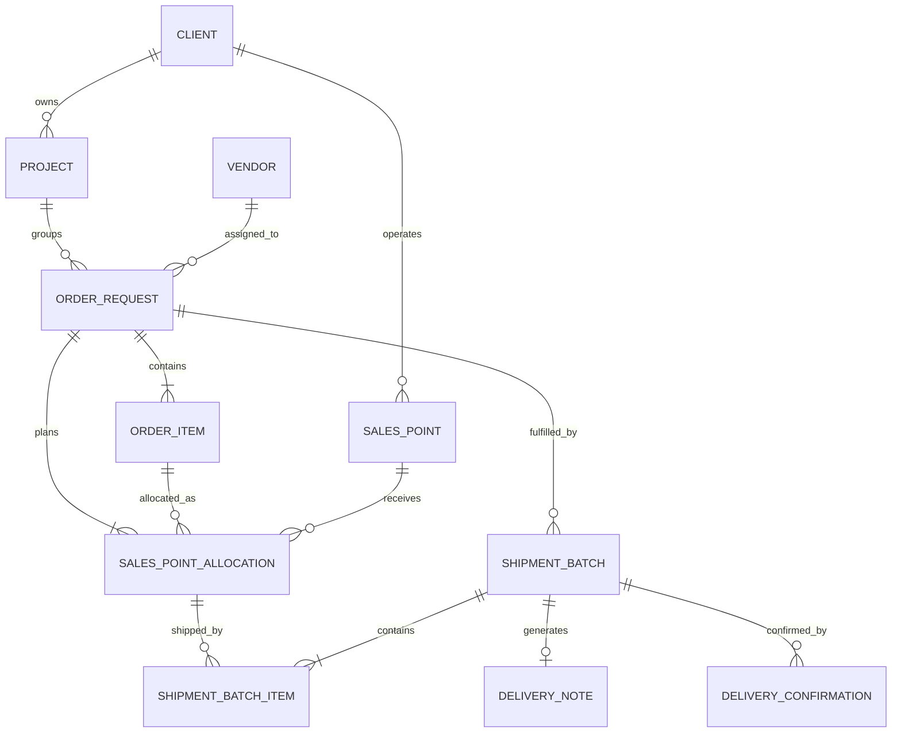

# Order Request API Contract

Canonical TypeScript-first contract for POSM demand capture, production visibility, allocation planning, and order-level dashboard/list views. Order Request is demand. Shipment, Delivery Note, and POD truth is owned by Shipment Batch, Delivery Note, and Delivery Confirmation contracts.

## 1. Entity Overview

### Business purpose

Order Request captures demand from PMG, Client, or Operator users. It defines the client PO, campaign/project, assigned vendor, POSM item lines, and Sales Point allocations that describe where quantities must eventually be delivered.

Order Request is the command center for fulfillment visibility, but it is not the source of truth for shipped or received quantities. Those values are derived from Sales Point Allocations, Shipment Batch Items, and verified Delivery Confirmations.

### Ownership

- Primary owner: Admin, Operator, or Client requester.
- Production owner: assigned Vendor updates production status and readiness.
- Distribution planning owner: Admin/Operator owns allocation quantities; Vendor may select eligible outstanding allocation quantities into batches.
- Verification owner: Admin verifies POD and received quantities.

### Lifecycle

1. Draft order is created with metadata, item lines, and optional allocations.
2. Order is submitted after required metadata, item, and allocation validation.
3. Vendor accepts and updates production through manufacturing states.
4. Eligible allocations are shipped through one or more Shipment Batches.
5. Each Shipment Batch may generate one Delivery Note.
6. Vendor uploads POD per batch; Admin verifies received quantities.
7. Order is complete only when production is `COMPLETED`, distribution is `FULLY_RECEIVED`, and all allocation quantities are verified received.
8. Cancelled orders cannot create new shipment batches or documents.

### Relationships with other entities

- Order Request belongs to one Client and one Project.
- Order Request is assigned to one Vendor.
- Order Request has many Order Items.
- Order Request has many Sales Point Allocations.
- Order Request may have many Shipment Batches through allocations.
- Order Request may have many Delivery Notes through Shipment Batches.
- Order Request may have many Delivery Confirmations through Shipment Batches.

## 2. TypeScript Interfaces

```ts
export type ID = string;
export type ISODateString = string;
export type ISODateTimeString = string;
export type Quantity = number;
export type CurrencyCode = "IDR" | "USD" | string;

export interface AuditStamp {
  createdAt: ISODateTimeString;
  createdByUserId: ID;
  updatedAt: ISODateTimeString;
  updatedByUserId: ID;
}

export interface EntityReference {
  id: ID;
  code?: string;
  name: string;
}

export interface ClientReference extends EntityReference {}
export interface ProjectReference extends EntityReference {
  clientId: ID;
}
export interface VendorReference extends EntityReference {}

export interface SalesPointReference extends EntityReference {
  wCode: string;
  zone: string;
  region: string;
  area: string;
  subArea: string;
}

export interface ProductReference extends EntityReference {
  sku: string;
  materialCode: string;
  unitOfMeasure: UnitOfMeasure;
}

export interface OrderRequest {
  id: ID;
  orderRequestNumber: string;
  clientPoNumber: string | null;
  client: ClientReference;
  project: ProjectReference;
  vendor: VendorReference;
  requester: RequesterSnapshot;
  source: OrderSource;
  priority: OrderPriority;
  productionStatus: ProductionStatus;
  distributionStatus: DistributionStatus;
  legacyStatusLabel?: string;
  deadlineDate: ISODateString;
  requestedDeliveryDate?: ISODateString;
  submittedAt?: ISODateTimeString;
  acceptedAt?: ISODateTimeString;
  cancelledAt?: ISODateTimeString;
  cancellationReason?: string;
  underAllocationReason?: string;
  remarks?: string;
  externalReferences: ExternalReference[];
  items: OrderItem[];
  allocations: SalesPointAllocation[];
  quantitySummary: OrderQuantitySummary;
  documentSummary: OrderDocumentSummary;
  exceptionSummary: OrderExceptionSummary;
  extension: OrderExtensionFields;
  audit: AuditStamp;
}

export interface RequesterSnapshot {
  userId: ID;
  name: string;
  email: string;
  role: UserRole;
  organizationName?: string;
}

export interface ExternalReference {
  type: ExternalReferenceType;
  value: string;
  sourceSystem?: IntegrationSystem;
}

export interface OrderItem {
  id: ID;
  orderRequestId: ID;
  lineNumber: number;
  product: ProductReference;
  description: string;
  specification?: string;
  brandName?: string;
  orderedQuantity: Quantity;
  unitOfMeasure: UnitOfMeasure;
  productionStatus: ProductionStatus;
  productionReadyQuantity: Quantity;
  productionCompletedQuantity: Quantity;
  allocatedQuantity: Quantity;
  shippedQuantity: Quantity;
  receivedQuantity: Quantity;
  remainingToAllocateQuantity: Quantity;
  notes?: string;
  extension: OrderItemExtensionFields;
}

export interface SalesPointAllocation {
  id: ID;
  orderRequestId: ID;
  orderItemId: ID;
  product: ProductReference;
  salesPoint: SalesPointReference;
  allocatedQuantity: Quantity;
  shippedQuantity: Quantity;
  receivedQuantity: Quantity;
  outstandingQuantity: Quantity;
  remainingToReceiveQuantity: Quantity;
  status: AllocationStatus;
  podStatus: PodStatus;
  exceptionState: ExceptionState;
  batchIds: ID[];
  latestShipmentBatchId?: ID;
  latestDeliveryNoteId?: ID;
  underAllocationReason?: string;
  notes?: string;
}

export interface OrderQuantitySummary {
  orderedQuantity: Quantity;
  allocatedQuantity: Quantity;
  shippedQuantity: Quantity;
  receivedQuantity: Quantity;
  outstandingToShipQuantity: Quantity;
  outstandingToReceiveQuantity: Quantity;
  productionReadyQuantity: Quantity;
  productionCompletionPercent: number;
  deliveryProgressPercent: number;
  salesPointCount: number;
  salesPointsFullyReceived: number;
  openPodIssueCount: number;
}

export interface OrderDocumentSummary {
  shipmentBatchCount: number;
  deliveryNoteCount: number;
  printedDeliveryNoteCount: number;
  uploadedPodCount: number;
  verifiedPodCount: number;
  missingPodCount: number;
}

export interface OrderExceptionSummary {
  hasException: boolean;
  exceptionCount: number;
  highestSeverity?: ExceptionSeverity;
  latestExceptionReason?: string;
}

export interface OrderSummary {
  id: ID;
  orderRequestNumber: string;
  clientPoNumber: string | null;
  clientName: string;
  projectName: string;
  vendorName: string;
  createdAt: ISODateTimeString;
  deadlineDate: ISODateString;
  productionStatus: ProductionStatus;
  distributionStatus: DistributionStatus;
  deliveryProgressPercent: number;
  orderedQuantity: Quantity;
  allocatedQuantity: Quantity;
  shippedQuantity: Quantity;
  receivedQuantity: Quantity;
  salesPointCount: number;
  shipmentBatchCount: number;
  deliveryNoteCount: number;
  openPodIssueCount: number;
  hasException: boolean;
}

export interface OrderExtensionFields {
  podUpload?: PodUploadExtension;
  installationVerification?: InstallationVerificationExtension;
  invoiceReconciliation?: InvoiceReconciliationExtension;
  vendorScorecard?: VendorScorecardExtension;
  sapCoupaIntegration?: SapCoupaIntegrationExtension;
}

export interface OrderItemExtensionFields {
  vendorScorecard?: {
    productionQualityScore?: number;
    productionSlaMet?: boolean;
  };
}

export interface PodUploadExtension {
  expectedPodDeadline?: ISODateString;
  podPolicyCode?: string;
}

export interface InstallationVerificationExtension {
  required: boolean;
  installationScope?: "NONE" | "PHOTO_ONLY" | "FIELD_AUDIT" | "CLIENT_SIGNOFF";
  plannedStartDate?: ISODateString;
  plannedEndDate?: ISODateString;
}

export interface InvoiceReconciliationExtension {
  invoiceRequired: boolean;
  invoiceReference?: string;
  reconciledQuantity?: Quantity;
  reconciliationStatus?: InvoiceReconciliationStatus;
}

export interface VendorScorecardExtension {
  productionSlaTargetDate?: ISODateString;
  distributionSlaTargetDate?: ISODateString;
  qualityIncidentCount?: number;
}

export interface SapCoupaIntegrationExtension {
  sourceSystem?: IntegrationSystem;
  externalOrderId?: string;
  externalPoId?: string;
  lastSyncedAt?: ISODateTimeString;
  syncStatus?: IntegrationSyncStatus;
}
```

## 3. Enums

```ts
export enum UserRole {
  ADMIN = "ADMIN",
  OPERATOR = "OPERATOR",
  ANALYST = "ANALYST",
  CLIENT = "CLIENT",
  VENDOR = "VENDOR",
}

export enum OrderSource {
  ADMIN_CREATE = "ADMIN_CREATE",
  OPERATOR_CREATE = "OPERATOR_CREATE",
  CLIENT_PORTAL = "CLIENT_PORTAL",
  BULK_IMPORT = "BULK_IMPORT",
  SAP = "SAP",
  COUPA = "COUPA",
  LEGACY_MIGRATION = "LEGACY_MIGRATION",
}

export enum OrderPriority {
  LOW = "LOW",
  NORMAL = "NORMAL",
  HIGH = "HIGH",
  URGENT = "URGENT",
}

export enum ProductionStatus {
  NEW = "NEW",
  SUBMITTED = "SUBMITTED",
  ACCEPTED = "ACCEPTED",
  PRINTING = "PRINTING",
  FINISHING = "FINISHING",
  QUALITY_CONTROL = "QUALITY_CONTROL",
  READY_FOR_DISTRIBUTION = "READY_FOR_DISTRIBUTION",
  COMPLETED = "COMPLETED",
  CANCELLED = "CANCELLED",
}

export enum DistributionStatus {
  NOT_STARTED = "NOT_STARTED",
  PARTIALLY_DISTRIBUTED = "PARTIALLY_DISTRIBUTED",
  FULLY_DISTRIBUTED = "FULLY_DISTRIBUTED",
  PARTIALLY_RECEIVED = "PARTIALLY_RECEIVED",
  FULLY_RECEIVED = "FULLY_RECEIVED",
  EXCEPTION = "EXCEPTION",
}

export enum AllocationStatus {
  NOT_SHIPPED = "NOT_SHIPPED",
  PARTIALLY_SHIPPED = "PARTIALLY_SHIPPED",
  FULLY_SHIPPED = "FULLY_SHIPPED",
  PARTIALLY_RECEIVED = "PARTIALLY_RECEIVED",
  FULLY_RECEIVED = "FULLY_RECEIVED",
  EXCEPTION = "EXCEPTION",
}

export enum ShipmentBatchStatus {
  DRAFT = "DRAFT",
  READY = "READY",
  DISPATCHED = "DISPATCHED",
  IN_TRANSIT = "IN_TRANSIT",
  PARTIALLY_RECEIVED = "PARTIALLY_RECEIVED",
  FULLY_RECEIVED = "FULLY_RECEIVED",
  CLOSED = "CLOSED",
}

export enum DeliveryNoteStatus {
  GENERATED = "GENERATED",
  PRINTED = "PRINTED",
  SIGNED = "SIGNED",
  UPLOADED = "UPLOADED",
  VERIFIED = "VERIFIED",
  CLOSED = "CLOSED",
}

export enum PodStatus {
  NOT_REQUIRED = "NOT_REQUIRED",
  PENDING_UPLOAD = "PENDING_UPLOAD",
  SUBMITTED = "SUBMITTED",
  VERIFIED = "VERIFIED",
  REJECTED = "REJECTED",
  CORRECTION_REQUESTED = "CORRECTION_REQUESTED",
  VARIANCE = "VARIANCE",
}

export enum ExceptionState {
  NONE = "NONE",
  WARNING = "WARNING",
  BLOCKED = "BLOCKED",
  RESOLVED = "RESOLVED",
}

export enum ExceptionSeverity {
  INFO = "INFO",
  WARNING = "WARNING",
  CRITICAL = "CRITICAL",
}

export enum UnitOfMeasure {
  PCS = "PCS",
  SET = "SET",
  BOX = "BOX",
  ROLL = "ROLL",
  PACK = "PACK",
}

export enum ExternalReferenceType {
  CLIENT_PO = "CLIENT_PO",
  SALES_ORDER = "SALES_ORDER",
  COUPA_REQUISITION = "COUPA_REQUISITION",
  SAP_ORDER = "SAP_ORDER",
  IMPORT_BATCH = "IMPORT_BATCH",
}

export enum IntegrationSystem {
  SAP = "SAP",
  COUPA = "COUPA",
  CLIENT_PORTAL = "CLIENT_PORTAL",
  MANUAL = "MANUAL",
}

export enum IntegrationSyncStatus {
  NOT_SYNCED = "NOT_SYNCED",
  SYNCED = "SYNCED",
  FAILED = "FAILED",
  CONFLICT = "CONFLICT",
}

export enum InvoiceReconciliationStatus {
  NOT_STARTED = "NOT_STARTED",
  PARTIALLY_RECONCILED = "PARTIALLY_RECONCILED",
  RECONCILED = "RECONCILED",
  DISPUTED = "DISPUTED",
}
```

## 4. Validation Rules

### Required fields

- `client`, `project`, `vendor`, `deadlineDate`, `requester`, and `source` are required before submit.
- `clientPoNumber` is required unless configured optional for the client.
- At least one `OrderItem` is required before submit.
- At least one `SalesPointAllocation` is required before submit.
- Each item requires product reference, description, quantity greater than zero, and unit of measure.
- Each allocation requires one Order Request, one Order Item/Product, one Sales Point, and quantity greater than zero.

### Optional fields

- `remarks`, `requestedDeliveryDate`, `externalReferences`, line notes, specifications, brand, and future extension fields are optional.
- Draft orders may omit allocations, client PO, delivery date, or complete Sales Point contact data.

### Uniqueness constraints

- `orderRequestNumber` must be globally unique.
- `clientPoNumber` must be unique within active orders for the same client when client policy requires PO uniqueness.
- `OrderItem.lineNumber` must be unique within an order.
- Allocation uniqueness is `(orderRequestId, orderItemId, salesPoint.id)` for the current allocation version unless split by explicit allocation revision.

### Status transition rules

- Production: `NEW -> SUBMITTED -> ACCEPTED -> PRINTING -> FINISHING -> QUALITY_CONTROL -> READY_FOR_DISTRIBUTION -> COMPLETED`.
- `CANCELLED` may be entered from non-terminal states by authorized users, but no new batches or documents may be created afterward.
- Vendor acceptance moves `SUBMITTED` to `ACCEPTED`.
- Distribution status is derived, not manually set.
- Order completion is derived only when production is `COMPLETED`, distribution is `FULLY_RECEIVED`, and allocated equals verified received across all allocation lines.
- Legacy blended status may be displayed as compatibility text only and must not drive calculations.

### Business validation rules

- Product SKU/material code must resolve to Product Master or be explicitly mapped during import.
- Sales Point must be a reusable master record; free-text destination is invalid for V2 allocation.
- Sales Point must belong to or be valid for the selected client/project context.
- Sum of allocation quantities per product must not exceed ordered quantity.
- Under-allocation is allowed only in draft or with `underAllocationReason`.
- Allocation quantity cannot be reduced below already shipped quantity.
- Vendor cannot change original allocation quantities without Admin/Operator approval.
- Shipment creation must use outstanding allocation quantity and cannot exceed production-ready quantity when readiness gating is enabled.
- Received quantity must be derived from Admin-verified Delivery Confirmations.

## 5. Relationship Diagram



## 6. API DTO Contracts

```ts
export interface CreateOrderRequestDto {
  clientId: ID;
  projectId: ID;
  vendorId: ID;
  clientPoNumber?: string;
  deadlineDate: ISODateString;
  requestedDeliveryDate?: ISODateString;
  priority?: OrderPriority;
  source: OrderSource;
  remarks?: string;
  externalReferences?: ExternalReference[];
  items: CreateOrderItemDto[];
  allocations?: CreateSalesPointAllocationDto[];
  underAllocationReason?: string;
}

export interface CreateOrderItemDto {
  productId: ID;
  lineNumber: number;
  description?: string;
  specification?: string;
  orderedQuantity: Quantity;
  unitOfMeasure: UnitOfMeasure;
  notes?: string;
}

export interface CreateSalesPointAllocationDto {
  orderItemClientLineNumber: number;
  salesPointId: ID;
  allocatedQuantity: Quantity;
  notes?: string;
}

export interface UpdateOrderRequestDto {
  clientPoNumber?: string | null;
  projectId?: ID;
  vendorId?: ID;
  deadlineDate?: ISODateString;
  requestedDeliveryDate?: ISODateString | null;
  priority?: OrderPriority;
  remarks?: string | null;
  underAllocationReason?: string | null;
  items?: UpdateOrderItemDto[];
  allocations?: UpdateSalesPointAllocationDto[];
  expectedVersion: number;
}

export interface UpdateOrderItemDto {
  id: ID;
  description?: string;
  specification?: string | null;
  orderedQuantity?: Quantity;
  unitOfMeasure?: UnitOfMeasure;
  notes?: string | null;
}

export interface UpdateSalesPointAllocationDto {
  id: ID;
  allocatedQuantity?: Quantity;
  notes?: string | null;
  correctionReason?: string;
}

export interface SubmitOrderRequestDto {
  orderRequestId: ID;
  expectedVersion: number;
}

export interface CancelOrderRequestDto {
  orderRequestId: ID;
  reason: string;
  expectedVersion: number;
}

export interface AcceptOrderRequestDto {
  orderRequestId: ID;
  vendorId: ID;
  acceptedAt: ISODateTimeString;
}

export interface UpdateProductionStatusDto {
  orderRequestId: ID;
  itemUpdates: Array<{
    orderItemId: ID;
    productionStatus: ProductionStatus;
    productionReadyQuantity?: Quantity;
    productionCompletedQuantity?: Quantity;
    notes?: string;
  }>;
  expectedVersion: number;
}

export interface OrderRequestListQuery {
  search?: string;
  clientId?: ID;
  projectId?: ID;
  vendorId?: ID;
  productionStatus?: ProductionStatus[];
  distributionStatus?: DistributionStatus[];
  deadlineState?: DeadlineState[];
  deliveryProgressMin?: number;
  deliveryProgressMax?: number;
  salesPointId?: ID;
  productId?: ID;
  podStatus?: PodStatus[];
  exceptionOnly?: boolean;
  createdFrom?: ISODateString;
  createdTo?: ISODateString;
  page?: number;
  pageSize?: number;
  sort?: OrderRequestSortField;
  sortDirection?: SortDirection;
}

export interface OrderRequestListResponse {
  rows: OrderListRow[];
  page: number;
  pageSize: number;
  totalRows: number;
  totalPages: number;
  summary: OrderDashboardSummary;
}

export interface OrderRequestDetailResponse {
  order: OrderRequest;
  shipmentBatches: ShipmentBatchSummary[];
  deliveryNotes: DeliveryNoteSummary[];
  deliveryConfirmations: DeliveryConfirmationSummary[];
  permissions: OrderRequestPermissions;
}

export interface OrderRequestPermissions {
  canEditMetadata: boolean;
  canSubmit: boolean;
  canCancel: boolean;
  canAccept: boolean;
  canUpdateProduction: boolean;
  canCreateShipmentBatch: boolean;
  canAdjustAllocation: boolean;
  canExport: boolean;
}

export interface ShipmentBatchSummary {
  id: ID;
  batchNumber: string;
  status: ShipmentBatchStatus;
  salesPointCount: number;
  shippedQuantity: Quantity;
  receivedQuantity: Quantity;
}

export interface DeliveryNoteSummary {
  id: ID;
  deliveryNoteNumber: string;
  shipmentBatchId: ID;
  status: DeliveryNoteStatus;
  shippedQuantity: Quantity;
}

export interface DeliveryConfirmationSummary {
  id: ID;
  shipmentBatchId: ID;
  salesPointId: ID;
  podStatus: PodStatus;
  verifiedReceivedQuantity: Quantity;
}

export enum DeadlineState {
  UPCOMING = "UPCOMING",
  DUE_SOON = "DUE_SOON",
  OVERDUE = "OVERDUE",
  NO_DEADLINE = "NO_DEADLINE",
}

export enum SortDirection {
  ASC = "ASC",
  DESC = "DESC",
}
```

## 7. Table View Models

```ts
export interface OrderListRow {
  id: ID;
  clientPoNumber: string | null;
  orderRequestNumber: string;
  clientName: string;
  projectName: string;
  vendorName: string;
  createdAt: ISODateTimeString;
  deadlineDate: ISODateString;
  deadlineState: DeadlineState;
  productionStatus: ProductionStatus;
  distributionStatus: DistributionStatus;
  deliveryProgressLabel: string;
  deliveryProgressPercent: number;
  orderedQuantity: Quantity;
  allocatedQuantity: Quantity;
  shippedQuantity: Quantity;
  receivedQuantity: Quantity;
  salesPointCount: number;
  openPodIssueCount: number;
  hasException: boolean;
  actionTargets: {
    detailPath: string;
    createShipmentBatchPath?: string;
    deliveryNotesPath?: string;
    podPath?: string;
  };
}

export interface OrderAllocationTableRow {
  allocationId: ID;
  salesPointCode: string;
  salesPointName: string;
  zone: string;
  region: string;
  area: string;
  subArea: string;
  productCode: string;
  productName: string;
  allocatedQuantity: Quantity;
  shippedQuantity: Quantity;
  receivedQuantity: Quantity;
  outstandingQuantity: Quantity;
  shipmentBatchCount: number;
  podStatus: PodStatus;
  allocationStatus: AllocationStatus;
  exceptionState: ExceptionState;
  canAddToBatch: boolean;
}

export enum OrderRequestSortField {
  CLIENT_PO = "clientPoNumber",
  ORDER_REQUEST_NUMBER = "orderRequestNumber",
  CLIENT_NAME = "clientName",
  PROJECT_NAME = "projectName",
  VENDOR_NAME = "vendorName",
  CREATED_AT = "createdAt",
  DEADLINE_DATE = "deadlineDate",
  PRODUCTION_STATUS = "productionStatus",
  DISTRIBUTION_STATUS = "distributionStatus",
  DELIVERY_PROGRESS = "deliveryProgressPercent",
  OPEN_POD_ISSUES = "openPodIssueCount",
}

export type OrderRequestFilterField =
  | "search"
  | "clientId"
  | "projectId"
  | "vendorId"
  | "productionStatus"
  | "distributionStatus"
  | "deadlineState"
  | "deliveryProgress"
  | "podStatus"
  | "exceptionOnly"
  | "salesPointId"
  | "productId";

export const orderListColumns = [
  "clientPoNumber",
  "orderRequestNumber",
  "clientName",
  "projectName",
  "vendorName",
  "createdAt",
  "deadlineDate",
  "productionStatus",
  "distributionStatus",
  "deliveryProgressPercent",
  "actions",
] as const;
```

## 8. Dashboard View Models

```ts
export interface OrderDashboardSummary {
  totalOrders: number;
  draftOrders: number;
  submittedOrders: number;
  activeOrders: number;
  completedOrders: number;
  cancelledOrders: number;
  overdueOrders: number;
  exceptionOrders: number;
  totalOrderedQuantity: Quantity;
  totalAllocatedQuantity: Quantity;
  totalShippedQuantity: Quantity;
  totalReceivedQuantity: Quantity;
  deliveryProgressPercent: number;
}

export interface ProductionDashboardSummary {
  byStatus: Record<ProductionStatus, number>;
  ordersInProduction: number;
  ordersInQualityControl: number;
  readyForDistributionOrders: number;
  readyForDistributionQuantity: Quantity;
  completedProductionQuantity: Quantity;
  productionCompletionRate: number;
  averageProductionLeadTimeDays?: number;
}

export interface DistributionDashboardSummary {
  byStatus: Record<DistributionStatus, number>;
  allocatedSalesPoints: number;
  dispatchedSalesPoints: number;
  fullyReceivedSalesPoints: number;
  pendingSalesPoints: number;
  partiallyShippedAllocations: number;
  partiallyReceivedAllocations: number;
  openPodIssues: number;
  exceptionCount: number;
  totalShipmentBatches: number;
  totalDeliveryNotes: number;
  deliverySuccessRate: number;
}
```

## 9. Sample JSON Payloads

### Create Order Request

```json
{
  "clientId": "client_hms",
  "projectId": "project_veev_launch_2026",
  "vendorId": "vendor_hh_global",
  "clientPoNumber": "PO-HMS-2026-00418",
  "deadlineDate": "2026-03-28",
  "requestedDeliveryDate": "2026-03-25",
  "priority": "HIGH",
  "source": "ADMIN_CREATE",
  "remarks": "VEEV POSM launch kit for North Sumatra and Aceh sales points.",
  "externalReferences": [
    {
      "type": "SALES_ORDER",
      "value": "SO-PMG-2026-00991",
      "sourceSystem": "MANUAL"
    }
  ],
  "items": [
    {
      "productId": "prod_veev_banner_a2",
      "lineNumber": 1,
      "description": "VEEV A2 Counter Banner",
      "specification": "A2 synthetic paper, full color, laminated",
      "orderedQuantity": 900,
      "unitOfMeasure": "PCS"
    },
    {
      "productId": "prod_veev_snap_frame",
      "lineNumber": 2,
      "description": "VEEV Snap Frame",
      "specification": "A3 aluminum frame with printed insert",
      "orderedQuantity": 450,
      "unitOfMeasure": "SET"
    },
    {
      "productId": "prod_veev_sticker_pack",
      "lineNumber": 3,
      "description": "VEEV Shelf Sticker Pack",
      "specification": "10 stickers per pack",
      "orderedQuantity": 1400,
      "unitOfMeasure": "PACK"
    }
  ],
  "allocations": [
    {
      "orderItemClientLineNumber": 1,
      "salesPointId": "sp_hms_medan_001",
      "allocatedQuantity": 300
    },
    {
      "orderItemClientLineNumber": 2,
      "salesPointId": "sp_hms_medan_001",
      "allocatedQuantity": 150
    },
    {
      "orderItemClientLineNumber": 3,
      "salesPointId": "sp_hms_medan_001",
      "allocatedQuantity": 500
    },
    {
      "orderItemClientLineNumber": 1,
      "salesPointId": "sp_dpc_meulaboh_014",
      "allocatedQuantity": 200
    },
    {
      "orderItemClientLineNumber": 2,
      "salesPointId": "sp_dpc_meulaboh_014",
      "allocatedQuantity": 100
    },
    {
      "orderItemClientLineNumber": 3,
      "salesPointId": "sp_dpc_meulaboh_014",
      "allocatedQuantity": 300
    },
    {
      "orderItemClientLineNumber": 1,
      "salesPointId": "sp_banda_aceh_022",
      "allocatedQuantity": 150
    },
    {
      "orderItemClientLineNumber": 3,
      "salesPointId": "sp_banda_aceh_022",
      "allocatedQuantity": 250
    }
  ],
  "underAllocationReason": "Remaining ordered quantity reserved for late-confirmed Sales Points."
}
```

### Sales Point Allocation with partial shipment and partial delivery

```json
{
  "id": "alloc_000183",
  "orderRequestId": "or_2026_000418",
  "orderItemId": "item_001",
  "product": {
    "id": "prod_veev_banner_a2",
    "sku": "VEEV-BAN-A2",
    "materialCode": "MAT-VEV-BA2",
    "name": "VEEV A2 Counter Banner",
    "unitOfMeasure": "PCS"
  },
  "salesPoint": {
    "id": "sp_dpc_meulaboh_014",
    "code": "SP-ACEH-014",
    "wCode": "W-ACEH-014",
    "name": "DPC Meulaboh",
    "zone": "Sumatra",
    "region": "Aceh",
    "area": "Meulaboh",
    "subArea": "Meulaboh Barat"
  },
  "allocatedQuantity": 200,
  "shippedQuantity": 120,
  "receivedQuantity": 115,
  "outstandingQuantity": 80,
  "remainingToReceiveQuantity": 85,
  "status": "PARTIALLY_RECEIVED",
  "podStatus": "VARIANCE",
  "exceptionState": "WARNING",
  "batchIds": ["batch_2026_00077", "batch_2026_00091"],
  "latestShipmentBatchId": "batch_2026_00091",
  "latestDeliveryNoteId": "dn_2026_00183",
  "notes": "Five banners reported water damaged during second partial delivery."
}
```

## 10. Future Extension Points

```ts
export interface OrderFutureExtensions {
  podUpload: PodUploadExtension;
  installationVerification: InstallationVerificationExtension;
  invoiceReconciliation: InvoiceReconciliationExtension;
  vendorScorecard: VendorScorecardExtension;
  sapCoupaIntegration: SapCoupaIntegrationExtension;
}
```

- POD Upload: keep POD policy and due-date hints at order level; actual evidence remains batch-scoped.
- Installation Verification: reserve per-order campaign installation requirement while later implementation links checks to Sales Points and allocations.
- Invoice Reconciliation: reserve invoice status and reconciled quantity fields for finance workflows.
- Vendor Scorecard: reserve SLA targets and incident counters; detailed scoring should derive from production, shipment, POD, and exception records.
- SAP/Coupa Integration: reserve external IDs and sync metadata for imported POs, outbound status updates, and conflict handling.

## 11. Development Readiness Amendments

This contract now depends on `docs/api-contracts/shared-foundation-api.md` for shared enums, command metadata, mutation responses, errors, authorization scopes, audit/domain events, files, policies, exceptions, integration records, installation records, invoice records, and projection metadata. Duplicate enum definitions in this file are retained only as documentation context until implementation creates a shared TypeScript module.

### Canonical vs projection fields

The following `OrderRequest` and `OrderItem` fields are read projections and must not be directly mutated by UI components, local store slices, or API commands:

- `productionStatus`
- `distributionStatus`
- `quantitySummary`
- `documentSummary`
- `exceptionSummary`
- `OrderItem.productionStatus`
- `OrderItem.productionReadyQuantity`
- `OrderItem.productionCompletedQuantity`
- `OrderItem.allocatedQuantity`
- `OrderItem.shippedQuantity`
- `OrderItem.receivedQuantity`

Projection sources:

- Production status and ready quantities come from `ProductionJob`.
- Allocated quantity comes from active `SalesPointAllocation` records and approved allocation adjustments.
- Shipped quantity comes from `ShipmentBatchItem`.
- Received quantity comes from applied `PodVerificationEvent` records.
- Document status comes from active and historical `DeliveryNote` and `ShippingLabel` records.
- Exception status comes from open/waived/resolved `OperationalException` records.

### Required new fields

```ts
export interface OrderRequestReadinessFields {
  policySnapshotId: ID;
  projectionVersion: number;
  projectionRebuiltAt: ISODateTimeString;
  projectionStale: boolean;
  completedAt?: ISODateTimeString;
  completedByDomainEventId?: ID;
  cancelledByUserId?: ID;
  amendmentIds: ID[];
  integrationSyncIds: ID[];
  openExceptionIds: ID[];
}

export interface OrderItemSnapshotFields {
  productSnapshotVersion: number;
  productSnapshotCapturedAt: ISODateTimeString;
}
```

### Required command DTO additions

```ts
export interface AmendOrderRequestDto {
  orderRequestId: ID;
  expectedVersion: number;
  metadataChanges?: Partial<UpdateOrderRequestDto>;
  itemChanges?: UpdateOrderItemDto[];
  allocationChanges?: UpdateSalesPointAllocationDto[];
  amendmentReason: string;
  command: CommandMetadata;
}

export interface ApproveUnderAllocationDto {
  orderRequestId: ID;
  expectedVersion: number;
  approvedByUserId: ID;
  reason: string;
  policyWaiverId?: ID;
  command: CommandMetadata;
}

export interface CancelOrderFulfillmentDto {
  orderRequestId: ID;
  expectedVersion: number;
  cancelReason: string;
  cancelRemainingAllocations: boolean;
  command: CommandMetadata;
}
```

All mutation responses must use `MutationResponse<T>` and include audit/domain event IDs plus projection version.

### Completion calculation

An order is complete only when all of the following are true:

- Every active Production Job is `COMPLETED` or explicitly waived/cancelled by policy.
- Sum of active allocated quantity equals sum of verified received quantity after approved adjustments.
- No active allocation is `SHORT_RECEIVED`, `OVER_RECEIVED`, `EXCEPTION`, or `CANCELLED` without resolved/waived exception.
- All required Delivery Notes and POD evidence are verified or explicitly waived by policy.
- There are no open blocking `OperationalException` records.
- The order projection is not stale.

### Authorization and tenancy

Order queries and commands must evaluate `AuthClaims` from the shared contract:

- Client users see only orders for their client scope and only fields allowed by exposure policy.
- Vendor users see only assigned order/workbench projections and cannot mutate demand or verified receipt.
- Analyst users can read/export only within granted client/project scope and cannot mutate fulfillment records.
- Operator mutation rights require explicit delegated permissions for production, shipment, POD, exceptions, or master data.

### Required tests

- Projection parity between raw allocations, batches, POD verification events, and order summaries.
- Under-allocation submit with and without policy approval.
- Order amendment after shipment opens or links an exception and does not rewrite shipped/received facts.
- Wrong-client and wrong-vendor query/command denial.
- Legacy compatibility batch creation does not mark unverified legacy delivered quantity as verified unless policy explicitly allows it.
