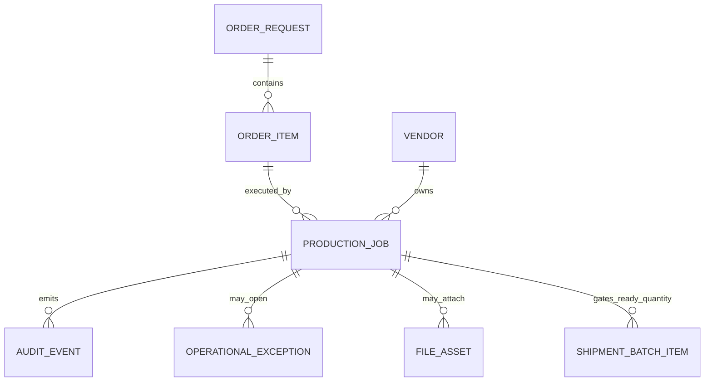

# Production Job API Contract

## 1. Entity Overview

### Business purpose

`ProductionJob` is the source of truth for manufacturing execution. It tracks vendor acceptance, production progress, QC, ready quantity, rework, rejection, and production completion independently from shipment and receipt.

Order and order-item production statuses are read projections derived from active Production Jobs. Shipment Batch creation uses Production Job ready quantity as an eligibility source when the active workflow policy enforces readiness gating.

### Ownership

- Admin can create, monitor, correct, cancel, and reopen production jobs with reason.
- Operator can monitor and update only when delegated.
- Vendor can accept and update assigned production jobs.
- Analyst and Client can read production status only where exposed by policy.

### Relationships



## 2. TypeScript Interfaces

```ts
import type {
  ActionDecision,
  AuditEvent,
  AuditStamp,
  CommandMetadata,
  EntityReference,
  ID,
  ISODateString,
  ISODateTimeString,
  MutationResponse,
  OperationalException,
  PageQuery,
  PageResult,
  ProductionStatus,
  Quantity,
  UserRole,
} from "./shared-foundation-api";

export interface ProductionJob {
  id: ID;
  jobNumber: string;
  orderRequestId: ID;
  orderItemId: ID;
  vendorId: ID;
  status: ProductionStatus;
  orderedQuantity: Quantity;
  producedQuantity: Quantity;
  qcPassedQuantity: Quantity;
  readyQuantity: Quantity;
  reservedForShipmentQuantity: Quantity;
  completedQuantity: Quantity;
  reworkQuantity: Quantity;
  rejectedQuantity: Quantity;
  startedAt?: ISODateTimeString;
  qcStartedAt?: ISODateTimeString;
  readyAt?: ISODateTimeString;
  completedAt?: ISODateTimeString;
  cancelledAt?: ISODateTimeString;
  assignedUserId?: ID;
  notes?: string;
  attachmentFileAssetIds: ID[];
  exceptionIds: ID[];
  audit: AuditStamp;
  version: number;
}

export interface ProductionJobListRow {
  id: ID;
  jobNumber: string;
  orderRequest: EntityReference;
  orderItem: EntityReference;
  vendor: EntityReference;
  status: ProductionStatus;
  orderedQuantity: Quantity;
  readyQuantity: Quantity;
  reservedForShipmentQuantity: Quantity;
  completedQuantity: Quantity;
  rejectedQuantity: Quantity;
  deadline?: ISODateString;
  hasBlockingException: boolean;
  updatedAt: ISODateTimeString;
  actions: ProductionJobActionDecisions;
}

export interface ProductionJobDetailResponse {
  productionJob: ProductionJob;
  orderRequest: EntityReference;
  orderItem: EntityReference;
  vendor: EntityReference;
  auditEvents: AuditEvent[];
  exceptions: OperationalException[];
  actions: ProductionJobActionDecisions;
}

export interface ProductionJobActionDecisions {
  canAccept: ActionDecision;
  canStart: ActionDecision;
  canUpdateProgress: ActionDecision;
  canMarkReady: ActionDecision;
  canComplete: ActionDecision;
  canCancel: ActionDecision;
  canReopen: ActionDecision;
  canAttachEvidence: ActionDecision;
}
```

## 3. DTO Contracts

```ts
export interface CreateProductionJobDto {
  orderRequestId: ID;
  orderItemId: ID;
  vendorId: ID;
  orderedQuantity: Quantity;
  assignedUserId?: ID;
  command: CommandMetadata;
}

export interface AcceptProductionJobDto {
  productionJobId: ID;
  expectedVersion: number;
  acceptedByUserId: ID;
  command: CommandMetadata;
}

export interface UpdateProductionProgressDto {
  productionJobId: ID;
  expectedVersion: number;
  status: ProductionStatus;
  producedQuantity: Quantity;
  qcPassedQuantity?: Quantity;
  readyQuantity?: Quantity;
  completedQuantity?: Quantity;
  reworkQuantity?: Quantity;
  rejectedQuantity?: Quantity;
  notes?: string;
  attachmentFileAssetIds?: ID[];
  command: CommandMetadata;
}

export interface MarkProductionReadyDto {
  productionJobId: ID;
  expectedVersion: number;
  readyQuantity: Quantity;
  command: CommandMetadata;
}

export interface CompleteProductionJobDto {
  productionJobId: ID;
  expectedVersion: number;
  completedQuantity: Quantity;
  command: CommandMetadata;
}

export interface CancelProductionJobDto {
  productionJobId: ID;
  expectedVersion: number;
  cancelReason: string;
  command: CommandMetadata;
}

export interface ReopenProductionJobDto {
  productionJobId: ID;
  expectedVersion: number;
  reopenReason: string;
  command: CommandMetadata;
}

export interface ReserveProductionReadyQuantityDto {
  productionJobId: ID;
  expectedVersion: number;
  shipmentBatchId: ID;
  quantity: Quantity;
  command: CommandMetadata;
}

export interface ProductionJobListQuery extends PageQuery {
  search?: string;
  clientId?: ID;
  projectId?: ID;
  vendorId?: ID;
  orderRequestId?: ID;
  orderItemId?: ID;
  status?: ProductionStatus[];
  readyQuantityGreaterThanZero?: boolean;
  hasBlockingException?: boolean;
  deadlineFrom?: ISODateString;
  deadlineTo?: ISODateString;
}

export type CreateProductionJobResponse = MutationResponse<ProductionJob>;
export type UpdateProductionJobResponse = MutationResponse<ProductionJob>;
export type ProductionJobListResponse = PageResult<ProductionJobListRow>;
```

## 4. Validation Rules

- `orderedQuantity`, `producedQuantity`, `qcPassedQuantity`, `readyQuantity`, and `completedQuantity` cannot be negative.
- `readyQuantity` cannot exceed `qcPassedQuantity` unless Admin override is used with an exception or reason.
- `completedQuantity` cannot exceed `orderedQuantity`.
- `reservedForShipmentQuantity` cannot exceed `readyQuantity`.
- Vendor can update only jobs assigned to the vendor scope in `AuthClaims`.
- Reducing ready quantity below already reserved or shipped quantity is blocked; use an operational exception and correction workflow instead.
- Shipment Batch creation must check ready quantity through this contract when `WorkflowPolicy.shipmentRules.enforceProductionReadyQuantity` is true.

## 5. Status Transition Rules

| From | To | Actor | Preconditions | Side effects |
| --- | --- | --- | --- | --- |
| `SUBMITTED` | `ACCEPTED` | Vendor | Vendor owns job. | Emit `STATUS_CHANGED`; update order production projection. |
| `ACCEPTED` | `PRINTING` | Vendor | Job accepted. | Set `startedAt`; update projection. |
| `PRINTING` | `FINISHING`, `QUALITY_CONTROL` | Vendor | Produced quantity recorded. | Emit progress event. |
| `QUALITY_CONTROL` | `READY_FOR_DISTRIBUTION` | Vendor | `readyQuantity > 0`. | Batch eligibility projection increases. |
| `READY_FOR_DISTRIBUTION` | `COMPLETED` | Vendor/Admin | Completed quantity reaches ordered quantity or approved partial close. | Order production projection may become complete. |
| Any non-terminal | `EXCEPTION` | System/Admin | Blocking production issue exists. | Open `OperationalException`; freeze eligibility if policy says blocking. |
| Any non-terminal | `CANCELLED` | Admin | Reason required; no shipped dependent quantity or explicit correction path. | Emit cancellation event and update order projection. |
| `COMPLETED`, `CANCELLED` | Prior valid state | Admin | Reopen reason required. | Emit reopen event; projections rebuilt. |

## 6. Readiness Allocation Rule

Phase 1 uses product-level ready quantity pooling per `orderItemId` and `vendorId`:

- Allocations are eligible for shipment when the order item has enough unreserved ready quantity.
- If ready quantity is lower than outstanding allocation demand, eligible allocation rows are sorted by priority, deadline, Sales Point geography, then creation time.
- Batch creation reserves ready quantity transactionally with allocation and production expected versions.
- Future allocation-specific reservations may be introduced without changing the visible workflow.

## 7. Screen And Table Requirements

Production queues must support:

- Admin `/admin/production`
- Vendor `/vendor/production`
- Order Detail Production tab
- Vendor Order Workbench Production tab

Required columns:

- Job number
- Order Request
- Product/SKU
- Vendor
- Ordered
- Produced
- QC passed
- Ready
- Reserved
- Completed
- Status
- Blocking exception
- Updated at

## 8. Tests Required Before UI Implementation

- Status transition guards for Vendor/Admin/Operator/Analyst/Client.
- Ready quantity cannot be over-reserved by concurrent batch creation.
- Order production status projection matches raw Production Job facts.
- Production cancellation after shipment opens exception instead of silently reducing shipped eligibility.
- Vendor wrong-scope update is denied.

