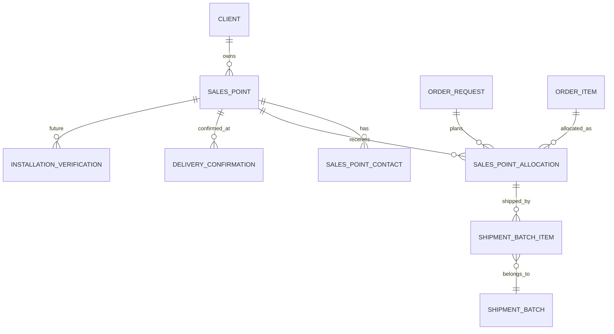

# Sales Point API Contract

Canonical TypeScript-first contract for Sales Point master data, contacts, allocation planning, and destination-centric reporting. Sales Point is the primary distribution entity for V2 and must support 1,400+ reusable destinations.

## 1. Entity Overview

### Business purpose

Sales Point represents the delivery destination for POSM distribution. It is a governed master-data entity, not a free-text address field. Sales Point powers allocation planning, shipment batch creation, Delivery Note destination snapshots, shipping labels, POD verification, and destination-level reporting.

### Ownership

- Primary owner: Admin.
- Delegated maintenance: Operator for approved operational updates and import match resolution.
- Read-only visibility: Vendor, Analyst, and Client within scope.
- Contact/data quality ownership remains Admin-controlled because missing address or receiver data can block dispatch.

### Lifecycle

1. Sales Point is drafted, imported, or created manually.
2. Admin validates identity, geography, address, client relationship, and contacts.
3. Active Sales Point becomes selectable for allocations and shipment workflows.
4. Sales Point may receive many allocations across many orders.
5. Sales Point appears in many shipment batches, delivery notes, and POD records.
6. Inactive Sales Point remains visible historically but cannot be selected for new workflows unless Admin override permits.
7. Master-data changes do not rewrite previously generated Delivery Note snapshots.

### Relationships with other entities

- Client has many Sales Points.
- Sales Point has many Sales Point Contacts.
- Sales Point has many Sales Point Allocations.
- Sales Point appears in many Shipment Batch Items through allocations.
- Sales Point appears in many Delivery Confirmations/POD records.
- Sales Point may have future installation verification records after delivery.

## 2. TypeScript Interfaces

```ts
export type ID = string;
export type ISODateString = string;
export type ISODateTimeString = string;
export type Quantity = number;

export interface SalesPoint {
  id: ID;
  code: string;
  wCode: string;
  name: string;
  clientId: ID;
  clientName: string;
  status: MasterDataStatus;
  entityType?: SalesPointEntityType;
  geography: SalesPointGeography;
  address: SalesPointAddress;
  deliveryInstructions?: string;
  contacts: SalesPointContact[];
  dataQuality: SalesPointDataQuality;
  operationalSummary: SalesPointOperationalSummary;
  allocationSummary: SalesPointAllocationSummary;
  extension: SalesPointExtensionFields;
  audit: AuditStamp;
  version: number;
}

export interface SalesPointContact {
  id: ID;
  salesPointId: ID;
  name: string;
  role: SalesPointContactRole;
  phone?: string;
  email?: string;
  isPrimary: boolean;
  isActive: boolean;
  notes?: string;
  audit: AuditStamp;
}

export interface SalesPointAllocation {
  id: ID;
  orderRequestId: ID;
  orderRequestNumber: string;
  clientPoNumber: string | null;
  projectId: ID;
  projectName: string;
  vendorId: ID;
  vendorName: string;
  orderItemId: ID;
  product: ProductReference;
  salesPointId: ID;
  salesPointCode: string;
  salesPointName: string;
  allocatedQuantity: Quantity;
  shippedQuantity: Quantity;
  receivedQuantity: Quantity;
  outstandingQuantity: Quantity;
  remainingToReceiveQuantity: Quantity;
  status: AllocationStatus;
  podStatus: PodStatus;
  exceptionState: ExceptionState;
  shipmentBatchIds: ID[];
  deliveryNoteIds: ID[];
  latestDeliveryConfirmationId?: ID;
  underAllocationReason?: string;
  notes?: string;
  audit: AuditStamp;
  version: number;
}

export interface SalesPointGeography {
  zone: string;
  region: string;
  area: string;
  subArea: string;
  latitude?: number;
  longitude?: number;
}

export interface SalesPointAddress {
  line1: string;
  line2?: string;
  city?: string;
  province?: string;
  postalCode?: string;
  country: string;
  fullAddress: string;
}

export interface SalesPointDataQuality {
  state: SalesPointDataQualityState;
  hasCompleteAddress: boolean;
  hasPrimaryContact: boolean;
  hasValidPhoneOrEmail: boolean;
  hasDeliveryInstructions: boolean;
  recentIssueCount: number;
  warnings: SalesPointDataWarning[];
}

export interface SalesPointDataWarning {
  code: SalesPointDataWarningCode;
  message: string;
  severity: ExceptionSeverity;
}

export interface SalesPointOperationalSummary {
  activeAllocationCount: number;
  activeShipmentBatchCount: number;
  openPodCount: number;
  rejectedPodCount: number;
  recentExceptionCount: number;
  lastShippedAt?: ISODateTimeString;
  lastReceivedAt?: ISODateTimeString;
}

export interface SalesPointAllocationSummary {
  allocatedQuantity: Quantity;
  shippedQuantity: Quantity;
  receivedQuantity: Quantity;
  outstandingQuantity: Quantity;
  remainingToReceiveQuantity: Quantity;
  deliveryProgressPercent: number;
  productCount: number;
  orderCount: number;
  fullyReceivedAllocationCount: number;
  partialAllocationCount: number;
}

export interface ProductReference {
  id: ID;
  sku: string;
  materialCode: string;
  name: string;
  unitOfMeasure: UnitOfMeasure;
}

export interface SalesPointAllocationCreateInput {
  salesPointId: ID;
  orderItemId: ID;
  allocatedQuantity: Quantity;
  notes?: string;
}

export interface AuditStamp {
  createdAt: ISODateTimeString;
  createdByUserId: ID;
  updatedAt: ISODateTimeString;
  updatedByUserId: ID;
}

export interface SalesPointExtensionFields {
  podUpload?: PodUploadSalesPointExtension;
  installationVerification?: InstallationVerificationSalesPointExtension;
  invoiceReconciliation?: InvoiceReconciliationSalesPointExtension;
  vendorScorecard?: VendorScorecardSalesPointExtension;
  sapCoupaIntegration?: IntegrationSalesPointExtension;
}

export interface PodUploadSalesPointExtension {
  preferredPodEvidenceTypes?: PodEvidenceType[];
  podEscalationContactId?: ID;
}

export interface InstallationVerificationSalesPointExtension {
  installationRequiredByDefault?: boolean;
  installationAccessInstructions?: string;
  storeOpeningHours?: string;
}

export interface InvoiceReconciliationSalesPointExtension {
  costCenterCode?: string;
  billToLocationCode?: string;
}

export interface VendorScorecardSalesPointExtension {
  deliveryDifficultyRating?: number;
  historicalPodIssueRate?: number;
}

export interface IntegrationSalesPointExtension {
  externalSalesPointId?: string;
  externalCustomerSiteId?: string;
  syncStatus?: IntegrationSyncStatus;
  lastSyncedAt?: ISODateTimeString;
}
```

## 3. Enums

```ts
export enum MasterDataStatus {
  DRAFT = "DRAFT",
  ACTIVE = "ACTIVE",
  INACTIVE = "INACTIVE",
  NEEDS_REVIEW = "NEEDS_REVIEW",
}

export enum SalesPointEntityType {
  DPC = "DPC",
  RETAIL = "RETAIL",
  DISTRIBUTION_POINT = "DISTRIBUTION_POINT",
  WAREHOUSE = "WAREHOUSE",
  OFFICE = "OFFICE",
  OTHER = "OTHER",
}

export enum SalesPointContactRole {
  ARA = "ARA",
  SRE = "SRE",
  SPV_DPC = "SPV_DPC",
  RECEIVER = "RECEIVER",
  LOGISTICS = "LOGISTICS",
  CLIENT_PIC = "CLIENT_PIC",
  OTHER = "OTHER",
}

export enum SalesPointDataQualityState {
  COMPLETE = "COMPLETE",
  MISSING_CONTACT = "MISSING_CONTACT",
  MISSING_ADDRESS = "MISSING_ADDRESS",
  DELIVERY_INSTRUCTION_MISSING = "DELIVERY_INSTRUCTION_MISSING",
  REPEATED_ISSUE = "REPEATED_ISSUE",
  NEEDS_REVIEW = "NEEDS_REVIEW",
}

export enum SalesPointDataWarningCode {
  MISSING_PRIMARY_CONTACT = "MISSING_PRIMARY_CONTACT",
  MISSING_PHONE_OR_EMAIL = "MISSING_PHONE_OR_EMAIL",
  MISSING_ADDRESS = "MISSING_ADDRESS",
  MISSING_GEOGRAPHY = "MISSING_GEOGRAPHY",
  MISSING_DELIVERY_INSTRUCTION = "MISSING_DELIVERY_INSTRUCTION",
  RECENT_POD_EXCEPTION = "RECENT_POD_EXCEPTION",
  DUPLICATE_CANDIDATE = "DUPLICATE_CANDIDATE",
}

export enum AllocationStatus {
  NOT_SHIPPED = "NOT_SHIPPED",
  PARTIALLY_SHIPPED = "PARTIALLY_SHIPPED",
  FULLY_SHIPPED = "FULLY_SHIPPED",
  PARTIALLY_RECEIVED = "PARTIALLY_RECEIVED",
  FULLY_RECEIVED = "FULLY_RECEIVED",
  EXCEPTION = "EXCEPTION",
}

export enum DistributionStatus {
  NOT_STARTED = "NOT_STARTED",
  PARTIALLY_DISTRIBUTED = "PARTIALLY_DISTRIBUTED",
  FULLY_DISTRIBUTED = "FULLY_DISTRIBUTED",
  PARTIALLY_RECEIVED = "PARTIALLY_RECEIVED",
  FULLY_RECEIVED = "FULLY_RECEIVED",
  EXCEPTION = "EXCEPTION",
}

export enum PodStatus {
  PENDING_UPLOAD = "PENDING_UPLOAD",
  SUBMITTED = "SUBMITTED",
  VERIFIED = "VERIFIED",
  REJECTED = "REJECTED",
  CORRECTION_REQUESTED = "CORRECTION_REQUESTED",
  VARIANCE = "VARIANCE",
}

export enum ExceptionState {
  NONE = "NONE",
  WARNING = "WARNING",
  BLOCKED = "BLOCKED",
  RESOLVED = "RESOLVED",
}

export enum ExceptionSeverity {
  INFO = "INFO",
  WARNING = "WARNING",
  CRITICAL = "CRITICAL",
}

export enum UnitOfMeasure {
  PCS = "PCS",
  SET = "SET",
  BOX = "BOX",
  ROLL = "ROLL",
  PACK = "PACK",
}

export enum PodEvidenceType {
  SIGNED_DN = "SIGNED_DN",
  POD_PHOTO = "POD_PHOTO",
  RECEIVER_STAMP = "RECEIVER_STAMP",
  INSTALLATION_PHOTO = "INSTALLATION_PHOTO",
}

export enum IntegrationSyncStatus {
  NOT_SYNCED = "NOT_SYNCED",
  SYNCED = "SYNCED",
  FAILED = "FAILED",
  CONFLICT = "CONFLICT",
}
```

## 4. Validation Rules

### Required fields

- Sales Point requires `code`, `wCode`, `name`, `clientId`, `status`, geography, and address before active use.
- Geography requires `zone`, `region`, `area`, and `subArea` when geography policy is enabled.
- Dispatch requires complete address unless Admin waiver policy is applied.
- Contact policy requires at least one active primary contact with phone or email before dispatch.
- Sales Point Allocation requires one Order Request, one Order Item/Product, one Sales Point, and quantity greater than zero.

### Optional fields

- `entityType`, latitude/longitude, delivery instructions, secondary address line, opening hours, and extension fields are optional unless client policy requires them.
- Draft Sales Points may be missing address/contact fields but cannot be used for dispatch.

### Uniqueness constraints

- `code` must be unique in the configured namespace.
- `wCode` must be unique within client or globally according to tenant configuration.
- Contact `isPrimary` must have at most one active primary contact per Sales Point and role group when configured.
- Allocation uniqueness is `(orderRequestId, orderItemId, salesPointId)` for the active allocation version.

### Status transition rules

- Master data: `DRAFT -> NEEDS_REVIEW -> ACTIVE` or `DRAFT -> ACTIVE`.
- `ACTIVE -> INACTIVE` is allowed by Admin if active operational dependencies are handled.
- Inactive Sales Points remain available for historical reads but are not selectable for new orders, allocations, or batches without Admin override.
- Allocation status is derived from allocated, shipped, received, and exception data; it is not manually selected.

### Business validation rules

- Sales Point must not be stored as free text on Order, Shipment, or Delivery Note.
- Sales Point must be valid for the selected client/project context before allocation.
- Imported Sales Point rows require match confirmation when confidence is below threshold.
- Allocation quantity cannot exceed ordered quantity when summed by product.
- Allocation quantity cannot be reduced below already shipped quantity.
- Allocation cannot be deleted after shipped quantity exists; use audited correction instead.
- Vendor may select outstanding allocation into batches but cannot edit original allocation quantity.
- Address/contact changes after DN generation do not retroactively change generated document snapshots.

## 5. Relationship Diagram



## 6. API DTO Contracts

```ts
export interface CreateSalesPointDto {
  code: string;
  wCode: string;
  name: string;
  clientId: ID;
  status?: MasterDataStatus;
  entityType?: SalesPointEntityType;
  geography: SalesPointGeography;
  address: SalesPointAddress;
  deliveryInstructions?: string;
  contacts?: CreateSalesPointContactDto[];
}

export interface UpdateSalesPointDto {
  code?: string;
  wCode?: string;
  name?: string;
  clientId?: ID;
  status?: MasterDataStatus;
  entityType?: SalesPointEntityType | null;
  geography?: Partial<SalesPointGeography>;
  address?: Partial<SalesPointAddress>;
  deliveryInstructions?: string | null;
  expectedVersion: number;
}

export interface CreateSalesPointContactDto {
  name: string;
  role: SalesPointContactRole;
  phone?: string;
  email?: string;
  isPrimary?: boolean;
  notes?: string;
}

export interface UpdateSalesPointContactDto {
  name?: string;
  role?: SalesPointContactRole;
  phone?: string | null;
  email?: string | null;
  isPrimary?: boolean;
  isActive?: boolean;
  notes?: string | null;
}

export interface CreateSalesPointAllocationDto {
  orderRequestId: ID;
  orderItemId: ID;
  salesPointId: ID;
  allocatedQuantity: Quantity;
  notes?: string;
}

export interface BulkCreateSalesPointAllocationDto {
  orderRequestId: ID;
  allocations: SalesPointAllocationCreateInput[];
  underAllocationReason?: string;
}

export interface UpdateSalesPointAllocationDto {
  salesPointAllocationId: ID;
  allocatedQuantity?: Quantity;
  notes?: string | null;
  correctionReason?: string;
  expectedVersion: number;
}

export interface ConfirmSalesPointImportMatchDto {
  importRowId: ID;
  salesPointId: ID;
  matchConfidence: ImportMatchConfidence;
  confirmedByUserId: ID;
}

export interface SalesPointListQuery {
  search?: string;
  clientId?: ID;
  status?: MasterDataStatus[];
  zone?: string;
  region?: string;
  area?: string;
  subArea?: string;
  entityType?: SalesPointEntityType[];
  dataQualityState?: SalesPointDataQualityState[];
  missingContactOnly?: boolean;
  missingAddressOnly?: boolean;
  deliveryIssueOnly?: boolean;
  recentPodExceptionOnly?: boolean;
  activeAllocationOnly?: boolean;
  page?: number;
  pageSize?: number;
  sort?: SalesPointSortField;
  sortDirection?: SortDirection;
}

export interface SalesPointListResponse {
  rows: SalesPointListRow[];
  page: number;
  pageSize: number;
  totalRows: number;
  totalPages: number;
  summary: SalesPointDashboardSummary;
}

export interface SalesPointDetailResponse {
  salesPoint: SalesPoint;
  allocations: SalesPointAllocationRow[];
  shipmentHistory: SalesPointShipmentHistoryRow[];
  podHistory: SalesPointPodHistoryRow[];
  permissions: SalesPointPermissions;
}

export interface SalesPointPermissions {
  canEdit: boolean;
  canDeactivate: boolean;
  canManageContacts: boolean;
  canCreateAllocation: boolean;
  canCorrectAllocation: boolean;
  canExport: boolean;
}

export enum ImportMatchConfidence {
  HIGH = "HIGH",
  MEDIUM = "MEDIUM",
  LOW = "LOW",
  MANUAL = "MANUAL",
}

export enum SalesPointSortField {
  ZONE = "zone",
  REGION = "region",
  AREA = "area",
  SUB_AREA = "subArea",
  W_CODE = "wCode",
  CODE = "code",
  NAME = "name",
  CLIENT_NAME = "clientName",
  ENTITY_TYPE = "entityType",
  PRIMARY_CONTACT = "primaryContactName",
  DATA_QUALITY = "dataQualityState",
  ALLOCATED_QUANTITY = "allocatedQuantity",
  SHIPPED_QUANTITY = "shippedQuantity",
  RECEIVED_QUANTITY = "receivedQuantity",
}

export enum SortDirection {
  ASC = "ASC",
  DESC = "DESC",
}
```

## 7. Table View Models

```ts
export interface SalesPointListRow {
  id: ID;
  zone: string;
  region: string;
  area: string;
  subArea: string;
  wCode: string;
  code: string;
  name: string;
  clientName: string;
  entityType?: SalesPointEntityType;
  primaryContactName?: string;
  primaryContactPhone?: string;
  dataQualityState: SalesPointDataQualityState;
  status: MasterDataStatus;
  activeAllocationCount: number;
  openPodCount: number;
  recentExceptionCount: number;
  actionTargets: {
    detailPath: string;
    editPath?: string;
    shipmentHistoryPath?: string;
  };
}

export interface SalesPointAllocationRow {
  allocationId: ID;
  orderRequestId: ID;
  orderRequestNumber: string;
  clientPoNumber: string | null;
  projectName: string;
  vendorName: string;
  productCode: string;
  productName: string;
  allocatedQuantity: Quantity;
  shippedQuantity: Quantity;
  receivedQuantity: Quantity;
  outstandingQuantity: Quantity;
  shipmentBatchCount: number;
  deliveryNoteCount: number;
  allocationStatus: AllocationStatus;
  podStatus: PodStatus;
  exceptionState: ExceptionState;
}

export interface SalesPointShipmentHistoryRow {
  shipmentBatchId: ID;
  batchNumber: string;
  orderRequestNumber: string;
  deliveryNoteNumber?: string;
  productCodes: string[];
  shippedQuantity: Quantity;
  receivedQuantity: Quantity;
  varianceQuantity: Quantity;
  status: string;
  dispatchedAt?: ISODateTimeString;
}

export interface SalesPointPodHistoryRow {
  deliveryConfirmationId: ID;
  shipmentBatchId: ID;
  deliveryNoteNumber: string;
  receiverName: string;
  receivedDate: ISODateString;
  expectedQuantity: Quantity;
  verifiedReceivedQuantity: Quantity;
  varianceQuantity: Quantity;
  podStatus: PodStatus;
}

export type SalesPointFilterField =
  | "search"
  | "clientId"
  | "status"
  | "zone"
  | "region"
  | "area"
  | "subArea"
  | "entityType"
  | "dataQualityState"
  | "missingContactOnly"
  | "missingAddressOnly"
  | "deliveryIssueOnly"
  | "recentPodExceptionOnly"
  | "activeAllocationOnly";

export const salesPointListColumns = [
  "zone",
  "region",
  "area",
  "subArea",
  "wCode",
  "name",
  "clientName",
  "entityType",
  "primaryContactName",
  "primaryContactPhone",
  "dataQualityState",
  "status",
  "actions",
] as const;
```

## 8. Dashboard View Models

```ts
export interface SalesPointDashboardSummary {
  totalSalesPoints: number;
  activeSalesPoints: number;
  inactiveSalesPoints: number;
  needsReviewSalesPoints: number;
  completeDataCount: number;
  missingContactCount: number;
  missingAddressCount: number;
  deliveryInstructionMissingCount: number;
  repeatedIssueCount: number;
  allocatedSalesPoints: number;
  dispatchedSalesPoints: number;
  fullyReceivedSalesPoints: number;
  pendingSalesPoints: number;
}

export interface SalesPointDistributionDashboardSummary {
  allocatedQuantity: Quantity;
  shippedQuantity: Quantity;
  receivedQuantity: Quantity;
  outstandingQuantity: Quantity;
  deliveryProgressPercent: number;
  totalAllocations: number;
  partiallyShippedAllocations: number;
  partiallyReceivedAllocations: number;
  fullyReceivedAllocations: number;
  openPodIssues: number;
  openExceptions: number;
}

export interface SalesPointGeographyDashboardSummary {
  zone: string;
  region?: string;
  area?: string;
  subArea?: string;
  salesPointCount: number;
  allocatedQuantity: Quantity;
  shippedQuantity: Quantity;
  receivedQuantity: Quantity;
  deliveryProgressPercent: number;
  exceptionCount: number;
}
```

## 9. Sample JSON Payloads

### Create Sales Point

```json
{
  "code": "SP-MDN-001",
  "wCode": "W-MDN-001",
  "name": "PT HMS Medan 1",
  "clientId": "client_hms",
  "status": "ACTIVE",
  "entityType": "DISTRIBUTION_POINT",
  "geography": {
    "zone": "Sumatra",
    "region": "North Sumatra",
    "area": "Medan",
    "subArea": "Medan Kota",
    "latitude": 3.5952,
    "longitude": 98.6722
  },
  "address": {
    "line1": "Jl. Gatot Subroto No. 18",
    "city": "Medan",
    "province": "North Sumatra",
    "postalCode": "20112",
    "country": "Indonesia",
    "fullAddress": "Jl. Gatot Subroto No. 18, Medan, North Sumatra 20112"
  },
  "deliveryInstructions": "Call ARA one hour before arrival. Loading access through rear gate.",
  "contacts": [
    {
      "name": "Rina Sari",
      "role": "ARA",
      "phone": "+6281211112222",
      "email": "rina.sari@example.com",
      "isPrimary": true
    },
    {
      "name": "Budi Hartono",
      "role": "LOGISTICS",
      "phone": "+6281211133333",
      "isPrimary": false
    }
  ]
}
```

### Sales Point Allocation for multiple SKUs

```json
{
  "orderRequestId": "or_2026_000418",
  "allocations": [
    {
      "salesPointId": "sp_hms_medan_001",
      "orderItemId": "item_001",
      "allocatedQuantity": 300,
      "notes": "Counter banners for Medan launch cluster"
    },
    {
      "salesPointId": "sp_hms_medan_001",
      "orderItemId": "item_002",
      "allocatedQuantity": 150
    },
    {
      "salesPointId": "sp_hms_medan_001",
      "orderItemId": "item_003",
      "allocatedQuantity": 500
    },
    {
      "salesPointId": "sp_dpc_meulaboh_014",
      "orderItemId": "item_001",
      "allocatedQuantity": 200,
      "notes": "May ship across two batches due to route capacity"
    },
    {
      "salesPointId": "sp_banda_aceh_022",
      "orderItemId": "item_003",
      "allocatedQuantity": 250
    }
  ],
  "underAllocationReason": "Remaining quantities reserved for late-confirmed Sales Points in the same campaign."
}
```

### Allocation after multiple batches and partial delivery

```json
{
  "id": "alloc_000183",
  "orderRequestId": "or_2026_000418",
  "orderRequestNumber": "OR-2026-000418",
  "clientPoNumber": "PO-HMS-2026-00418",
  "projectId": "project_veev_launch_2026",
  "projectName": "VEEV Launch 2026",
  "vendorId": "vendor_hh_global",
  "vendorName": "HH Global",
  "orderItemId": "item_001",
  "product": {
    "id": "prod_veev_banner_a2",
    "sku": "VEEV-BAN-A2",
    "materialCode": "MAT-VEV-BA2",
    "name": "VEEV A2 Counter Banner",
    "unitOfMeasure": "PCS"
  },
  "salesPointId": "sp_dpc_meulaboh_014",
  "salesPointCode": "SP-ACEH-014",
  "salesPointName": "DPC Meulaboh",
  "allocatedQuantity": 200,
  "shippedQuantity": 200,
  "receivedQuantity": 195,
  "outstandingQuantity": 0,
  "remainingToReceiveQuantity": 5,
  "status": "PARTIALLY_RECEIVED",
  "podStatus": "VARIANCE",
  "exceptionState": "WARNING",
  "shipmentBatchIds": ["batch_2026_00077", "batch_2026_00091"],
  "deliveryNoteIds": ["dn_2026_00161", "dn_2026_00183"],
  "latestDeliveryConfirmationId": "pod_2026_00412",
  "notes": "Five units rejected as damaged in first batch; second batch fully received."
}
```

### Sales Point list row for high-volume table

```json
{
  "id": "sp_hms_medan_001",
  "zone": "Sumatra",
  "region": "North Sumatra",
  "area": "Medan",
  "subArea": "Medan Kota",
  "wCode": "W-MDN-001",
  "code": "SP-MDN-001",
  "name": "PT HMS Medan 1",
  "clientName": "HM Sampoerna",
  "entityType": "DISTRIBUTION_POINT",
  "primaryContactName": "Rina Sari",
  "primaryContactPhone": "+6281211112222",
  "dataQualityState": "COMPLETE",
  "status": "ACTIVE",
  "activeAllocationCount": 3,
  "openPodCount": 0,
  "recentExceptionCount": 0,
  "actionTargets": {
    "detailPath": "/admin/sales-points/sp_hms_medan_001",
    "editPath": "/admin/sales-points/sp_hms_medan_001/edit",
    "shipmentHistoryPath": "/admin/sales-points/sp_hms_medan_001?tab=shipment-history"
  }
}
```

## 10. Future Extension Points

```ts
export interface SalesPointFutureExtensions {
  podUpload: PodUploadSalesPointExtension;
  installationVerification: InstallationVerificationSalesPointExtension;
  invoiceReconciliation: InvoiceReconciliationSalesPointExtension;
  vendorScorecard: VendorScorecardSalesPointExtension;
  sapCoupaIntegration: IntegrationSalesPointExtension;
}
```

- POD Upload: reserve preferred evidence and escalation contacts for Sales Points with recurring POD issues.
- Installation Verification: reserve access instructions, default installation requirements, and future installation records.
- Invoice Reconciliation: reserve cost center and bill-to site references for delivery cost allocation.
- Vendor Scorecard: reserve destination difficulty and historical issue rate so vendor scoring can account for route complexity.
- SAP/Coupa Integration: reserve external Sales Point/customer site IDs and sync metadata for master-data alignment.
