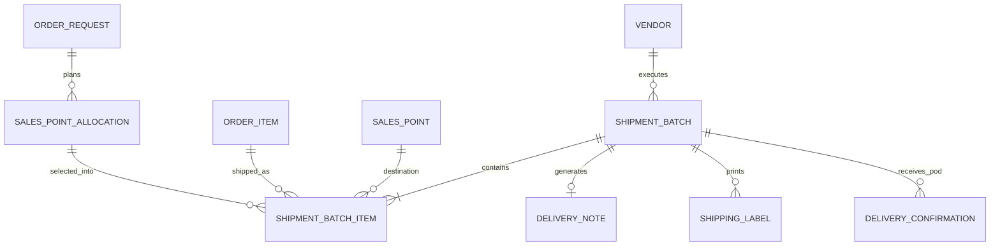

# Shipment Batch API Contract

Canonical TypeScript-first contract for physical POSM shipment events. Shipment Batch is the logistics source of truth for shipped quantities, batch-scoped Delivery Notes, labels, dispatch state, POD submission, and received quantity derivation.

## 1. Entity Overview

### Business purpose

Shipment Batch converts outstanding Sales Point Allocation quantities into concrete shipment lines. A batch may include one Sales Point, many Sales Points, one SKU, or many SKUs. It supports partial shipment by allowing each batch line quantity to be less than the remaining allocation quantity.

### Ownership

- Primary execution owner: Vendor assigned to the source Order Request.
- Administrative owner: Admin can review, correct, verify POD, close, and reopen with reason.
- Operator may prepare batches and documents when delegated.
- Analyst and Client receive read-only visibility within scope.

### Lifecycle

1. Draft batch is created from eligible outstanding Sales Point Allocations.
2. Batch is validated and moved to `READY`.
3. Delivery Note and labels are generated from batch items.
4. Batch is marked `DISPATCHED` and optionally `IN_TRANSIT`.
5. Vendor uploads POD and claimed received quantities.
6. Admin verifies POD, producing partial or full received state.
7. Batch is closed when POD is verified and exceptions are resolved.

### Relationships with other entities

- Shipment Batch belongs to exactly one Order Request in V2.
- Shipment Batch contains many Shipment Batch Items.
- Shipment Batch Item references one Sales Point Allocation and one Order Item/Product.
- Shipment Batch may include many Sales Points.
- Shipment Batch generates at most one active Delivery Note.
- Shipment Batch owns Delivery Confirmations/POD records.

## 2. TypeScript Interfaces

```ts
export type ID = string;
export type ISODateString = string;
export type ISODateTimeString = string;
export type Quantity = number;

export interface EntityReference {
  id: ID;
  code?: string;
  name: string;
}

export interface ShipmentBatch {
  id: ID;
  batchNumber: string;
  orderRequestId: ID;
  orderRequestNumber: string;
  clientPoNumber: string | null;
  client: EntityReference;
  project: EntityReference;
  vendor: EntityReference;
  status: ShipmentBatchStatus;
  deliveryNoteId?: ID;
  deliveryNoteNumber?: string;
  deliveryNoteStatus?: DeliveryNoteStatus;
  labelStatus: ShippingLabelStatus;
  podStatus: PodStatus;
  plannedDispatchDate?: ISODateString;
  dispatchedAt?: ISODateTimeString;
  inTransitAt?: ISODateTimeString;
  receivedAt?: ISODateTimeString;
  closedAt?: ISODateTimeString;
  closedByUserId?: ID;
  closureReason?: string;
  senderSnapshot: ShipmentPartySnapshot;
  destinationSnapshots: ShipmentDestinationSnapshot[];
  items: ShipmentBatchItem[];
  quantitySummary: ShipmentBatchQuantitySummary;
  exceptionSummary: ShipmentBatchExceptionSummary;
  carrier?: CarrierSnapshot;
  extension: ShipmentBatchExtensionFields;
  audit: AuditStamp;
  version: number;
}

export interface ShipmentBatchItem {
  id: ID;
  shipmentBatchId: ID;
  orderRequestId: ID;
  orderItemId: ID;
  salesPointAllocationId: ID;
  product: ProductSnapshot;
  salesPoint: SalesPointSnapshot;
  allocatedQuantity: Quantity;
  previouslyShippedQuantity: Quantity;
  outstandingBeforeBatchQuantity: Quantity;
  shippedQuantity: Quantity;
  verifiedReceivedQuantity: Quantity;
  claimedReceivedQuantity?: Quantity;
  outstandingAfterBatchQuantity: Quantity;
  varianceQuantity: Quantity;
  status: ShipmentBatchItemStatus;
  podStatus: PodStatus;
  packageCount?: number;
  labelIds: ID[];
  remarks?: string;
}

export interface ShipmentBatchSummary {
  id: ID;
  batchNumber: string;
  orderRequestId: ID;
  orderRequestNumber: string;
  clientPoNumber: string | null;
  clientName: string;
  projectName: string;
  vendorName: string;
  status: ShipmentBatchStatus;
  deliveryNoteStatus?: DeliveryNoteStatus;
  podStatus: PodStatus;
  salesPointCount: number;
  itemCount: number;
  shippedQuantity: Quantity;
  receivedQuantity: Quantity;
  varianceQuantity: Quantity;
  plannedDispatchDate?: ISODateString;
  dispatchedAt?: ISODateTimeString;
  hasPartialShipment: boolean;
  hasPartialDelivery: boolean;
  hasException: boolean;
}

export interface ShipmentPartySnapshot {
  name: string;
  address: string;
  phone?: string;
  email?: string;
  contactName?: string;
}

export interface ShipmentDestinationSnapshot {
  salesPointId: ID;
  salesPointCode: string;
  wCode: string;
  salesPointName: string;
  clientId: ID;
  clientName: string;
  zone: string;
  region: string;
  area: string;
  subArea: string;
  address: string;
  deliveryInstructions?: string;
  contacts: SalesPointContactSnapshot[];
}

export interface SalesPointContactSnapshot {
  contactId?: ID;
  name: string;
  role: SalesPointContactRole;
  phone?: string;
  email?: string;
  isPrimary: boolean;
}

export interface ProductSnapshot {
  productId: ID;
  sku: string;
  materialCode: string;
  name: string;
  description?: string;
  specification?: string;
  unitOfMeasure: UnitOfMeasure;
}

export interface SalesPointSnapshot {
  salesPointId: ID;
  code: string;
  wCode: string;
  name: string;
  zone: string;
  region: string;
  area: string;
  subArea: string;
}

export interface ShipmentBatchQuantitySummary {
  allocatedContextQuantity: Quantity;
  shippedQuantity: Quantity;
  claimedReceivedQuantity: Quantity;
  verifiedReceivedQuantity: Quantity;
  varianceQuantity: Quantity;
  receiptProgressPercent: number;
  salesPointCount: number;
  itemCount: number;
  partialShipmentLineCount: number;
  partialDeliveryLineCount: number;
}

export interface ShipmentBatchExceptionSummary {
  hasException: boolean;
  exceptionCount: number;
  highestSeverity?: ExceptionSeverity;
  unresolvedReasons: string[];
}

export interface CarrierSnapshot {
  carrierName?: string;
  driverName?: string;
  driverPhone?: string;
  vehicleNumber?: string;
  trackingNumber?: string;
}

export interface AuditStamp {
  createdAt: ISODateTimeString;
  createdByUserId: ID;
  updatedAt: ISODateTimeString;
  updatedByUserId: ID;
}

export interface ShipmentBatchExtensionFields {
  podUpload?: PodUploadBatchExtension;
  installationVerification?: InstallationVerificationBatchExtension;
  invoiceReconciliation?: InvoiceReconciliationBatchExtension;
  vendorScorecard?: VendorScorecardBatchExtension;
  sapCoupaIntegration?: IntegrationBatchExtension;
}

export interface PodUploadBatchExtension {
  podDeadline?: ISODateString;
  requiredEvidenceTypes?: PodEvidenceType[];
}

export interface InstallationVerificationBatchExtension {
  installationRequiredForSalesPointIds?: ID[];
  installationTicketIds?: ID[];
}

export interface InvoiceReconciliationBatchExtension {
  billableShipmentQuantity?: Quantity;
  shipmentCostEstimate?: number;
  invoiceLineReference?: string;
}

export interface VendorScorecardBatchExtension {
  dispatchSlaMet?: boolean;
  podSlaMet?: boolean;
  deliveryVariancePenalty?: number;
}

export interface IntegrationBatchExtension {
  externalShipmentId?: string;
  externalDeliveryId?: string;
  syncStatus?: IntegrationSyncStatus;
  lastSyncedAt?: ISODateTimeString;
}
```

## 3. Enums

```ts
export enum ShipmentBatchStatus {
  DRAFT = "DRAFT",
  READY = "READY",
  DISPATCHED = "DISPATCHED",
  IN_TRANSIT = "IN_TRANSIT",
  PARTIALLY_RECEIVED = "PARTIALLY_RECEIVED",
  FULLY_RECEIVED = "FULLY_RECEIVED",
  CLOSED = "CLOSED",
}

export enum ShipmentBatchItemStatus {
  DRAFT = "DRAFT",
  READY = "READY",
  SHIPPED = "SHIPPED",
  PARTIALLY_RECEIVED = "PARTIALLY_RECEIVED",
  FULLY_RECEIVED = "FULLY_RECEIVED",
  VARIANCE = "VARIANCE",
  CANCELLED = "CANCELLED",
}

export enum DeliveryNoteStatus {
  GENERATED = "GENERATED",
  PRINTED = "PRINTED",
  SIGNED = "SIGNED",
  UPLOADED = "UPLOADED",
  VERIFIED = "VERIFIED",
  CLOSED = "CLOSED",
}

export enum ShippingLabelStatus {
  NOT_GENERATED = "NOT_GENERATED",
  GENERATED = "GENERATED",
  PRINTED = "PRINTED",
  VOIDED = "VOIDED",
}

export enum PodStatus {
  PENDING_UPLOAD = "PENDING_UPLOAD",
  SUBMITTED = "SUBMITTED",
  VERIFIED = "VERIFIED",
  REJECTED = "REJECTED",
  CORRECTION_REQUESTED = "CORRECTION_REQUESTED",
  VARIANCE = "VARIANCE",
}

export enum AllocationStatus {
  NOT_SHIPPED = "NOT_SHIPPED",
  PARTIALLY_SHIPPED = "PARTIALLY_SHIPPED",
  FULLY_SHIPPED = "FULLY_SHIPPED",
  PARTIALLY_RECEIVED = "PARTIALLY_RECEIVED",
  FULLY_RECEIVED = "FULLY_RECEIVED",
  EXCEPTION = "EXCEPTION",
}

export enum UnitOfMeasure {
  PCS = "PCS",
  SET = "SET",
  BOX = "BOX",
  ROLL = "ROLL",
  PACK = "PACK",
}

export enum SalesPointContactRole {
  ARA = "ARA",
  SRE = "SRE",
  SPV_DPC = "SPV_DPC",
  RECEIVER = "RECEIVER",
  LOGISTICS = "LOGISTICS",
  OTHER = "OTHER",
}

export enum ExceptionSeverity {
  INFO = "INFO",
  WARNING = "WARNING",
  CRITICAL = "CRITICAL",
}

export enum PodEvidenceType {
  SIGNED_DN = "SIGNED_DN",
  POD_PHOTO = "POD_PHOTO",
  RECEIVER_STAMP = "RECEIVER_STAMP",
  INSTALLATION_PHOTO = "INSTALLATION_PHOTO",
}

export enum IntegrationSyncStatus {
  NOT_SYNCED = "NOT_SYNCED",
  SYNCED = "SYNCED",
  FAILED = "FAILED",
  CONFLICT = "CONFLICT",
}
```

## 4. Validation Rules

### Required fields

- `orderRequestId`, `vendor.id`, and at least one `ShipmentBatchItem` are required before `READY`.
- Each batch item requires `salesPointAllocationId`, `orderItemId`, `product`, `salesPoint`, and `shippedQuantity`.
- `shippedQuantity` must be greater than zero.
- Dispatch requires at least one item, generated Delivery Note when DN policy is required, and generated labels when label policy is required.

### Optional fields

- `plannedDispatchDate`, `carrier`, `packageCount`, `remarks`, and extension fields are optional for draft batches.
- `claimedReceivedQuantity` is optional until POD is submitted.
- `verifiedReceivedQuantity` remains zero until Admin verification.

### Uniqueness constraints

- `batchNumber` must be globally unique.
- `ShipmentBatchItem.id` must be unique globally.
- A batch cannot contain duplicate lines for the same `(salesPointAllocationId, product.materialCode)` unless an explicit split/package reason is stored.
- A Shipment Batch can have only one active Delivery Note.

### Status transition rules

- Allowed main path: `DRAFT -> READY -> DISPATCHED -> IN_TRANSIT -> PARTIALLY_RECEIVED | FULLY_RECEIVED -> CLOSED`.
- `IN_TRANSIT` is optional.
- `PARTIALLY_RECEIVED` is entered when verified received quantity is greater than zero but lower than shipped quantity on any line.
- `FULLY_RECEIVED` is entered when verified received quantity equals shipped quantity for all lines.
- `CLOSED` requires verified POD or approved exception resolution.
- Draft cancellation/deletion is allowed only before dispatch and when document policy permits.
- Reopening `CLOSED` requires Admin role and correction reason.

### Business validation rules

- Batch must reference exactly one source Order Request.
- Batch may include multiple Sales Points and multiple products from that order.
- Same allocation may appear in multiple batches until fully shipped.
- Batch quantity cannot exceed allocation outstanding quantity.
- Batch quantity cannot exceed production-ready quantity when readiness gating is enabled.
- Dispatched batch quantities cannot be edited without Admin correction.
- Vendor can update only batches assigned to its vendor account.
- Address/contact snapshots must be captured at batch creation/document generation time.

## 5. Relationship Diagram



## 6. API DTO Contracts

```ts
export interface CreateShipmentBatchDto {
  orderRequestId: ID;
  plannedDispatchDate?: ISODateString;
  carrier?: CarrierSnapshot;
  items: CreateShipmentBatchItemDto[];
  generateDeliveryNote?: boolean;
  generateLabels?: boolean;
  remarks?: string;
}

export interface CreateShipmentBatchItemDto {
  salesPointAllocationId: ID;
  orderItemId: ID;
  shippedQuantity: Quantity;
  packageCount?: number;
  remarks?: string;
}

export interface UpdateShipmentBatchDto {
  plannedDispatchDate?: ISODateString | null;
  carrier?: CarrierSnapshot | null;
  items?: UpdateShipmentBatchItemDto[];
  remarks?: string | null;
  expectedVersion: number;
}

export interface UpdateShipmentBatchItemDto {
  id: ID;
  shippedQuantity?: Quantity;
  packageCount?: number | null;
  remarks?: string | null;
}

export interface MarkShipmentBatchReadyDto {
  shipmentBatchId: ID;
  generateDeliveryNote: boolean;
  generateLabels: boolean;
  expectedVersion: number;
}

export interface DispatchShipmentBatchDto {
  shipmentBatchId: ID;
  dispatchedAt: ISODateTimeString;
  carrier?: CarrierSnapshot;
  expectedVersion: number;
}

export interface CloseShipmentBatchDto {
  shipmentBatchId: ID;
  closedAt: ISODateTimeString;
  closureReason?: string;
  expectedVersion: number;
}

export interface ReopenShipmentBatchDto {
  shipmentBatchId: ID;
  reason: string;
  expectedVersion: number;
}

export interface ShipmentBatchListQuery {
  search?: string;
  orderRequestId?: ID;
  vendorId?: ID;
  clientId?: ID;
  projectId?: ID;
  salesPointId?: ID;
  productId?: ID;
  status?: ShipmentBatchStatus[];
  deliveryNoteStatus?: DeliveryNoteStatus[];
  podStatus?: PodStatus[];
  dispatchDateFrom?: ISODateString;
  dispatchDateTo?: ISODateString;
  partialShipmentOnly?: boolean;
  partialDeliveryOnly?: boolean;
  exceptionOnly?: boolean;
  page?: number;
  pageSize?: number;
  sort?: ShipmentBatchSortField;
  sortDirection?: SortDirection;
}

export interface ShipmentBatchListResponse {
  rows: ShipmentBatchListRow[];
  page: number;
  pageSize: number;
  totalRows: number;
  totalPages: number;
  summary: ShipmentBatchDashboardSummary;
}

export interface ShipmentBatchDetailResponse {
  batch: ShipmentBatch;
  permissions: ShipmentBatchPermissions;
  relatedDeliveryNote?: {
    id: ID;
    deliveryNoteNumber: string;
    status: DeliveryNoteStatus;
  };
}

export interface ShipmentBatchPermissions {
  canEditDraft: boolean;
  canMarkReady: boolean;
  canGenerateDeliveryNote: boolean;
  canPrintDeliveryNote: boolean;
  canPrintLabels: boolean;
  canDispatch: boolean;
  canUploadPod: boolean;
  canVerifyPod: boolean;
  canClose: boolean;
  canReopen: boolean;
}

export enum ShipmentBatchSortField {
  BATCH_NUMBER = "batchNumber",
  ORDER_REQUEST_NUMBER = "orderRequestNumber",
  CLIENT_PO = "clientPoNumber",
  VENDOR_NAME = "vendorName",
  CLIENT_NAME = "clientName",
  PROJECT_NAME = "projectName",
  SALES_POINT_COUNT = "salesPointCount",
  ITEM_COUNT = "itemCount",
  SHIPPED_QUANTITY = "shippedQuantity",
  RECEIVED_QUANTITY = "receivedQuantity",
  DISPATCH_DATE = "dispatchedAt",
  STATUS = "status",
  DELIVERY_NOTE_STATUS = "deliveryNoteStatus",
  POD_STATUS = "podStatus",
}

export enum SortDirection {
  ASC = "ASC",
  DESC = "DESC",
}
```

## 7. Table View Models

```ts
export interface ShipmentBatchListRow {
  id: ID;
  batchNumber: string;
  orderRequestId: ID;
  orderRequestNumber: string;
  clientPoNumber: string | null;
  vendorName: string;
  clientName: string;
  projectName: string;
  salesPointCount: number;
  itemCount: number;
  shippedQuantity: Quantity;
  receivedQuantity: Quantity;
  varianceQuantity: Quantity;
  plannedDispatchDate?: ISODateString;
  dispatchedAt?: ISODateTimeString;
  status: ShipmentBatchStatus;
  deliveryNoteStatus?: DeliveryNoteStatus;
  podStatus: PodStatus;
  hasPartialShipment: boolean;
  hasPartialDelivery: boolean;
  hasException: boolean;
  actionTargets: {
    detailPath: string;
    deliveryNotePrintPath?: string;
    labelsPrintPath?: string;
    podPath?: string;
  };
}

export interface ShipmentBatchItemTableRow {
  id: ID;
  salesPointCode: string;
  salesPointName: string;
  productCode: string;
  productName: string;
  allocatedQuantity: Quantity;
  previouslyShippedQuantity: Quantity;
  shippedQuantity: Quantity;
  verifiedReceivedQuantity: Quantity;
  varianceQuantity: Quantity;
  podStatus: PodStatus;
  remarks?: string;
}

export type ShipmentBatchFilterField =
  | "search"
  | "vendorId"
  | "clientId"
  | "projectId"
  | "status"
  | "deliveryNoteStatus"
  | "podStatus"
  | "dispatchDateRange"
  | "partialShipmentOnly"
  | "partialDeliveryOnly"
  | "exceptionOnly"
  | "salesPointId"
  | "productId";

export const shipmentBatchListColumns = [
  "batchNumber",
  "orderRequestNumber",
  "clientPoNumber",
  "vendorName",
  "clientName",
  "projectName",
  "salesPointCount",
  "itemCount",
  "shippedQuantity",
  "receivedQuantity",
  "dispatchedAt",
  "status",
  "deliveryNoteStatus",
  "podStatus",
  "actions",
] as const;
```

## 8. Dashboard View Models

```ts
export interface ShipmentBatchDashboardSummary {
  totalBatches: number;
  draftBatches: number;
  readyBatches: number;
  dispatchedBatches: number;
  inTransitBatches: number;
  partiallyReceivedBatches: number;
  fullyReceivedBatches: number;
  closedBatches: number;
  totalShippedQuantity: Quantity;
  totalReceivedQuantity: Quantity;
  totalVarianceQuantity: Quantity;
  partialShipmentBatchCount: number;
  partialDeliveryBatchCount: number;
  missingPodBatchCount: number;
  exceptionBatchCount: number;
  averageReceiptProgressPercent: number;
}

export interface DistributionDashboardSummary {
  allocatedQuantity: Quantity;
  shippedQuantity: Quantity;
  receivedQuantity: Quantity;
  deliveryProgressPercent: number;
  deliverySuccessRate: number;
  dispatchedSalesPoints: number;
  fullyReceivedSalesPoints: number;
  pendingSalesPoints: number;
  activeShipmentBatches: number;
  openDistributionExceptions: number;
}

export interface VendorShipmentDashboardSummary {
  vendorId: ID;
  assignedOpenOrders: number;
  readyToShipQuantity: Quantity;
  activeBatches: number;
  pendingPodUploads: number;
  rejectedPodCount: number;
  dispatchSlaAtRiskCount: number;
}
```

## 9. Sample JSON Payloads

### Create Shipment Batch with multiple Sales Points and partial shipment

```json
{
  "orderRequestId": "or_2026_000418",
  "plannedDispatchDate": "2026-03-18",
  "carrier": {
    "carrierName": "PMG Contract Logistics",
    "driverName": "Andi Pratama",
    "driverPhone": "+6281211100099",
    "vehicleNumber": "BK 8123 PMG",
    "trackingNumber": "PMG-SUM-20260318-07"
  },
  "generateDeliveryNote": true,
  "generateLabels": true,
  "remarks": "First partial shipment for Medan and Meulaboh. Aceh remaining quantity will ship in Batch 2.",
  "items": [
    {
      "salesPointAllocationId": "alloc_000181",
      "orderItemId": "item_001",
      "shippedQuantity": 300,
      "packageCount": 6
    },
    {
      "salesPointAllocationId": "alloc_000182",
      "orderItemId": "item_002",
      "shippedQuantity": 150,
      "packageCount": 5
    },
    {
      "salesPointAllocationId": "alloc_000183",
      "orderItemId": "item_001",
      "shippedQuantity": 120,
      "packageCount": 3,
      "remarks": "Partial shipment: 80 banners remain outstanding."
    },
    {
      "salesPointAllocationId": "alloc_000184",
      "orderItemId": "item_003",
      "shippedQuantity": 300,
      "packageCount": 10
    }
  ]
}
```

### Shipment Batch response after partial delivery verification

```json
{
  "id": "batch_2026_00077",
  "batchNumber": "BATCH-20260318-0077",
  "orderRequestId": "or_2026_000418",
  "orderRequestNumber": "OR-2026-000418",
  "clientPoNumber": "PO-HMS-2026-00418",
  "status": "PARTIALLY_RECEIVED",
  "deliveryNoteId": "dn_2026_00161",
  "deliveryNoteNumber": "DEL202603180161",
  "deliveryNoteStatus": "VERIFIED",
  "labelStatus": "PRINTED",
  "podStatus": "VARIANCE",
  "dispatchedAt": "2026-03-18T02:30:00.000Z",
  "quantitySummary": {
    "allocatedContextQuantity": 870,
    "shippedQuantity": 870,
    "claimedReceivedQuantity": 865,
    "verifiedReceivedQuantity": 865,
    "varianceQuantity": -5,
    "receiptProgressPercent": 99.43,
    "salesPointCount": 2,
    "itemCount": 4,
    "partialShipmentLineCount": 1,
    "partialDeliveryLineCount": 1
  },
  "items": [
    {
      "id": "sbi_000301",
      "salesPointAllocationId": "alloc_000183",
      "orderItemId": "item_001",
      "product": {
        "productId": "prod_veev_banner_a2",
        "sku": "VEEV-BAN-A2",
        "materialCode": "MAT-VEV-BA2",
        "name": "VEEV A2 Counter Banner",
        "unitOfMeasure": "PCS"
      },
      "salesPoint": {
        "salesPointId": "sp_dpc_meulaboh_014",
        "code": "SP-ACEH-014",
        "wCode": "W-ACEH-014",
        "name": "DPC Meulaboh",
        "zone": "Sumatra",
        "region": "Aceh",
        "area": "Meulaboh",
        "subArea": "Meulaboh Barat"
      },
      "allocatedQuantity": 200,
      "previouslyShippedQuantity": 0,
      "outstandingBeforeBatchQuantity": 200,
      "shippedQuantity": 120,
      "verifiedReceivedQuantity": 115,
      "claimedReceivedQuantity": 115,
      "outstandingAfterBatchQuantity": 80,
      "varianceQuantity": -5,
      "status": "VARIANCE",
      "podStatus": "VARIANCE",
      "labelIds": ["label_00811", "label_00812", "label_00813"],
      "remarks": "Five banners damaged on arrival."
    }
  ]
}
```

## 10. Future Extension Points

```ts
export interface ShipmentBatchFutureExtensions {
  podUpload: PodUploadBatchExtension;
  installationVerification: InstallationVerificationBatchExtension;
  invoiceReconciliation: InvoiceReconciliationBatchExtension;
  vendorScorecard: VendorScorecardBatchExtension;
  sapCoupaIntegration: IntegrationBatchExtension;
}
```

- POD Upload: batch extension stores evidence requirements and deadline; actual POD records live in Delivery Confirmation.
- Installation Verification: batch may reserve installation ticket IDs for Sales Points that require field installation after delivery.
- Invoice Reconciliation: shipment quantity and cost fields support future invoice line matching.
- Vendor Scorecard: SLA and variance fields support vendor performance metrics without changing batch core fields.
- SAP/Coupa Integration: external shipment/delivery IDs support outbound dispatch and receipt sync.
