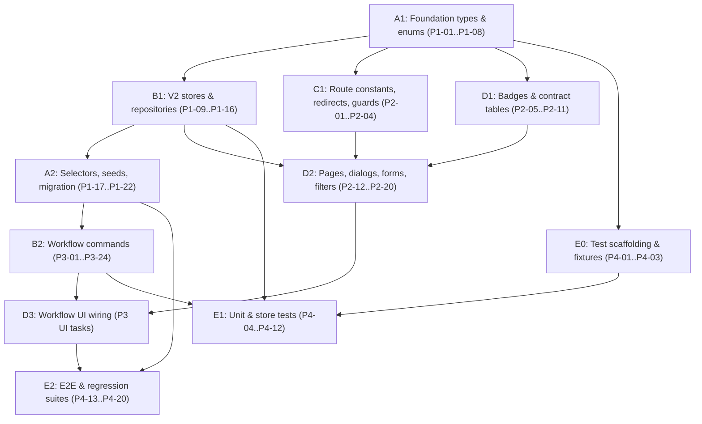

# 00 - Master Execution Plan

Status: Approved for autonomous implementation
Sources: `AGENTS.md`, `docs/specs/*`, `docs/api-contracts/*`, `docs/implementation/*`, `docs/review/*`, `docs/remediation/00-master-gap-register.md`, `docs/v2-architecture-package.md`, `docs/v2-domain-model.md`, `docs/v2-status-lifecycle.md`, `docs/ui-architecture-v2.md`, `docs/ui-migration-plan.md`, `docs/screen-inventory-v2.md`, `docs/page-entity-matrix.md`

## Roadmap Overview

| Phase | Name | Detail Document | Gate |
| --- | --- | --- | --- |
| 1 | Foundation | `docs/execution/01-phase-1-foundation.md` | All V2 types/enums compile; V2 stores own their aggregates; seeds migrate idempotently; `npm run build` green |
| 2 | UI Refactor | `docs/execution/02-phase-2-ui-refactor.md` | Canonical routes live with redirects; all status badge families render; tables bound to contract view models |
| 3 | Workflow Implementation | `docs/execution/03-phase-3-workflow-implementation.md` | All six workflows executable end-to-end on mock stores with audit events and exception blockers |
| 4 | Testing & Stabilization | `docs/execution/04-phase-4-testing-hardening.md` | Unit/store/E2E/regression suites green; parity fixtures pass; readiness thresholds met |

Guardrails (from `docs/ui-migration-plan.md`):

- Do not replace the app shell (`Sidebar`, `Header`, `ContentArea`).
- Do not introduce a new component library; shadcn/ui + Tailwind v4 + `cn()` only.
- Do not make Delivery Notes order-scoped in new screens; DN belongs to Shipment Batch.
- Do not collapse production and distribution into one status.
- Do not remove legacy order print routes until compatibility behavior exists.
- Admin is verification owner; Vendor is execution owner.

---

## Phase 1 - Foundation

### Objectives

- Implement the V2 domain model exactly as defined in `docs/api-contracts/*` and `docs/v2-domain-model.md`.
- Replace the single `orderStore` aggregate ownership with module-owned stores per `docs/implementation/02-state-management-refactor.md`.
- Implement shared foundation contracts (`CommandMetadata`, `MutationResponse`, `ApiError`, idempotency, `expectedVersion`) from `docs/api-contracts/shared-foundation-api.md`.
- Implement remediation-mandated aggregates: `OperationalException` (CR-01), `AuditEvent`/`DomainEvent` (CR-02), `ShippingPackage`/`ShippingLabel` (CR-03), `WorkflowPolicy` (CR-04), `FileAsset` (CR-05).
- Migrate mock data and localStorage seeds idempotently per `docs/implementation/05-data-migration.md`.

### Deliverables

- `src/lib/types/v2/*` contract-shaped types and enums.
- V2 stores: `orderRequestStore`, `salesPointStore`, `productionStore`, `shipmentBatchStore`, `deliveryNoteStore`, `podStore`, `exceptionStore`, `policyStore`, `fileAssetStore`, `auditEventStore`, `labelStore`.
- Repository adapter layer (localStorage now, API-swappable later).
- Derived selectors for `DistributionStatus`, `AllocationStatus`, `PodStatus`, completion rule.
- Normalized seed builders and migration manifest with idempotent re-run support.

### Dependencies

- None external. Internal ordering: shared foundation types -> entity types -> stores -> selectors -> seeds.

### Risks

| Risk | Mitigation |
| --- | --- |
| Derived state drift between stores (CR-07) | Summaries/statuses are read projections only; selectors compute from source aggregates; parity tests in Phase 4 |
| Migration corrupts shipped/received meaning (CR-09) | Compatibility batch semantics; never overwrite `va-trace-orders`; migration manifest + read-only reverse migration |
| Circular store updates | Event-driven projection rebuilds; stores never write into each other directly |
| Contract divergence from docs | Types copied verbatim from `docs/api-contracts/*`; build gate enforces compile parity |

### Validation Criteria

- `npm run build` (tsc) passes with all V2 types in place.
- Migration runs twice with identical output (idempotency check).
- Legacy `va-trace-orders` key untouched after migration; V2 keys populated; manifest recorded.
- Each store owns exactly the aggregates listed in `docs/implementation/02-state-management-refactor.md`; no cross-store writes.

### Rollback Strategy

- All V2 stores use new localStorage keys; rollback = delete V2 keys + migration manifest, app falls back to `orderStore` reading `va-trace-orders`.
- Feature flag `v2DomainEnabled` in a single config module gates V2 store reads from UI.
- No file deletions in Phase 1; legacy modules (`orderDomain.ts`, `orderStatus.ts`, `deliveryNote.ts`) remain frozen compatibility layers.

---

## Phase 2 - UI Refactor

### Objectives

- Implement canonical route constants and the redirect table from `docs/implementation/03-routing-refactor.md` (HI-10).
- Extend `Sidebar` navigation for Admin logistics (Shipments, Delivery Notes, POD) and Vendor execution queues.
- Build the status badge families, contract-bound tables, dialogs, forms, and filters from `docs/implementation/04-ui-component-refactor.md`.
- Add the missing screens from HI-11: exceptions register, label register, production queue, client order list, vendor POD correction queue.

### Deliverables

- `src/lib/routes.ts` canonical route constants + redirect map.
- Role/permission route guards backed by `authStore` and `AuthorizationScope` (CR-08).
- 7 badge components, 9 contract-bound tables, workflow dialogs/drawers, filter presets via `FilterSection`.
- Refactored `AllOrders`, `OrderDetail` (tabbed command center), `LogisticsList` replacement, `SalesPointList` + detail.

### Dependencies

- Phase 1 types, enums, and read selectors (badges/tables bind to contract view models).
- Route guards depend on Phase 1 `policyStore` and scope model.

### Risks

| Risk | Mitigation |
| --- | --- |
| Broken bookmarks/legacy routes | Redirect table live before any route removal; compatibility selectors for order-scoped print routes |
| 10,000+ Sales Point table performance (HI-09) | `@tanstack/react-virtual` on Sales Point/allocation tables from first render |
| Status color sprawl | Only documented tokens: success `#10B981`, warning `#F59E0B`, processing `#3B82F6`, destructive, secondary |
| Mobile dense tables (MED-08) | Horizontal scroll, compact filters, sticky columns per `AGENTS.md` responsive rules |

### Validation Criteria

- Every route in the target route map resolves; every legacy route redirects per the table.
- All badge components render every enum member of their status family without fallback styling.
- Tables show empty/loading/error states; virtualized tables handle 10k-row fixtures.
- `npm run lint` and `npm run build` green.

### Rollback Strategy

- New routes are additive; rollback = remove new `<Route>` entries and nav groups, legacy routes still function.
- Refactored pages keep legacy render path behind the `v2DomainEnabled` flag until Phase 3 sign-off.

---

## Phase 3 - Workflow Implementation

### Objectives

- Implement the six operational workflows end-to-end: Order Request, Production, Shipment Batch, Delivery Note, Sales Point Allocation, POD.
- Enforce lifecycle transition guards from `docs/v2-status-lifecycle.md` and `docs/specs/01..06` (HI-06).
- Enforce policy-driven validation via `WorkflowPolicy` (CR-04) and exception blockers via `OperationalException` (CR-01).
- Emit `AuditEvent`/`DomainEvent` from every mutating command (CR-02).

### Deliverables

- Command functions per store implementing each workflow step with `expectedVersion` + `idempotencyKey`.
- Batch eligibility/reservation semantics (HI-13), DN versioning/supersession (HI-07), POD attempt history + idempotent verification (CR-06).
- Wired UI: creation wizards, vendor workbench, batch dialogs, POD upload/verification drawers.

### Dependencies

- Phase 1 stores and Phase 2 screens/components. Workflows land in the strict sequence defined in `docs/execution/03-phase-3-workflow-implementation.md` because each consumes the previous workflow's outputs.

### Risks

| Risk | Mitigation |
| --- | --- |
| Quantity math errors across allocation/batch/POD | Single derivation module for quantity selectors; unit-tested before UI wiring |
| Concurrent batch edits over-reserving allocations (HI-13) | `ShipmentReservation` semantics + `expectedVersion` conflict errors |
| POD resubmission corrupting received quantities (CR-06) | Immutable `DeliveryConfirmationAttempt` history; verification reversal command |
| Close/complete with open blockers | Closure blocked while open blocking `OperationalException` exists unless policy waiver recorded |

### Validation Criteria

- Each workflow demo-executable on seeds: create order -> production -> batch -> DN -> dispatch -> POD -> verify -> derived statuses update.
- Every mutating command appends audit events and returns `MutationResponse` with side effects.
- Invalid transitions rejected with contract `ApiError` shapes.
- Completion rule holds: production `COMPLETED` + distribution `FULLY_RECEIVED` + all allocations verified received.

### Rollback Strategy

- Commands are store-scoped; a defective workflow is disabled by reverting its command exports and hiding its UI actions, other workflows unaffected.
- Order completion derivation falls back to `legacyStatusLabel` display if derivation is flagged off.

---

## Phase 4 - Testing & Stabilization

### Objectives

- Implement the full test pyramid from `docs/implementation/06-testing-strategy.md` (closes HI-14, the 4 residual medium issues).
- Prove V1->V2 migration parity (CR-09) and projection parity (CR-07, MED-05).
- Regression-protect legacy routes and print views.

### Deliverables

- Unit tests for domain selectors, status mapping, quantity math.
- Store tests for command validation, persistence, migration, rollback.
- Playwright E2E for Admin/Vendor/Client workflows; regression suite for compatibility routes; 10k Sales Point scale fixtures.

### Dependencies

- Phases 1-3 complete for the surfaces under test. Test scaffolding (runner config, fixtures) can start in parallel with Phase 2.

### Risks

| Risk | Mitigation |
| --- | --- |
| No unit runner currently configured | Introduce Vitest (Vite-native) or pure-TS test modules per `docs/implementation/06-testing-strategy.md` |
| Flaky E2E from localStorage state | Per-test storage seeding/reset helpers; deterministic fixtures |
| Scale fixtures slow CI | Tag scale tests; run in dedicated CI job |

### Validation Criteria

- All acceptance criteria in `docs/execution/04-phase-4-testing-hardening.md` pass.
- `npm run build`, `npm run lint`, `npm test` green in CI.
- Migration parity fixtures: legacy seed -> migration -> derived statuses match expected snapshots; second run is a no-op.

### Rollback Strategy

- Tests are additive; no rollback needed. Failing gates block merge of the offending phase branch, not previously merged work.

---

# Parallel Agent Plan

| Agent | Domain | Owns (write access) | Must not touch |
| --- | --- | --- | --- |
| A | Domain Model | `src/lib/types/v2/*`, status enums, quantity/derivation selectors, seed builders, migration manifest | Stores' persistence internals, pages, routes |
| B | State Management | All V2 stores (`src/lib/*Store.ts` new modules), repository adapters, command functions, audit/event emission | Type definitions (consumes A), pages, routes |
| C | Routing | `src/App.tsx`, `src/lib/routes.ts`, redirects, route guards, `Sidebar` nav config | Store internals, domain types, ui primitives |
| D | UI Components | `src/components/ui/*` additions, `src/components/shared/*`, `src/components/domain/*`, pages in `src/pages/*` | Types, stores, route constants (consumes A/B/C) |
| E | Testing | `tests/*`, fixtures, unit/store test modules, Playwright specs, CI config | All `src/` production modules (read-only) |

## Ownership Boundaries

- Agent A is the only writer of contract types; B/C/D import from `src/lib/types/v2/*` and never redefine enums.
- Agent B is the only writer of localStorage keys and command functions; D calls commands but never mutates storage directly.
- Agent C owns `src/App.tsx` exclusively to avoid the highest-traffic merge conflict file; D registers pages by exporting them, C wires routes.
- Shared file exceptions (require coordination): `src/components/layout/Sidebar.tsx` (C owns nav data, D owns rendering tweaks), `src/lib/mockData.ts` (A only, append-only compatibility exports).

## Merge Order

1. Agent A batch 1 (foundation types + enums) - everything depends on this.
2. Agent B batch 1 (stores + repositories) - after A batch 1.
3. Agent C batch 1 (route constants + redirects + guards) - after A batch 1; parallel with B batch 1.
4. Agent A batch 2 (selectors + seeds/migration) - after B batch 1 (needs store keys).
5. Agent D batch 1 (badges + tables) - after A batch 1; parallel with B/C.
6. Agent D batch 2 (pages + dialogs wired to stores) - after B batch 1 and C batch 1.
7. Agent B batch 2 (workflow commands, Phase 3) - after A batch 2.
8. Agent D batch 3 (workflow UI wiring, Phase 3) - after B batch 2.
9. Agent E (continuous): scaffolding after A batch 1; unit/store tests after each B batch; E2E after D batch 3.

## Conflict Risks

| File / Area | Agents | Mitigation |
| --- | --- | --- |
| `src/App.tsx` | C, D | C is sole writer; D submits page exports only |
| `src/components/layout/Sidebar.tsx` | C, D | Split nav item data (C) from component shell (D); merge C first |
| `src/lib/types/status.ts` legacy vs `types/v2` | A, B | Legacy file frozen; all new enums in `types/v2`; adapter functions in A's selector layer |
| `src/lib/orderStore.ts` | A, B | Read-only for both; compatibility writes only via B's adapter with A's mapping functions |
| `src/lib/mockData.ts` | A, B, E | Append-only; A merges first; E consumes fixtures from A's seed builders, never inline data |
| Badge/token CSS in `src/index.css` | D | Single writer (D); no new arbitrary colors permitted |

## Dependency Graph

Text form (batch X blocks batch Y):

- A1 blocks: B1, C1, D1, E0
- B1 blocks: A2, D2, E1
- C1 blocks: D2
- D1 blocks: D2
- A2 blocks: B2, E2
- B2 blocks: D3, E1 (workflow command tests)
- D2 blocks: D3
- D3 blocks: E2

Critical path: A1 -> B1 -> A2 -> B2 -> D3 -> E2.
