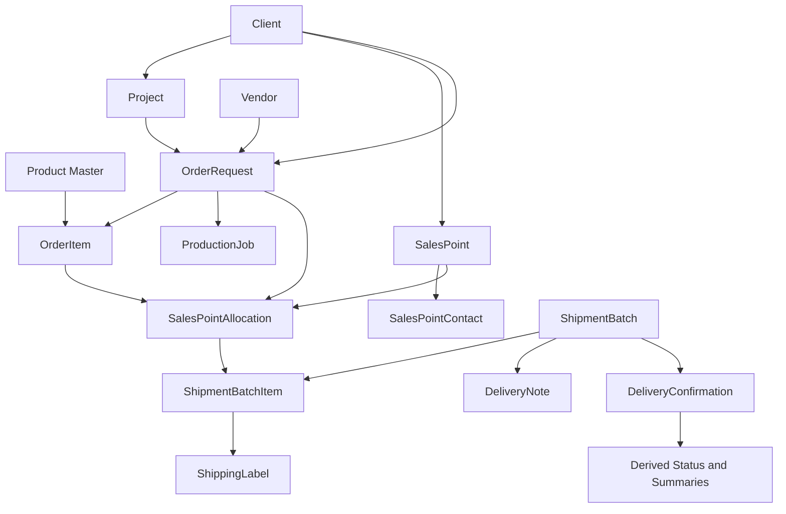

# 01 - Domain Model Refactor

## Purpose

This document defines the implementation-ready domain migration from the current order-centered V1/V1.5 model to the V2 Sales Point-centric distribution model described in `docs/v2-architecture-package.md`, `docs/v2-domain-model.md`, `docs/v2-status-lifecycle.md`, and `docs/api-contracts/*`.

The refactor must preserve the existing React/Tailwind/shadcn UI shell, preserve Admin/Vendor role separation, and keep legacy order routes functional while new domain ownership is introduced incrementally.

## Current State Analysis

### Existing entities

| Current entity | Location | Current responsibility | Target entity |
| --- | --- | --- | --- |
| `Order` | `src/lib/types/order.ts` | Mixed demand, production, allocation, shipment, labels, delivery notes, complaints. | `OrderRequest` |
| `OrderLine` | `src/lib/types/order.ts` | Product line plus V1 delivered quantity and label state. | `OrderItem` |
| `SalesPointMapping` | `src/lib/types/salesPoint.ts`, `src/lib/mock/salesPoints.ts`, `src/lib/salesPointSeed.ts` | Sales Point seed/master mapping used by order creation and print documents. | `SalesPoint` and `SalesPointContact` |
| `SalesPointAllocation` | `src/lib/types/order.ts` | Lightweight allocation derived from order line and one order-level `salesPointId`. | `SalesPointAllocation` |
| `ProductionJob` | `src/lib/types/order.ts` | Single production status record generated from order item status. | `ProductionJob` |
| `ShipmentBatch` | `src/lib/types/logistics.ts` | Embedded order child with simple items, status, and POD confirmations. | `ShipmentBatch` |
| `ShipmentItem` | `src/lib/types/logistics.ts` | Batch item linked to order line and Sales Point ID. | `ShipmentBatchItem` |
| `StoredDeliveryNoteRecord` | `src/lib/types/logistics.ts` | Stored DN generated from order labels, optionally linked to a batch. | `DeliveryNote` |
| `DeliveryConfirmation` | `src/lib/types/logistics.ts` | Embedded POD upload record with simplified `PodStatus`. | `DeliveryConfirmation` |
| `StoredPackagingLabel` | `src/lib/types/logistics.ts` | Order label generated from order line/delivery snapshot. | Shipping Label generated from `ShipmentBatchItem` |
| `Supplier` | `src/lib/supplierStore.ts` | Vendor-like master record. | `Vendor` reference |
| `Client` | `src/lib/clientStore.ts` | Client master data. | `Client` reference |
| `Project` | `src/lib/projectStore.ts` | Project name options. | `Project` reference |
| `OrderComplaint` | `src/lib/types/order.ts` | Quantity complaint/revision workflow. | `ExceptionState`, audit, POD variance, future exception records |

### Existing stores and domain utilities

| Current module | Current storage key / role | Migration treatment |
| --- | --- | --- |
| `orderStore.ts` | `va-trace-orders`; owns orders, embedded allocations, batches, labels, DNs, POD, complaints. | Keep as compatibility aggregate during Phase 1-3; progressively replace writes with V2 stores. |
| `orderDomain.ts` | Normalizes legacy orders into allocations and compatibility shipment batches. | Reuse as migration adapter, then freeze as legacy compatibility layer. |
| `orderStatus.ts` | Maps legacy status to production/distribution and derives delivery progress. | Split into V2 domain selectors plus legacy label adapter. |
| `deliveryNote.ts` | Generates order-scoped labels and DNs, with partial batch support. | Replace with batch-scoped document factory backed by `DeliveryNoteStore`. |
| `importStore.ts` | Bulk PO import workflow with order creation. | Update to produce `OrderRequest`, `OrderItem`, and `SalesPointAllocation` DTOs. |
| `clientStore.ts`, `projectStore.ts`, `supplierStore.ts`, `userStore.ts`, `authStore.ts` | Local master/account stores. | Keep with reference adapters; only change where V2 contracts require stable IDs/scope. |

### Existing mock data structures

| Current source | Content | Target use |
| --- | --- | --- |
| `src/lib/mock/orders.ts` | V1 order seeds with `clientPO`, `campaign`, `supplier`, order-level `salesPointId`, item-level `deliveredQuantity`. | Seed `OrderRequest`, `OrderItem`, compatibility allocations, and default compatibility batches where delivered quantities exist. |
| `src/lib/mock/salesPoints.ts` and `salesPointSeed.ts` | Sales Point geography, WCode, contacts, address-like fields, client binding. | Seed normalized `SalesPoint` and `SalesPointContact`. |
| `src/lib/mock/products.ts` | Product master-like data. | Seed `ProductReference`/Product Master references. |
| `src/lib/mock/suppliers.ts` | Supplier/vendor records. | Seed `VendorReference`. |

### Existing status model

| Current status | Current source | Target status |
| --- | --- | --- |
| `LegacyOrderStatus`: `New`, `In Production`, `Ready to Ship`, `On Delivery`, `Delivered`, `Completed`, `Overdue`, `Waiting` | `src/lib/types/status.ts` | Compatibility display only through `legacyStatusLabel`. |
| `ProductionStatus`: `NEW`, `SUBMITTED`, `ACCEPTED`, `PRINTING`, `FINISHING`, `QUALITY_CONTROL`, `READY_FOR_DISTRIBUTION`, `COMPLETED`, `CANCELLED` | Already present | Canonical production status. |
| `DistributionStatus`: `NOT_STARTED`, `PARTIALLY_DISTRIBUTED`, `FULLY_DISTRIBUTED`, `PARTIALLY_RECEIVED`, `FULLY_RECEIVED`, `EXCEPTION` | Already present | Canonical derived distribution status. |
| `ShipmentBatchStatus`: `DRAFT`, `READY`, `DISPATCHED`, `IN_TRANSIT`, `PARTIALLY_RECEIVED`, `FULLY_RECEIVED`, `CLOSED` | Already present | Canonical batch lifecycle. |
| `DeliveryNoteStatus`: `GENERATED`, `PRINTED`, `SIGNED`, `UPLOADED`, `VERIFIED`, `CLOSED` | Already present | Canonical document lifecycle. |
| `PodStatus`: currently `PENDING`, `UPLOADED`, `VERIFIED`, `REJECTED` | `src/lib/types/status.ts` | Replace with contract enum: `PENDING_UPLOAD`, `SUBMITTED`, `VERIFIED`, `REJECTED`, `CORRECTION_REQUESTED`, `VARIANCE`; `OrderRequest` also supports `NOT_REQUIRED`. |

### Current -> Target mapping

| Current | Target | Notes |
| --- | --- | --- |
| `Order` | `OrderRequest` | Preserve ID as `orderRequestNumber` where possible; introduce durable internal `id`. |
| `Order.id` | `OrderRequest.orderRequestNumber` and/or `id` | Avoid breaking route params until route compatibility is in place. |
| `campaign` | `project.name` | Map to a `ProjectReference`; create/match project by client and campaign name. |
| `clientPO` | `clientPoNumber` | Use `null` when absent, not empty string. |
| `supplier` | `vendor.name` | Resolve through supplier/vendor master data; create fallback vendor reference during seed migration. |
| `salesPointId` | `SalesPointAllocation.salesPoint.id` / `SalesPoint.wCode` | No V2 shipment should store only free-text or order-level destination. |
| `OrderLine` | `OrderItem` | `quantity` -> `orderedQuantity`; `productCode` -> `product.materialCode`; `status` -> `productionStatus`. |
| `deliveredQuantity` | Derived `receivedQuantity` | Only trusted after compatibility batch/POD migration; future updates from verified `DeliveryConfirmation`. |
| `labelGenerated` and `storedLabels` | Shipping Label records | Bind labels to `ShipmentBatchItem`, batch ID, DN number, Sales Point, and product. |
| Embedded `allocations` | `SalesPointAllocation` store | Normalize by allocation ID; derive shipped/received from batches and confirmations. |
| Embedded `shipmentBatches` | `ShipmentBatch` store | Normalize by batch ID; one batch belongs to exactly one order. |
| `StoredDeliveryNoteRecord` | `DeliveryNote` | One active DN per shipment batch; one order may have many DNs. |
| `DeliveryConfirmation` | `DeliveryConfirmation` contract | Add item confirmations, evidence, review decision, verified quantities. |
| `Store` wording in legacy screens | `SalesPoint` | Use Sales Point consistently. |
| `Delivery`/`LogisticsList` shipment rows | `ShipmentBatch` | Existing `/admin/logistics` becomes redirect or list shell for `/admin/logistics/shipments`. |

## Target Domain Model

The implementation must follow the API contracts exactly for canonical fields, enums, relationships, and DTOs. Local store models may add internal indexes, but public selectors and repository adapters must return contract-shaped objects.

### `OrderRequest`

Demand command center. Owns client, project, vendor, requester, source, priority, deadline, item lines, allocation list, derived quantity/document/exception summaries, and compatibility `legacyStatusLabel`.

Rules:

- Does not own shipped or received truth.
- Completion is derived only when `productionStatus = COMPLETED`, `distributionStatus = FULLY_RECEIVED`, and all allocated quantities are verified received.
- Cancelled orders cannot create new shipment batches or documents.

### `OrderItem`

POSM line item. Owns product reference, ordered quantity, production status, production ready/completed quantities, allocation totals, and notes.

Rules:

- `orderedQuantity > 0`.
- SKU/material code must resolve to Product Master or an explicit import mapping.
- Shipment quantities are derived from `ShipmentBatchItem`.

### `SalesPoint`

Governed destination master. Owns WCode/code/name, client binding, geography, address, delivery instructions, contacts, data quality, summaries, extensions, audit, and version.

Rules:

- Shipments, DNs, and labels must reference Sales Point IDs/snapshots, not free-text destinations.
- Master changes do not rewrite existing Delivery Note snapshots.

### `SalesPointContact`

Contact attached to a Sales Point. Owns role, phone/email, active/primary flags, notes, and audit.

Rules:

- At least one primary contact should exist before dispatch unless exception policy allows warning-only shipment.

### `SalesPointAllocation`

Planning bridge between demand and physical shipment. Owns order request, order item/product, Sales Point, allocated quantity, derived shipped/received/outstanding/remaining quantities, allocation status, POD status, batch IDs, DN IDs, exception state, audit, and version.

Rules:

- Uniqueness: `(orderRequestId, orderItemId, salesPointId)` for the active allocation version.
- Quantity cannot exceed ordered quantity when summed by product.
- Quantity cannot be reduced below already shipped quantity.
- Vendor may select outstanding quantities into batches but cannot edit original allocations.

### `ProductionJob`

Manufacturing execution generated from an Order Request. Owns status progression and item readiness.

Rules:

- Vendor updates production for assigned orders only.
- Readiness can gate batch creation when enabled.

### `ShipmentBatch`

Physical shipment event. Owns batch number, source order request, vendor, status, DN/label/POD status, destination snapshots, batch items, quantity summary, carrier, exceptions, audit, and version.

Rules:

- Belongs to exactly one Order Request.
- May include many Sales Points and products.
- Contains one or more `ShipmentBatchItem` records sourced from outstanding allocations.
- Can generate at most one active Delivery Note.
- Status main path: `DRAFT -> READY -> DISPATCHED -> IN_TRANSIT -> PARTIALLY_RECEIVED | FULLY_RECEIVED -> CLOSED`.

### `DeliveryNote`

Batch-scoped logistics document. Owns DN number, shipment batch ID, order request ID, immutable sender/destination snapshots, items sourced from batch items, signature fields, QR payload, files, status, quantity summary, audit, and version.

Rules:

- Never generated directly from total order quantities.
- One active Delivery Note per Shipment Batch.
- One Order Request may have many Delivery Notes through batches.
- DN shipped quantity must equal batch item shipped quantity.

### `DeliveryConfirmation`

POD record attached to a Shipment Batch and Sales Point. Owns receiver details, evidence, item confirmations, claimed/verified quantities, review status/reason, audit, and version.

Rules:

- Vendor creates/submits for assigned batch.
- Admin verifies, rejects, or requests correction.
- Verified quantities update shipment items, allocations, and derived distribution status.
- Rejected POD does not update received quantities.

## Dependency Graph



Implementation order:

```text
Client/Project/Vendor/Product references
-> SalesPoint
-> SalesPointContact
-> OrderRequest
-> OrderItem
-> ProductionJob
-> SalesPointAllocation
-> ShipmentBatch
-> DeliveryNote and ShippingLabel
-> DeliveryConfirmation/POD
-> Derived summaries, dashboards, and compatibility labels
```

## Refactor Sequence

1. Freeze canonical domain contracts.
   - Add or align local TypeScript models to `docs/api-contracts/*`.
   - Replace local `PodStatus` with contract values behind compatibility adapters.
   - Keep `LegacyOrderStatus` only as a display adapter.

2. Introduce ID/reference strategy.
   - Define stable ID conventions for `orderRequestId`, `orderItemId`, `salesPointId`, `allocationId`, `shipmentBatchId`, `deliveryNoteId`, and `deliveryConfirmationId`.
   - Preserve old `OR-*` values for route params and user-facing order numbers.

3. Normalize Sales Point master data.
   - Convert `SalesPointMapping`/`salesPointSeed` into `SalesPoint` and `SalesPointContact`.
   - Add data quality derivation: complete, missing contact, missing address, missing delivery instruction, repeated issue, needs review.

4. Convert order seeds into `OrderRequest` aggregates.
   - Map `Order` to `OrderRequest`.
   - Map each `OrderLine` to `OrderItem`.
   - Create allocation rows from current `salesPointId` and order lines.
   - Preserve `campaign`, `clientPO`, `supplier`, `picProject`, and notes through references/snapshots.

5. Extract production.
   - Create `ProductionJob` records from item statuses.
   - Move production updates out of shipment/document flows.

6. Extract allocations.
   - Store `SalesPointAllocation` records independently.
   - Derive `OrderRequest.quantitySummary` from allocations, batch items, and confirmations.

7. Extract shipment batches.
   - Convert embedded `shipmentBatches` to normalized `ShipmentBatch` and `ShipmentBatchItem`.
   - For legacy delivered quantities without batches, create Admin-visible compatibility batches.

8. Extract Delivery Notes and labels.
   - Convert `StoredDeliveryNoteRecord` to `DeliveryNote` where `shipmentBatchId` exists.
   - For legacy DNs without batch ID, create compatibility batch first, then generate a batch-scoped DN.
   - Bind labels to `ShipmentBatchItem`.

9. Extract POD/Delivery Confirmations.
   - Convert simplified POD uploads to `DeliveryConfirmation`.
   - Treat legacy `UPLOADED` as `SUBMITTED`.
   - Treat legacy `PENDING` as `PENDING_UPLOAD`.

10. Replace direct aggregate writes.
    - Move new write workflows to module stores/repositories.
    - Keep `orderStore` as read compatibility until all screens consume V2 selectors.

11. Remove order-scoped shipment/document authority.
    - Prevent new order-scoped Delivery Notes after any V2 batch exists.
    - Keep old routes as selectors/redirectors.

## Parallel Workstreams

| Workstream | Can start after | Deliverables |
| --- | --- | --- |
| Domain types and adapters | Step 1 | Contract-aligned local types, enum adapters, fixture builders. |
| Sales Point normalization | Step 2 | Sales Point store/data seed, contact mapping, data quality selectors. |
| OrderRequest migration | Step 2 | Order seed transformer, OrderRequest selectors, compatibility label adapter. |
| Allocation extraction | Sales Point normalization, OrderRequest migration | Allocation store, validation, derived allocation rows. |
| Shipment Batch extraction | Allocation extraction | Batch store, batch item validation, compatibility batch migration. |
| Documents/POD extraction | Shipment Batch extraction | Batch-scoped DN/label generation, DeliveryConfirmation model. |
| UI route/component migration | Selectors for target entity | Pages consume V2 view models without changing visual system. |

## Risks

| Risk | Impact | Mitigation |
| --- | --- | --- |
| Breaking route params by changing order IDs. | Existing bookmarks/tests fail. | Keep `OR-*` user-facing number and resolve route param to `OrderRequest.id`. |
| Type incompatibility between local string unions and contract enums. | Status badges/selectors fail. | Introduce enum adapter and exhaustive tests before UI migration. |
| Circular dependencies between stores. | Derived state becomes fragile. | Stores own entities only; selectors compose read snapshots in a separate query layer. |
| Delivery Note stays order-scoped in hidden paths. | Multiple-batch orders generate wrong documents. | Block order-scoped DN creation once V2 batches exist; compatibility route must choose a batch. |
| POD verification updates wrong quantities. | Distribution status and allocation quantities become inaccurate. | Only verification repository updates `verifiedReceivedQuantity`; no direct UI writes. |
| Sales Point seed mismatch or duplicate WCode. | Allocations point to wrong destination. | Add uniqueness validation for code/WCode and import match confidence checks. |
| Vendor sees other vendor data. | Permission breach. | Scope selectors and route guards by assigned vendor ID. |
| UI regressions from entity rename. | User confusion and broken tests. | Keep visible Admin/Vendor shell and incrementally relabel pages with compatibility breadcrumbs. |

## Rollback Plan

Rollback must be possible at each phase without losing user-created local data.

1. Keep V1 `va-trace-orders` untouched until V2 stores pass migration parity tests.
2. Version all new localStorage keys, for example `va-trace-v2-order-requests`, `va-trace-v2-sales-points`, `va-trace-v2-shipment-batches`, and keep a `migrationVersion`.
3. Treat V2 stores as derived/read-only during initial rollout. If a failure occurs, disable V2 selectors and route screens back to `orderStore`.
4. After enabling V2 writes, write an audit/migration snapshot before each destructive transformation.
5. Keep compatibility adapters for:
   - Legacy order status labels.
   - Old order print routes.
   - Legacy `PodStatus` values.
   - Embedded shipment batches.
6. Roll back individual modules by feature flag:
   - `v2SalesPointStoreEnabled`
   - `v2OrderRequestStoreEnabled`
   - `v2ShipmentBatchStoreEnabled`
   - `v2DeliveryNoteStoreEnabled`
   - `v2PodVerificationEnabled`
7. If rollback is required after V2 writes, rebuild `Order` compatibility aggregates from normalized V2 stores using the reverse migration adapter, then restore old route behavior.

## Definition of Done

- Canonical domain types match `docs/api-contracts/*`.
- Every shipped quantity belongs to a `ShipmentBatchItem`.
- Every Delivery Note belongs to a `ShipmentBatch`.
- Every received quantity is derived from verified `DeliveryConfirmation` or audited Admin correction.
- Orders can display multiple batches and multiple Delivery Notes.
- Partial shipment and partial delivery are represented in allocations, batches, documents, filters, and tests.
- Admin remains the verification owner; Vendor remains the execution owner.
