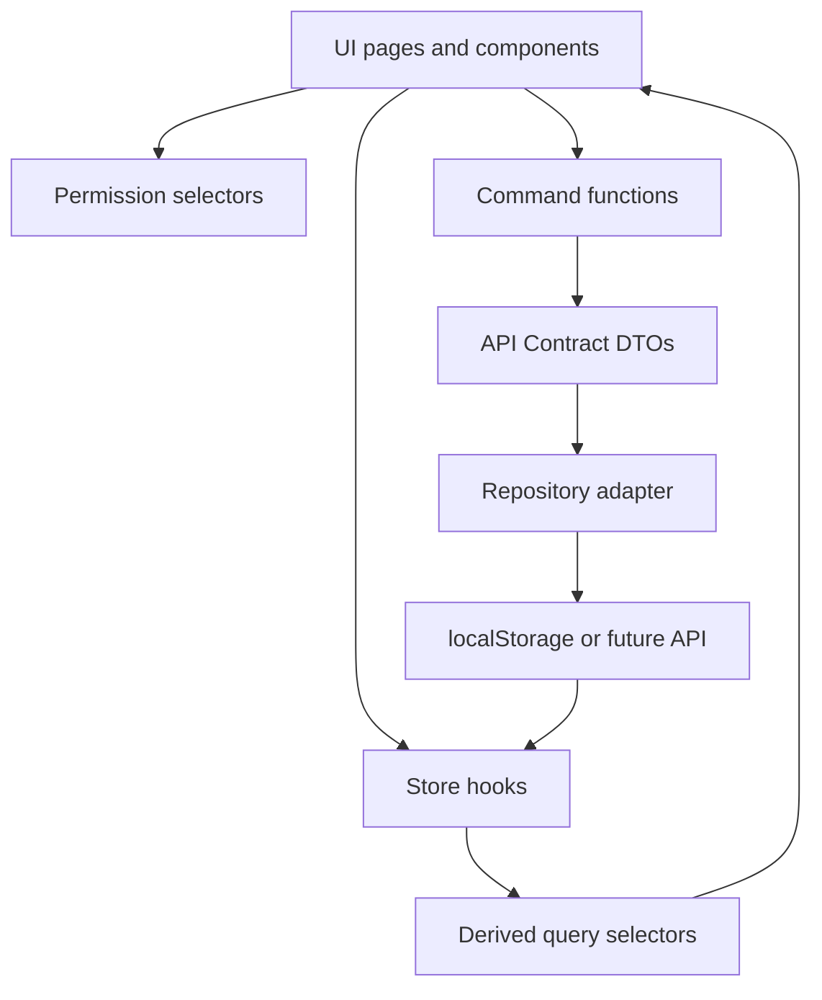

# 02 - State Management Refactor

## Purpose

This document defines the state-management migration from the current single order aggregate store to module-owned V2 stores with repository adapters and derived query selectors.

The design keeps the current localStorage plus `useSyncExternalStore` pattern while preparing the codebase for future API-backed repositories.

## Current Stores

### `orderStore`

File: `src/lib/orderStore.ts`

Current responsibilities:

- Reads/writes `va-trace-orders`.
- Exposes `useOrders`, `getOrdersSnapshot`, `saveOrders`, `appendOrders`, `upsertOrder`.
- Creates manual orders.
- Starts production.
- Generates labels and Delivery Notes.
- Creates and dispatches shipment batches.
- Uploads POD.
- Raises/resolves quantity complaints.
- Owns embedded order-level child data.

Primary issue:

- It mixes demand, production, distribution, document, and POD writes in one aggregate. This blocks exact API-contract ownership and makes partial shipment/partial delivery risky.

### `orderDomain`

File: `src/lib/orderDomain.ts`

Current responsibilities:

- Normalizes legacy orders.
- Creates default allocations from order lines.
- Creates compatibility shipment batches from delivered quantities.
- Syncs allocation shipped/received quantities from embedded shipment batches.

Migration role:

- Keep as a compatibility migration adapter.
- Do not let it remain the long-term authority for V2 entities.

### `orderStatus`

File: `src/lib/orderStatus.ts`

Current responsibilities:

- Maps legacy statuses to `ProductionStatus`.
- Derives `DistributionStatus` from allocations and shipment batches.
- Calculates `DeliveryProgress`.
- Converts V2 statuses back to a legacy label.

Migration role:

- Split into V2 selectors and compatibility-label helpers.
- Add exact contract `PodStatus` handling.

### `deliveryNote`

File: `src/lib/deliveryNote.ts`

Current responsibilities:

- Builds order-scoped and partially batch-aware label/DN records.
- Reads `orderStore` for generated documents.
- Resolves Sales Point delivery profiles.

Migration role:

- Replace with `DeliveryNoteRepository`/factory that accepts `ShipmentBatch` and `ShipmentBatchItem` data.
- Keep legacy functions only for old route compatibility.

### Master and account stores

| Store | File | Current role | V2 treatment |
| --- | --- | --- | --- |
| `clientStore` | `src/lib/clientStore.ts` | Client CRUD and user sync. | Keep; add `ClientReference` selectors. |
| `projectStore` | `src/lib/projectStore.ts` | Project names. | Extend to stable project references or adapt during OrderRequest migration. |
| `supplierStore` | `src/lib/supplierStore.ts` | Supplier/vendor master data. | Use as Vendor source until a dedicated Vendor store exists. |
| `userStore` | `src/lib/userStore.ts` | Users and roles. | Keep; add ownership scope validation. |
| `authStore` | `src/lib/authStore.ts` | Current user selection. | Keep; power route/action permission selectors. |
| `importStore` | `src/lib/importStore.ts` | Bulk PO import. | Migrate output from legacy order draft to OrderRequest + allocations. |

### Missing stores

There is no standalone `deliveryNoteStore`, `shipmentBatchStore`, `salesPointStore`, `productionStore`, or vendor execution store. V2 requires these ownership boundaries before new screens become authoritative.

## Proposed Stores

Use the existing local pattern:

- One localStorage key per aggregate group.
- `useSyncExternalStore` subscriptions per store.
- Public read hooks for UI.
- Command functions for writes.
- Repository abstraction that can later switch from localStorage to API calls without changing page components.

### `OrderRequestStore`

Owns:

- `OrderRequest`
- `OrderItem`
- Order-level summaries derived by selectors
- Compatibility `legacyStatusLabel`

Does not own:

- Shipped quantity truth
- Received quantity truth
- Delivery Notes
- POD evidence

Commands:

- `createOrderRequest`
- `updateOrderRequest`
- `submitOrderRequest`
- `cancelOrderRequest`
- `acceptOrderRequest`
- `updateProductionStatus` only if no separate production repository command owns the write yet

### `SalesPointStore`

Owns:

- `SalesPoint`
- `SalesPointContact`
- Sales Point data quality
- Master-data import matching metadata

Commands:

- `createSalesPoint`
- `updateSalesPoint`
- `createSalesPointContact`
- `updateSalesPointContact`
- `confirmSalesPointImportMatch`

### `SalesPointAllocationStore`

Can be implemented as its own module or as a submodule of `OrderRequestStore`. It must still have a clear ownership boundary.

Owns:

- `SalesPointAllocation`
- Allocation version/audit metadata

Commands:

- `createAllocation`
- `bulkCreateAllocations`
- `updateAllocationQuantity`
- `correctAllocation`
- `raiseAllocationException`

Does not own:

- `shippedQuantity` and `receivedQuantity` writes directly. These are derived from batch and verified POD records, except audited Admin corrections.

### `ProductionStore`

Owns:

- `ProductionJob`
- Production item readiness events

Commands:

- `acceptOrder`
- `updateItemProductionStatus`
- `markReadyForDistribution`
- `completeProduction`

Rules:

- Vendor can mutate assigned production only.
- Production readiness may gate shipment quantity when enabled.

### `ShipmentBatchStore`

Owns:

- `ShipmentBatch`
- `ShipmentBatchItem`
- Batch lifecycle state
- Carrier/dispatch data
- Batch exception state

Commands:

- `createShipmentBatch`
- `updateShipmentBatchDraft`
- `markShipmentBatchReady`
- `dispatchShipmentBatch`
- `closeShipmentBatch`
- `reopenShipmentBatch`

Rules:

- Batch belongs to exactly one Order Request.
- Batch item quantity cannot exceed allocation outstanding quantity.
- Vendor can update assigned batches only.
- Dispatched quantities require Admin correction to change.

### `DeliveryNoteStore`

Owns:

- `DeliveryNote`
- `DeliveryNoteItem`
- Delivery Note file metadata
- Delivery Note lifecycle
- Shipping Label records if labels are not separated into `ShippingLabelStore`

Commands:

- `generateDeliveryNote`
- `recordDeliveryNotePrint`
- `uploadSignedDeliveryNote`
- `regenerateDeliveryNote`
- `closeDeliveryNote`
- `generateShippingLabels`
- `recordLabelPrint`

Rules:

- One active DN per Shipment Batch.
- DN items come from batch items, never total order lines.

### `DeliveryConfirmationStore`

Owns:

- `DeliveryConfirmation`
- `DeliveryConfirmationItem`
- POD evidence metadata
- Review decisions

Commands:

- `createDeliveryConfirmationDraft`
- `submitDeliveryConfirmation`
- `verifyDeliveryConfirmation`
- `rejectDeliveryConfirmation`
- `requestDeliveryCorrection`

Rules:

- Vendor submits assigned POD.
- Admin verifies.
- Verified quantities are the only normal source of received quantity.

## Store Responsibilities

| Domain | Owning store | Read dependencies | Write dependencies |
| --- | --- | --- | --- |
| Demand metadata | `OrderRequestStore` | Client, Project, Vendor | None |
| Production readiness | `ProductionStore` | OrderRequest, OrderItem | OrderRequest status summary |
| Sales Point master | `SalesPointStore` | Client | None |
| Planned distribution | `SalesPointAllocationStore` | OrderRequest, OrderItem, SalesPoint | None |
| Physical shipment | `ShipmentBatchStore` | Allocation, Production readiness, SalesPoint snapshots | DeliveryNote generation optional command |
| Delivery document | `DeliveryNoteStore` | ShipmentBatch and items | ShipmentBatch `deliveryNoteId/status` summary |
| POD verification | `DeliveryConfirmationStore` | ShipmentBatch, DeliveryNote | ShipmentBatch verified quantities, allocation derived totals |
| Dashboards | Query selectors | All stores | None |

## Derived State

Derived state must be computed in selectors/query modules, not written directly except cached summaries that can be rebuilt.

### `deliveryProgress`

Inputs:

- Allocation allocated quantity.
- Shipment batch item shipped quantity.
- Verified Delivery Confirmation received quantity.

Output:

- Allocated quantity.
- Shipped quantity.
- Received quantity.
- Sales Point count.
- Fully received Sales Point count.
- POD count.
- Percentage.

### `distributionStatus`

Rules:

- `NOT_STARTED`: allocated quantity exists but shipped quantity is zero.
- `PARTIALLY_DISTRIBUTED`: shipped quantity is greater than zero and lower than allocated quantity.
- `FULLY_DISTRIBUTED`: shipped quantity equals allocated quantity, received quantity is zero or not complete.
- `PARTIALLY_RECEIVED`: verified received quantity is greater than zero and lower than allocated quantity.
- `FULLY_RECEIVED`: verified received quantity equals allocated quantity for all allocation lines.
- `EXCEPTION`: unresolved exception, rejected POD, blocked address/contact issue, or unresolved variance.

### `completionPercentage`

Use explicit percentages:

- Production completion percent = `productionCompletedQuantity / orderedQuantity`.
- Delivery progress percent = `verifiedReceivedQuantity / allocatedQuantity`.
- Receipt progress percent per batch = `verifiedReceivedQuantity / shippedQuantity`.

### `vendorPerformance`

Future-ready derived selector. Inputs:

- Production SLA target and readiness timestamps.
- Dispatch SLA target and dispatch timestamps.
- POD submission SLA.
- POD first-pass verification rate.
- Variance count/quantity.

### `documentSummary`

Inputs:

- Shipment batch count.
- Delivery Note count.
- Printed DN count.
- Uploaded POD count.
- Verified POD count.
- Missing POD count.

## State Normalization

### Entity maps

Use normalized maps for all V2 entities:

```text
orderRequestsById
orderItemsById
salesPointsById
salesPointContactsById
salesPointAllocationsById
productionJobsById
shipmentBatchesById
shipmentBatchItemsById
deliveryNotesById
shippingLabelsById
deliveryConfirmationsById
deliveryConfirmationItemsById
```

### Indexes

Maintain derived indexes that can be rebuilt:

```text
orderItemIdsByOrderRequestId
allocationIdsByOrderRequestId
allocationIdsBySalesPointId
batchIdsByOrderRequestId
batchItemIdsByBatchId
deliveryNoteIdByShipmentBatchId
deliveryNoteIdsByOrderRequestId
deliveryConfirmationIdsByShipmentBatchId
deliveryConfirmationIdsBySalesPointId
```

### Snapshot policy

- `SalesPointStore` owns current master data.
- `ShipmentBatch` and `DeliveryNote` store immutable destination snapshots captured at batch/DN generation time.
- Updating Sales Point master data must not mutate historical Delivery Notes.

### Versioning

Every mutable entity that maps to an API contract with `version` must include:

- `version`
- `audit.createdAt`
- `audit.createdByUserId`
- `audit.updatedAt`
- `audit.updatedByUserId`

Commands must accept `expectedVersion` where the API contract requires it.

## Data Flow Diagram



Target runtime path:

```text
UI
-> Store command
-> API Contract DTO validation
-> Repository
-> Entity store
-> Derived query selectors
-> UI view model
```

## Migration Sequence

### Phase 0 - Store infrastructure

1. Create shared local repository helpers:
   - Read snapshot.
   - Write snapshot.
   - Subscribe by store event.
   - Version migration hook.
2. Add contract DTO validation helpers or type-only command signatures.
3. Add feature flags for V2 stores.
4. Keep `orderStore` unchanged as source of truth.

Rollback:

- Disable flags; UI continues reading `orderStore`.

### Phase 1 - Sales Point store

1. Seed `SalesPointStore` from `mockSalesPoints` and `salesPointSeed`.
2. Normalize contacts.
3. Add selectors for code/WCode lookup and data quality.
4. Update create-order and Sales Point list reads to use selectors while preserving UI behavior.

Rollback:

- Fall back to `mockSalesPoints`.

### Phase 2 - OrderRequest read model

1. Create `OrderRequestStore` as derived from `orderStore`.
2. Map legacy `Order` to `OrderRequest` and `OrderItem`.
3. Add selectors for list rows and detail response.
4. Keep writes in `orderStore`.

Rollback:

- Switch list/detail selectors back to `useOrders`.

### Phase 3 - Allocation store

1. Extract or derive allocations into normalized `SalesPointAllocationStore`.
2. Validate product allocation totals.
3. Add outstanding quantity selectors.
4. Update order detail allocations tab and batch creation source to read allocation rows.

Rollback:

- Rebuild allocations from `orderDomain.createAllocationsFromOrder`.

### Phase 4 - Production store

1. Extract `ProductionJob` and item readiness.
2. Move Vendor production commands behind `ProductionStore`.
3. Keep compatibility write-through to legacy item status until all screens consume production selectors.

Rollback:

- Recompute `ProductionStatus` from legacy item status.

### Phase 5 - Shipment batch store

1. Extract embedded batches from orders.
2. Create compatibility batches for delivered quantities without explicit batches.
3. Implement batch commands against normalized records.
4. Write through batch IDs to order compatibility summaries only.

Rollback:

- Re-embed normalized batches into `Order.shipmentBatches`.

### Phase 6 - Delivery Note and label store

1. Convert stored DNs/labels to batch-scoped records.
2. Implement DN generation from `ShipmentBatch`.
3. Add batch selector behavior for old order print routes.
4. Stop order-level DN generation for orders with V2 batches.

Rollback:

- Use legacy `deliveryNote.ts` functions for old print views.

### Phase 7 - Delivery Confirmation/POD store

1. Convert legacy POD values:
   - `PENDING` -> `PENDING_UPLOAD`
   - `UPLOADED` -> `SUBMITTED`
   - `VERIFIED` -> `VERIFIED`
   - `REJECTED` -> `REJECTED`
2. Add item-level claimed/verified quantities.
3. Make Admin verification the only normal writer of received quantities.
4. Update allocation, batch, order summaries from verified confirmations.

Rollback:

- Preserve submitted evidence; rehydrate simplified `DeliveryConfirmation` into embedded batch confirmations.

### Phase 8 - API-ready repository boundary

1. Ensure every command accepts API DTO-shaped input.
2. Ensure every page consumes API response/view-model-shaped selectors.
3. Keep localStorage implementation hidden behind repositories.

Rollback:

- Repository can remain local-only; no UI rollback required.

## Testing Requirements

- Unit tests for every derived selector.
- Store command tests for each validation rule.
- Migration parity tests comparing legacy aggregate values to V2 summaries.
- Permission tests for Admin, Operator, Analyst, Vendor, Client scopes.
- E2E tests for old and new route compatibility.

## Risks

| Risk | Mitigation |
| --- | --- |
| Duplicate writes between V1 and V2 stores diverge. | During write-through phases, assert parity after each command in tests. |
| Derived indexes become stale. | Rebuild indexes from entity maps on read until performance requires persisted indexes. |
| LocalStorage migration corrupts user data. | Version keys and keep original `va-trace-orders` unchanged until final cutover. |
| UI reads mixed old/new entities. | Export view-model selectors from one query layer; pages should not compose raw stores. |
| Future API shape differs from local models. | Use DTO-shaped command boundaries now. |

## Acceptance Criteria

- Each V2 entity has one owning store or explicitly owned submodule.
- No new feature writes shipped/received quantities directly to `Order`.
- Order, batch, DN, POD, and Sales Point list/detail pages read from view-model selectors.
- Old localStorage data can migrate forward and backward for compatibility.
- The app can run entirely on local repositories while matching API contract DTOs.
