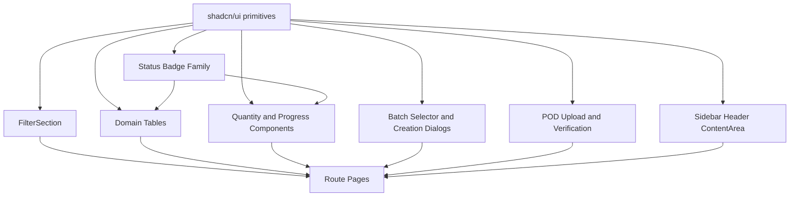

# 04 - UI Component Refactor

## Purpose

This document defines the reusable UI component migration required for V2. The implementation must preserve the existing design system:

- React 18 + Vite.
- Tailwind CSS v4 utility classes.
- shadcn/ui primitives in `src/components/ui`.
- `cn()` for class merging.
- lucide-react icons.
- Existing `Sidebar`, `Header`, `ContentArea`, and `FilterSection`.
- Existing status color tokens: success, warning, processing, destructive, secondary.

No new component library should be introduced.

## Component Inventory

### Keep

| Component | Path | Reason |
| --- | --- | --- |
| `Sidebar` | `src/components/layout/Sidebar.tsx` | Existing role shell; extend nav groups only. |
| `Header` | `src/components/layout/Header.tsx` | Existing breadcrumb/action shell; extend segment labels and explicit breadcrumbs. |
| `ContentArea` | `src/components/layout/ContentArea.tsx` | Existing page layout. |
| `RoleSwitcherFloatingButton` | `src/components/layout/RoleSwitcherFloatingButton.tsx` | Useful for demo/testing role surfaces. |
| `UserAccountMenu` | `src/components/layout/UserAccountMenu.tsx` | Existing user affordance. |
| `FilterSection` | `src/components/shared/FilterSection.tsx` | Reuse for dense V2 table filters. |
| shadcn primitives | `src/components/ui/*` | Required foundation. |

### Refactor

| Component/page pattern | Current issue | Target behavior |
| --- | --- | --- |
| `StatusBadge` | Supports legacy and some V2 statuses, but `PodStatus`, DN, allocation, label statuses are incomplete. | Expand into status-family aware badges or thin wrappers using contract enums. |
| `AllOrders` table | Order status is still legacy-first. | Demand list with production status, distribution status, delivery progress, POD exception. |
| `OrderDetail` | Order-centered detail with order-scoped documents and timeline. | Tabbed command center: Overview, Allocations, Production, Shipment Batches, Delivery Notes, POD, Audit. |
| `DeliveryNotePrint` | Receives order route and can generate order-scoped DN. | Batch-scoped print view; old order route becomes selector. |
| `PackagingLabelsPrint` | Labels are order/item scoped. | Batch item/package scoped labels. |
| `VendorUpdateProgress` | Vendor order progress page. | Vendor Order Workbench with production, eligible allocations, batches, DNs, POD uploads. |
| `LogisticsList` | Static/simple shipment tracker. | Shipment Batch list backed by `ShipmentBatchListRow`. |
| `SalesPointList` | Master list only, no detail route/history. | Add detail route and operational tabs. |
| Dashboard cards/tables | Legacy order status metrics. | Split production, distribution, POD, batch, Sales Point metrics. |

### Replace

| Current pattern | Replacement |
| --- | --- |
| Order-level "Generate Delivery Note" action | `BatchSelectorDialog` -> batch-scoped `DeliveryNotePrint`. |
| Order-level "Print Packaging Labels" action | `BatchSelectorDialog` -> batch-scoped labels print. |
| Inline shipment arrays in order detail | `ShipmentBatchTable` and `ShipmentBatchCard` using batch selectors. |
| Legacy delivery progress rows hardcoded in Order Detail | `DeliveryProgressBar` and `QuantitySummaryRail`. |

### Remove after compatibility phase

| Item | Removal condition |
| --- | --- |
| Direct order-scoped DN generation UI | Batch selector and batch DN generation cover all cases. |
| Direct item-level label generation UI | Batch label generation covers all cases. |
| Legacy `PodStatus` display values `PENDING`/`UPLOADED` | All migrations use contract `PENDING_UPLOAD`/`SUBMITTED`. |

## New Components

Place domain-specific components under `src/components/shared` or a new `src/components/domain` folder if the repo adopts that boundary. shadcn-style primitives still belong in `src/components/ui`.

### Status badges

| Component | Purpose |
| --- | --- |
| `ProductionStatusBadge` | Display `ProductionStatus`: `NEW`, `SUBMITTED`, `ACCEPTED`, `PRINTING`, `FINISHING`, `QUALITY_CONTROL`, `READY_FOR_DISTRIBUTION`, `COMPLETED`, `CANCELLED`. |
| `DistributionStatusBadge` | Display `DistributionStatus`: `NOT_STARTED`, `PARTIALLY_DISTRIBUTED`, `FULLY_DISTRIBUTED`, `PARTIALLY_RECEIVED`, `FULLY_RECEIVED`, `EXCEPTION`. |
| `AllocationStatusBadge` | Display `AllocationStatus`: `NOT_SHIPPED`, `PARTIALLY_SHIPPED`, `FULLY_SHIPPED`, `PARTIALLY_RECEIVED`, `FULLY_RECEIVED`, `EXCEPTION`. |
| `ShipmentBatchStatusBadge` | Display batch lifecycle. |
| `DeliveryNoteStatusBadge` | Display DN lifecycle. |
| `PodStatusBadge` | Display `PENDING_UPLOAD`, `SUBMITTED`, `VERIFIED`, `REJECTED`, `CORRECTION_REQUESTED`, `VARIANCE`, and Order-only `NOT_REQUIRED`. |
| `ExceptionStateBadge` | Display `NONE`, `WARNING`, `BLOCKED`, `RESOLVED`. |

Implementation guidance:

- Use `Badge` variants and the existing token palette.
- Keep `StatusBadge` as a generic wrapper for backward compatibility.
- Use `formatDomainStatusLabel`-style display formatting for enum labels.
- Do not introduce arbitrary inline colors.

### Tables and lists

| Component | Primary view model |
| --- | --- |
| `OrderRequestTable` | `OrderListRow` from `order-request-api.md`. |
| `SalesPointAllocationTable` | `OrderAllocationTableRow` / `SalesPointAllocationRow`. |
| `ShipmentBatchTable` | `ShipmentBatchListRow`. |
| `ShipmentBatchItemTable` | `ShipmentBatchItemTableRow`. |
| `DeliveryNoteRegisterTable` | `DeliveryNoteListRow`. |
| `DeliveryNoteItemTable` | `DeliveryNoteItemTableRow`. |
| `PodVerificationQueueTable` | `PodVerificationQueueRow`. |
| `SalesPointTable` | `SalesPointListRow`. |
| `SalesPointShipmentHistoryTable` | `SalesPointShipmentHistoryRow`. |

Table requirements:

- Keep dense, scannable ops-console layout.
- Prefer horizontal scroll on mobile for data-heavy tables.
- Use sticky or repeated actions only when already established locally.
- Include empty, loading, and error states.

### Detail and workflow components

| Component | Purpose |
| --- | --- |
| `QuantitySummaryRail` | Ordered, allocated, shipped, received, outstanding, POD issues. |
| `DeliveryProgressBar` | Allocation/received percentage with numeric label. |
| `ProductionProgressPanel` | Production job and item readiness. |
| `BatchCreationDialog` | Select outstanding allocations and create draft/ready batch. |
| `BatchSelectorDialog` | Required for old order-scoped document routes and multi-batch document actions. |
| `ShipmentBatchCard` | Compact batch summary for detail tabs/dashboard. |
| `DeliveryNoteSummaryCard` | DN number, batch, status, print/upload state. |
| `PODUploader` | Vendor upload signed DN/POD photos and received quantities. |
| `PODVerificationDrawer` | Admin review evidence, compare quantities, decide. |
| `PODDecisionForm` | Verify/reject/request correction with required reasons. |
| `SalesPointContactPanel` | Primary/active contacts and delivery instructions. |
| `DataQualityAlert` | Missing address/contact/delivery instruction warnings. |
| `AuditTimeline` | Order, batch, DN, POD events. |

## Shared Component Strategy

### View-model first

Components should receive table/detail view models from query selectors rather than raw stores. This prevents UI components from knowing whether data came from legacy aggregate, normalized localStorage, or future API.

Examples:

- `ShipmentBatchTable` receives `ShipmentBatchListRow[]`.
- `OrderRequestTable` receives `OrderListRow[]`.
- `SalesPointAllocationTable` receives allocation rows with already-derived `outstandingQuantity`, `podStatus`, and `canAddToBatch`.

### Role/action awareness

Action components receive permission booleans and disabled reasons:

```text
canCreateShipmentBatch
canPrintDeliveryNote
canUploadPod
canVerifyPod
canClose
disabledReason
```

Do not infer permissions inside visual components from role strings unless the component is explicitly a route shell.

### Composition pattern

- Page owns data loading and commands.
- Section component owns layout.
- Table component owns table rendering and row actions.
- Dialog/drawer owns workflow form state.
- Status components only format status.

## shadcn/ui Usage Rules

- Use existing primitives before creating custom UI primitives:
  - `Button`, `Badge`, `Card`, `Table`, `Dialog`, `Sheet`, `Tabs`, `Select`, `Checkbox`, `Input`, `Textarea`, `Progress`, `Alert`, `Tooltip`.
- Use CVA only for reusable variant sets.
- Use `cn()` for conditional classes.
- Use lucide icons in command buttons and icon-only buttons.
- Keep cards to actual containers, repeated items, modals, and framed tools.
- Do not nest cards inside cards.
- Keep border radius consistent with `--radius`.
- Use status variants/tokens instead of arbitrary color classes.
- Preserve print CSS scope for `.delivery-note-chrome` and `.packaging-label-chrome`.

## Responsive Requirements

### Desktop

- Sidebar visible at `lg`.
- Tables are primary interaction surfaces.
- Order Detail uses main tab area plus right rail summary.
- Batch Detail uses tabs: Items, Delivery Note, Labels, POD, Audit.
- Dialogs can be multi-column where helpful but must keep form controls aligned.

### Tablet

- Sidebar hidden behind Sheet.
- Keep tables horizontally scrollable.
- Right rail moves below tab content or becomes a stacked summary section.
- Batch creation dialog should use a single-column layout with sticky footer actions.

### Mobile

- Do not replace dense operational tables with oversized marketing cards.
- Use horizontal scroll for tables and compact summary rows above them.
- Primary actions should wrap without text overflow.
- Dialogs/drawers should use full width/height where needed.
- Print routes remain printable and should not rely on mobile-only controls.

## Component Dependency Diagram



## Incremental Refactor Sequence

### Phase 1 - Status and summary primitives

1. Extend status vocabulary for production, distribution, allocation, batch, DN, POD, exception, label.
2. Add `QuantitySummaryRail`.
3. Add `DeliveryProgressBar`.
4. Update dashboard/order list to display V2 statuses without changing route behavior.

Rollback:

- Keep `StatusBadge` legacy support; remove new columns from pages if needed.

### Phase 2 - Table components

1. Extract current `AllOrders` table into `OrderRequestTable`.
2. Add `SalesPointAllocationTable`.
3. Add `ShipmentBatchTable`.
4. Add `DeliveryNoteRegisterTable`.
5. Add `PodVerificationQueueTable`.

Rollback:

- Pages can continue rendering current inline tables.

### Phase 3 - Order Detail command center

1. Add `Tabs` structure to `OrderDetail`.
2. Move existing overview/detail content into Overview.
3. Add Allocations tab with `SalesPointAllocationTable`.
4. Add Production tab.
5. Add Shipment Batches and Delivery Notes tabs as read-only first.
6. Add POD and Audit tabs.

Rollback:

- Keep existing content available in Overview and hide tabs via feature flag.

### Phase 4 - Batch workflow components

1. Add `BatchCreationDialog` sourced from outstanding allocations.
2. Add `BatchSelectorDialog` for document routes.
3. Add `ShipmentBatchDetail` layout and item table.
4. Add batch actions: generate DN, print DN, print labels, dispatch.

Rollback:

- Disable create/dispatch actions; keep read-only batch list/detail.

### Phase 5 - Delivery Note and labels

1. Refactor `DeliveryNotePrint` to accept batch/DN view model.
2. Refactor `PackagingLabelsPrint` to accept batch label view model.
3. Preserve print CSS and A4 layout.
4. Add old order route selector behavior.

Rollback:

- Fall back to legacy order print for orders without V2 batches only.

### Phase 6 - POD workflow

1. Add `PODUploader` for Vendor.
2. Add `PODVerificationDrawer` and `PODDecisionForm` for Admin.
3. Add evidence preview placeholders for future file storage.
4. Wire decisions to `DeliveryConfirmationStore`.

Rollback:

- Keep POD upload read-only; no verified quantity writes.

### Phase 7 - Sales Point detail

1. Add `/admin/sales-points/:id`.
2. Add tabs: Profile, Contacts, Allocations, Shipment History, POD History, Notes.
3. Add `DataQualityAlert`.
4. Link allocations/batches/POD rows back to orders and shipment details.

Rollback:

- Keep `SalesPointList` as current modal/detail surface.

### Phase 8 - Dashboard/reporting update

1. Replace legacy blended status cards.
2. Add production, distribution, Sales Point, batch, POD, vendor metrics.
3. Ensure dashboard selectors do not mutate or fetch raw stores directly.

Rollback:

- Keep old dashboard metrics while V2 detail pages remain accessible.

## Risks

| Risk | Mitigation |
| --- | --- |
| Component proliferation with overlapping tables. | Use API view model names and shared table wrappers. |
| Status badges become inconsistent. | Centralize status family config and tests. |
| Mobile tables become unusable. | Use horizontal scroll and compact filters; avoid oversized cards. |
| Print layout regression. | Keep existing print CSS scoped and add print E2E screenshots. |
| Action buttons appear for wrong role. | Drive actions from permission view models. |
| Batch selector adds friction for one-batch orders. | Auto-redirect when exactly one eligible batch exists. |

## Testing Requirements

- Component tests or focused Playwright checks for:
  - Status badge variants and labels.
  - Tables with empty/loading/error/populated states.
  - Batch selector one/none/many states.
  - Batch creation validation states.
  - POD upload and Admin decision forms.
  - Print routes for DN and labels.
- Responsive checks:
  - Desktop 1440px.
  - Tablet 768px.
  - Mobile 390px.
- Accessibility checks:
  - Form labels.
  - Dialog focus.
  - Button accessible names, especially icon buttons.
  - Table row action names.

## Acceptance Criteria

- V2 components preserve the existing app shell and shadcn/Tailwind styling.
- Production, distribution, allocation, batch, DN, POD, and exception statuses are visually distinct and contract-aligned.
- Order Detail can show multiple shipment batches and multiple DNs.
- Batch-scoped DN and label print views do not merge unrelated batches.
- Vendor and Admin workflows use the same shared components with different permission props.
