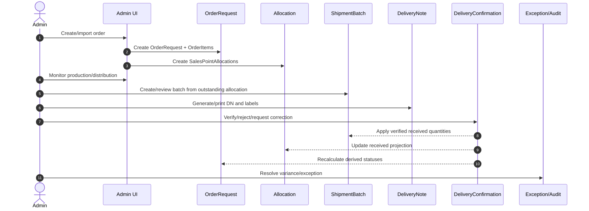
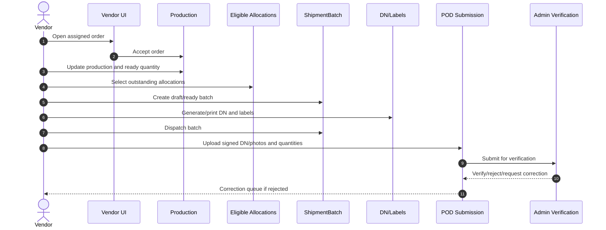
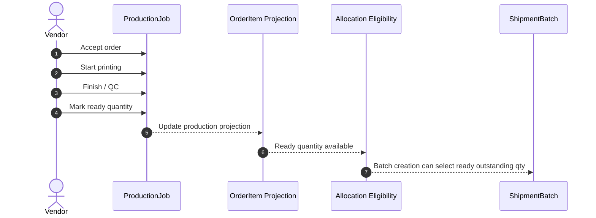
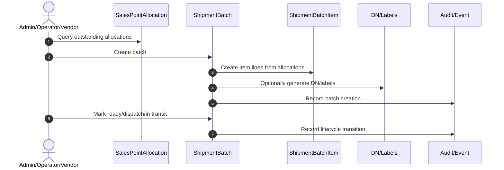
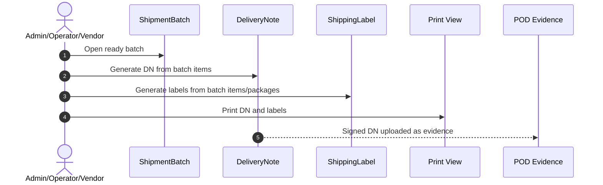
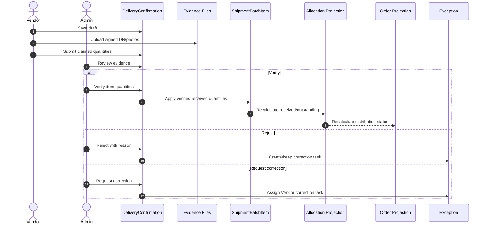

# 03 - Workflow Review

## Executive Assessment

The documented workflows cover the happy path and the main partial shipment/POD verification cases. They are not yet safe for implementation because correction, exception, cancellation, resubmission, closure, and ownership handoffs are under-specified.

The biggest weakness is that workflows assume derived quantities and statuses will update correctly without defining the command/event side effects that make those updates reliable.

## Workflow Readiness Summary

| Workflow | Readiness | Main Blocker |
| --- | --- | --- |
| Admin Workflow | Mostly ready | Exception/correction ownership is not modeled. |
| Vendor Workflow | Partially ready | Vendor boundaries are clear, but batch/POD correction loops need detail. |
| Production Workflow | Partially ready | `ProductionJob` contract and item-level event history are missing. |
| Distribution Workflow | Mostly ready | Batch creation is solid, but cancellation/reopen/correction paths are weak. |
| Delivery Workflow | Partially ready | Multi-destination DN signing and label lifecycle are under-modeled. |
| POD Workflow | Partially ready | Resubmission attempts, idempotent verification, and partial verification are missing. |

## Admin Workflow

### Intended Flow

### Findings

| Severity | Issue | Impact | Recommendation |
| --- | --- | --- | --- |
| Critical | Admin correction workflow is not formally modeled. | Admin can change received quantities, reopened batches, or allocations without consistent audit/side effects. | Add command specs for quantity correction, allocation correction, batch reopen, POD reversal, and document regeneration. |
| Critical | Exception ownership is ambiguous. | "Raise Exception" exists in UI, but no entity owns assignment, resolution, reopening, or closure blocking. | Add `OperationalException` workflow with owner, source, status, severity, resolution, and SLA. |
| High | Admin can create/review batches, but approval boundaries with Vendor are unclear. | Vendor may dispatch Admin-created batch without explicit acceptance or readiness check. | Define batch owner and handoff states: draft owner, ready owner, dispatch owner. |
| High | Batch close requires resolved exceptions, but no resolution object exists. | Closure rules cannot be enforced. | Close should validate POD status, exception records, unresolved variance, and document status. |
| Medium | Import-created orders need approval/gating before submit. | Dirty imports can enter production/shipment too early. | Add import validation and submit gate with issue queue. |

## Vendor Workflow

### Intended Flow

### Findings

| Severity | Issue | Impact | Recommendation |
| --- | --- | --- | --- |
| High | Vendor correction loop lacks explicit attempt/version history. | Resubmitted POD can overwrite previous evidence or confuse audit. | Add POD attempt history and immutable review events. |
| High | Vendor can create batches from eligible allocations, but eligibility source is underspecified. | Batch quantity may exceed production-ready or outstanding quantity under concurrency. | Define eligibility query and command validation with `expectedVersion` across allocation and production readiness. |
| High | Vendor dispatch path does not define failed delivery or returned shipment. | Real-world delivery failures become exception notes only. | Add failed delivery/return workflow or exception subtype with batch state impact. |
| Medium | Vendor-owned Delivery Notes and labels lack regenerate/void permission rules. | Vendor may reprint incorrect documents without Admin oversight. | Define who can regenerate, void, and reprint documents by batch state. |
| Medium | Vendor cannot verify POD, but "Admin correction only" upload path is unclear. | Admin may need to upload signed DN on behalf of Vendor. | Add delegated/Admin upload path with audit reason. |

## Production Workflow

### Intended Flow

### Findings

| Severity | Issue | Impact | Recommendation |
| --- | --- | --- | --- |
| High | No `ProductionJob` API contract. | Workflow cannot be implemented consistently across UI/store/API. | Add production contract and command DTOs. |
| High | Partial readiness across products and Sales Points is unclear. | Ready quantity by product may not map to allocation eligibility fairly. | Define readiness allocation rule: product-level pool, allocation-specific reservation, or FIFO/priority. |
| Medium | Backward movement from QC to printing is allowed but side effects are not defined. | Already-created batches may exceed corrected ready quantity. | Once shipped, production correction must create exception, not silently reduce eligibility. |
| Medium | No production evidence/attachment model. | QC/rework claims cannot be verified later. | Add optional production attachments and rework/defect codes if required. |

## Distribution Workflow

### Intended Flow

### Findings

| Severity | Issue | Impact | Recommendation |
| --- | --- | --- | --- |
| High | Batch cancellation/delete is only briefly mentioned. | Drafts with generated documents may leave orphan labels/DNs. | Define draft cancel, document void, dispatched cancellation, and returned shipment flows. |
| High | Allocation outstanding is derived, but batch command concurrency is not fully specified. | Two users can create batches against the same outstanding quantity. | Require version checks or reservation records for selected allocation quantities. |
| Medium | Multi-order shipment consolidation is deferred. | Future route/courier optimization may require a new model. | Add future `ShipmentManifest` boundary now so `ShipmentBatch` remains one-order scoped. |
| Medium | Carrier and route tracking are future, but dispatch state has no checkpoint model. | In-transit aging and failed delivery reporting will be weak. | Add optional shipment checkpoint/event model later; do not overload batch status. |

## Delivery Workflow

### Intended Flow

### Findings

| Severity | Issue | Impact | Recommendation |
| --- | --- | --- | --- |
| Critical | Shipping label workflow lacks entity contract. | Labels cannot be audited, voided, regenerated, or reconciled with packages. | Add label/package lifecycle before implementing print routes. |
| High | One DN per multi-Sales Point batch may not match signing reality. | If each Sales Point signs separately, one DN per batch creates ambiguous signature fields. | Validate whether DN should be per batch, per Sales Point, or batch document with per-destination signature sections. |
| High | DN regeneration DTO exists but no supersession workflow. | Incorrect documents may be replaced without historical trace. | Add document versioning and void/regenerate states. |
| Medium | QR payload checksum is specified but validation workflow is not. | QR scanning future will lack trust semantics. | Define QR verification endpoint and checksum source. |

## POD Workflow

### Intended Flow

### Findings

| Severity | Issue | Impact | Recommendation |
| --- | --- | --- | --- |
| Critical | Verification idempotency is stated but not modeled. | Duplicate clicks or retries can double-apply received quantities. | Apply received quantity through immutable verification event with idempotency key. |
| Critical | Resubmission history is ambiguous. | Rejected and corrected evidence may overwrite previous evidence. | Add POD attempts or versioned confirmation submissions. |
| High | Partial verification at item level is not defined. | Admin may accept some lines and reject others. | Add item-level review decision or block mixed decisions explicitly. |
| High | Overage is allowed with Admin decision, but no overage approval entity exists. | Invoices and inventory reconciliation will be unreliable. | Link overage to exception/variance approval with reason and billable handling. |
| Medium | Evidence quality checks are future only. | Poor images may pass to Admin manually without structured reason. | Add evidence quality/status fields when file asset model is added. |

## Invalid Or Ambiguous Transitions

| Severity | Transition | Problem | Recommendation |
| --- | --- | --- | --- |
| High | `READY_FOR_DISTRIBUTION -> COMPLETED` while distribution incomplete | Production completion can be confused with order completion. | Keep production completed separate and never show as business complete until distribution is fully received. |
| High | `FULLY_RECEIVED -> CLOSED` with unresolved variance | "Resolved exception" is required but not enforceable. | Require no open `OperationalException` records or explicit waiver. |
| High | `DeliveryNote SIGNED -> UPLOADED` | Signed can be inferred from upload, causing redundant states. | Define whether `SIGNED` is manual/offline state or remove it from normal UI. |
| High | `POD VERIFIED -> REJECTED` after correction | Edge case mentioned but no reversal model. | Add reversal/correction event, never overwrite previous verified event. |
| Medium | Batch quantity edit after dispatch | Admin correction mentioned but side effects unclear. | Forbid direct edit; require adjustment event with reason and recalculation. |
| Medium | Allocation edit after shipment | Block/reason is mentioned but no workflow. | Add allocation correction command with exception/audit linkage. |

## Dead-End States

| State | Why It Is A Dead End | Required Exit |
| --- | --- | --- |
| Batch `IN_TRANSIT` with missing POD | No aging/escalation owner is modeled. | Missing POD exception/reminder/escalation flow. |
| POD `REJECTED` | Vendor resubmit exists conceptually but no attempt model. | Correction task and new submission attempt. |
| Allocation `EXCEPTION` | Exception entity does not exist. | Resolve/reopen exception workflow. |
| Sales Point `NEEDS_REVIEW` | Master data review workflow is not specified. | Assign/approve/reject/remap workflow. |
| Delivery Note `UPLOADED` | Verification source is POD review, but state ownership is ambiguous. | Link DN status transition to verification event. |

## Ownership Gaps

- Admin owns verification and closure, but Admin correction authority needs command-level boundaries.
- Vendor owns execution, but cannot be the authority for received truth.
- Operator delegation is mentioned but no delegation model exists.
- Analyst read-only is clear in UI but needs command rejection in repository/API.
- Client visibility is "where exposed"; exposure must be policy-driven, not hardcoded.

## Workflow Recommendations

1. Add command/event specifications for every mutation, including side effects.
2. Add `OperationalException` workflow before batch close and dashboard exception work.
3. Add POD attempt/version model before implementing rejection/correction.
4. Add shipping label lifecycle before label print migration.
5. Define lifecycle transition matrices with actor, preconditions, side effects, and audit event.
6. Treat projections as recalculated after events, not manually updated by UI.
7. Validate DN-per-batch business assumption for multi-Sales Point shipments before coding print views.
